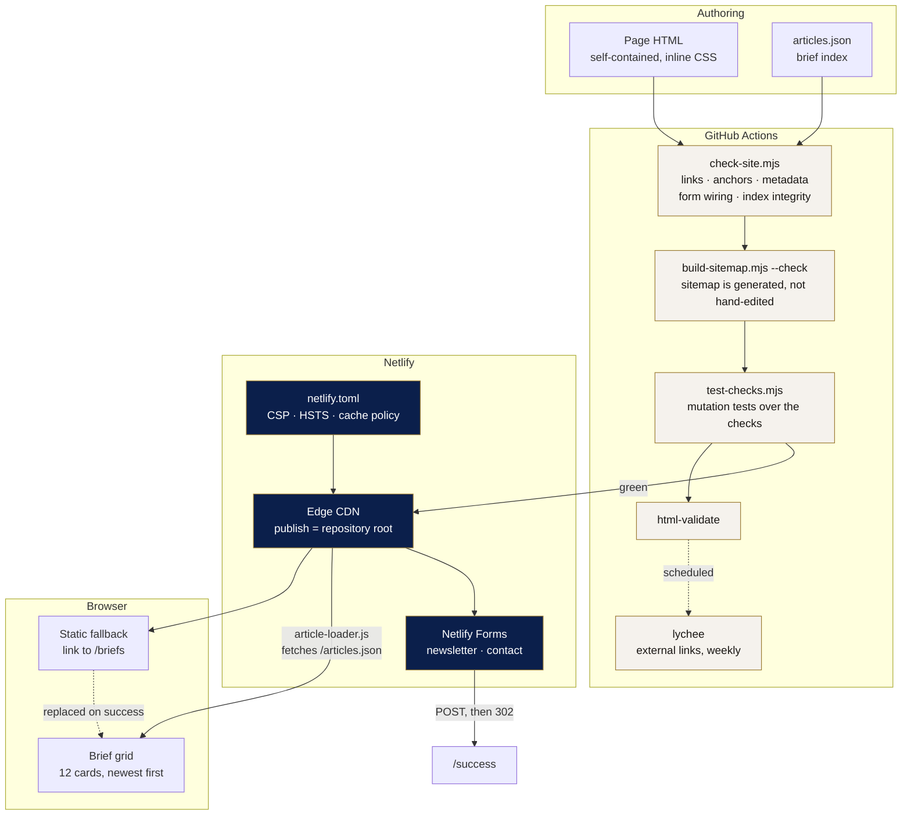

# gobeyondadvisory.com

Source for the GoBeyond Advisory website: a hand-authored static site deployed on
Netlify at [gobeyondadvisory.com](https://gobeyondadvisory.com). Fifteen public
pages — a home page, a leadership page, an intelligence-brief archive and twelve
long-form briefs — plus form-confirmation and not-found pages.

**There is no framework, no bundler and no build step.** Pages are self-contained
HTML with inline CSS. The only moving parts are a small progressive-enhancement
script that renders the brief grid from `articles.json`, two Netlify Forms that
capture inbound enquiries, and a zero-dependency validation suite that runs in CI.

That is a deliberate choice, not an omission — see
[Design decisions](#design-decisions-and-tradeoffs). The engineering effort in
this repository went into the things a static site can still get wrong: form
wiring that silently discards submissions, links that rot, metadata that goes
missing, and delivery headers.

```
npm run validate     # everything CI runs, in one command
npm run dev          # local preview with Netlify redirects and headers applied
```

---

## Architecture



**Request path.** A visitor hits Netlify's edge. `netlify.toml` attaches the
security and cache headers to every response. HTML is served with
`must-revalidate` so a published correction is live immediately; nothing here is
content-hashed, so nothing is cached immutably.

**Brief grid.** `index.html` ships a static card linking to `/briefs`.
`article-loader.js` fetches `/articles.json`, sorts by `published` descending,
and replaces that card with the full grid. If the fetch fails or JavaScript is
off, the fallback stays and the section is still useful. The loader escapes every
interpolated value before writing HTML.

**Forms.** Netlify detects `data-netlify="true"` at deploy time and provisions a
submission endpoint. The browser POSTs same-origin; Netlify stores the submission
and redirects to `/success`.

---

## Repository layout

| Path | Purpose |
| --- | --- |
| `index.html` | Home page: initiatives, advisory, markets, brief grid, both forms |
| `briefs.html` | Intelligence brief archive |
| `founders.html` | Leadership page |
| `gba-article*.html`, `article-*.html` | The 12 published briefs |
| `success.html`, `404.html` | Form confirmation and not-found pages (both `noindex`) |
| `articles.json` | Brief index consumed by the loader and the sitemap generator |
| `article-loader.js` | Renders the brief grid |
| `netlify.toml` | Publish directory, redirects, security headers, cache policy |
| `sitemap.xml` | **Generated.** Do not hand-edit — run `npm run sitemap` |
| `academy/` | The **AI Cloud Infrastructure Program** PWA — a self-contained app, `noindex`, outside the site checks |
| `scripts/` | Validation and generation tooling (404s on the public site) |
| `.github/workflows/ci.yml` | CI |

---

## Prerequisites

- **Node.js 20 or newer** (`.nvmrc` pins 22) — only for validation tooling. The
  site itself has no runtime dependencies and no install step.
- A Netlify account with this repository connected, for deploying.
- Optional: `netlify-cli` for a local preview that applies `netlify.toml`.

There is nothing to `npm install`. Every script in `package.json` runs against
the Node standard library or fetches a pinned tool through `npx` on demand.

## Local setup

```bash
git clone https://github.com/mikeinc80/gobeyondadvisory-site.git
cd gobeyondadvisory-site

npm run serve   # plain static server on http://localhost:3000
npm run dev     # Netlify Dev — applies redirects, headers and form detection
```

Use `npm run dev` when you need to check anything in `netlify.toml`. A plain
static server does not apply the CSP, the cache headers, or the `/scripts/*`
block, and it will not resolve extensionless URLs the way the edge does.

## Validation

```bash
npm run validate         # check + sitemap freshness + mutation tests
npm run check            # structural checks only
npm run check:strict     # also fail on SEO advisory warnings
npm run sitemap          # regenerate sitemap.xml
npm test                 # mutation tests over the checks themselves
npx html-validate '*.html'
```

`scripts/check-site.mjs` encodes the defects this site has actually shipped:

| Check | What it catches |
| --- | --- |
| Form wiring | A control with no `name` attribute — the form submits, but the field is silently absent from the payload |
| Form plumbing | Missing `data-netlify`, missing hidden `form-name` input, missing honeypot, a control with no associated `<label for>` |
| Dead links | `/cdn-cgi/l/email-protection` links left behind by HTML saved from a Cloudflare-proxied origin |
| Anchors | `href="index.html#focus"` when no element on that page has `id="focus"` |
| Internal links | Any local href that resolves to no file, extensionless URLs included |
| Head metadata | Missing `<title>`, description, canonical, `lang`, charset, viewport; more than one `<h1>` |
| Canonical | A canonical URL that does not match the page's own address |
| Brief index | Duplicate ids, non-ISO dates, unknown fields, more than one featured brief, an index entry with no page, **a published page missing from the index** |
| Sitemap | A `<loc>` that does not resolve, a relative `<loc>`, the confirmation page being advertised |
| Secrets | AWS keys, live API keys, GitHub and Slack tokens, private keys |

Length limits on `<title>` and `meta description` are reported as **advisory
warnings**, not failures: they are editorial calls, and CI should not block a
publish on one.

`scripts/test-checks.mjs` is the reason to trust any of that. It copies the site
to a temporary directory, reintroduces each defect above one at a time, and
asserts the checker rejects it with the expected message. A validator that has
never been shown to fail is not evidence of anything.

## Deployment

Netlify builds on push to `main`.

```bash
git switch -c content/new-brief
# ...edit...
npm run validate
git commit -am "Publish brief: <title>"
git push -u origin content/new-brief
```

Open a pull request. CI runs the validation suite and `html-validate`; Netlify
publishes a Deploy Preview at a unique URL. Merging to `main` promotes to
production. `netlify.toml` sets `publish = "."` and no build command, so a deploy
is an upload of the repository contents.

### Rollback

Netlify keeps every deploy. **Deploys → select the last good deploy → Publish
deploy** restores it immediately without a git operation. Follow up with a
`git revert` so the repository and the live site agree.

### Teardown

There is no infrastructure to destroy. Unlinking the repository in Netlify
(**Site configuration → Build & deploy → Manage repository**) stops deploys;
deleting the site removes the edge configuration, the DNS records Netlify
manages, and **all stored form submissions**. Export submissions first.

## Publishing a brief

1. Add the page as `<id>.html` at the repository root, following an existing
   brief. Include `<title>`, a meta description, and a canonical URL of
   `https://gobeyondadvisory.com/<id>`.
2. Add an entry to `articles.json`. `id` must match the filename without
   `.html`, `url` must be `/<id>`, `published` must be `YYYY-MM-DD`, and exactly
   one brief across the file may have `"featured": true`.
3. `npm run sitemap && npm run validate`.
4. Commit both the page and the regenerated `sitemap.xml`.

Step 3 is not optional: CI fails if `sitemap.xml` does not match what the
generator produces, and fails if a brief page exists that `articles.json` does
not list. That check exists because five published briefs were invisible on the
site for exactly that reason.

---

## Security considerations

**Headers.** `netlify.toml` sets a CSP, `Strict-Transport-Security`
(currently `max-age=300`, apex only — see below), `X-Frame-Options: DENY`,
`X-Content-Type-Options: nosniff`, `Referrer-Policy:
strict-origin-when-cross-origin`, `Cross-Origin-Opener-Policy: same-origin`, and
a `Permissions-Policy` that denies every device capability the site does not use.

**Content Security Policy.** `default-src 'self'` with `base-uri 'none'`,
`object-src 'none'`, `frame-ancestors 'none'` and `form-action 'self'`. External
origins are allowed only where they are actually used: `fonts.googleapis.com` for
stylesheets and `fonts.gstatic.com` for font files. `img-src` permits `data:`
because several briefs embed images as base64.

The policy still carries `'unsafe-inline'` for scripts and styles. Every page is
hand-authored with an inline `<style>` block, and several carry an inline
`<script>`. Removing it needs either per-response nonces (which Netlify cannot
inject without a build step or an edge function) or a build that extracts inline
blocks and emits hashes. **This is the weakest part of the current policy and it
is stated plainly rather than papered over.** The mitigating factor is that the
site renders no user-supplied content: there is no comment system, no search
reflection, and no query parameter that reaches the DOM. `articles.json` is
repository-controlled, and the loader HTML-escapes every value it interpolates
regardless.

**HSTS is deliberately short.** The header is `max-age=300` with no
`includeSubDomains` and no `preload`, which is weaker than this site should
finish at. It is staged that way on purpose: a long `max-age` with
`includeSubDomains` makes every subdomain HTTPS-only in any browser that has
seen the header, for the full duration, and there is no way to recall it from
visitors who have already cached it. Raising it is a separate, deliberate step —
confirm the production deploy is healthy and every subdomain serves valid HTTPS,
then increase `max-age` first and add `includeSubDomains` only after that has
been observed working. `preload` should be added last, and only with the
understanding that removal from the preload list takes months.

**Least privilege.** The CI workflow declares `permissions: contents: read` and
no job requests more. No deployment credential exists in this repository — the
Netlify build is triggered by Netlify's own GitHub App, so no token is stored
here and no workflow can deploy. Every GitHub Action is pinned to a full commit
SHA, not a mutable tag. Dependabot proposes action updates monthly.

**Forms and spam.** Both forms carry a `bot-field` honeypot, declared via
`data-netlify-honeypot`. Netlify discards submissions where it is filled. Netlify
also offers reCAPTCHA if honeypot alone proves insufficient — see
[What is deliberately not here](#what-is-deliberately-not-here).

**No secrets.** There are no credentials, account identifiers or environment
variables in this repository, and `check-site.mjs` scans for common key formats
on every run. The two published email addresses are business contact addresses
that appear on the site by design.

**Personal data.** Form submissions contain names, organisations, email addresses
and free text, and they are stored by Netlify, not here. That is the site's only
personal-data store; treat access to the Netlify account accordingly.

## Cost considerations

Netlify's free tier covers this site's shape comfortably: static assets on the
CDN, 100 form submissions per month, and 300 build minutes. Builds cost
essentially nothing because there is no build — a deploy is a file upload, so
build minutes are not the constraint.

The two things that would actually change the bill:

- **Form submissions above 100/month.** The next tier is the pricing cliff to
  watch, and it is the metric most likely to move if a brief circulates widely.
- **Bandwidth.** `founders.html` is 727 KB and three briefs are 260–380 KB,
  almost entirely base64-embedded images. Extracting those to real image files
  would cut the largest page by roughly 90%, let the CDN cache them separately
  from the HTML, and remove the need for `data:` in `img-src`. At current traffic
  this is a page-weight problem before it is a cost problem.

GitHub Actions is free for public repositories. There is no cloud account, no
compute, no database and no per-request charge anywhere in this architecture.

## Design decisions and tradeoffs

**No framework, no build step.** The site is fifteen pages of long-form editorial
updated a few times a month by one person. A static-site generator would add a
toolchain, a dependency tree and an upgrade treadmill to solve a templating
problem that does not currently hurt. The cost is real and visible: the
navigation and footer are duplicated across every page, and changing them means
touching every one of them. If the page count or the number of authors grows, that
duplication becomes the reason to adopt a generator — and it is the trigger to
watch for, rather than a decision to take pre-emptively.

**Validation instead of abstraction.** The failure modes this site actually has
are not the ones a framework prevents. Broken forms, dead links, drifting
metadata and unindexed pages are caught more directly by checks that assert the
invariants than by a build system that hides the markup. So the tooling budget
went entirely into `scripts/`, and it is zero-dependency so it keeps working on a
clean clone years from now.

**Mutation-tested checks.** A validation script that passes tells you nothing on
its own — it might not be testing anything. `test-checks.mjs` proves each check
rejects the defect it claims to. It costs about a second in CI.

**Generated sitemap.** The committed `sitemap.xml` listed 3 of 15 public pages. Hand-
maintained derived files drift, so it is generated from `articles.json` and disk
contents, and CI fails if the committed copy is stale.

**Progressive enhancement over a static grid.** The brief grid could be static
HTML, removing JavaScript entirely. Keeping `articles.json` means adding a brief
is one page plus one JSON entry rather than an edit to the home page markup, and
the ordering and featured logic live in one place. The tradeoff — a section that
depends on a fetch — is bounded by shipping a real static fallback inside the
container rather than an empty `<div>`.

**Extensionless canonical URLs.** Netlify serves both `/briefs` and
`/briefs.html`. Every page now declares an extensionless canonical URL, and the
sitemap agrees, so search engines index one address. Existing in-page links that
still use `.html` were left alone: they resolve correctly, and rewriting links
across every page to save one redirect hop is risk without benefit.

**`must-revalidate` on HTML.** Nothing here is content-hashed, so caching HTML or
`articles.json` aggressively would mean a published correction sitting stale
behind a CDN TTL with no way to bust it. Correctness beats a few milliseconds.

## Troubleshooting and common failure modes

**Form submissions arrive empty, or not at all.**
Netlify only submits controls that have a `name` attribute — this site shipped
that bug in production, with both forms POSTing nothing but the submit action.
Run `npm run check`. Also confirm the hidden `<input name="form-name">` value
matches the form's own `name`; without it Netlify cannot route the submission.

**A form does not appear in the Netlify dashboard at all.**
Netlify detects forms by parsing the deployed HTML at build time. The form must
carry `data-netlify="true"` and be present in the HTML as served — a form
injected by JavaScript is never detected. Re-deploy after adding the attribute;
detection does not happen retroactively.

**A new brief does not show on the home page.**
The grid renders from `articles.json`, not from the files on disk. If the entry
is missing, the page is unreachable from the grid. `npm run check` fails on this.
If the entry is present but the grid is empty, open devtools: a failed
`/articles.json` fetch leaves the static fallback in place by design.

**Everything renders but the CSP blocks something.**
Check the browser console for a `Content-Security-Policy` violation. Anything
loaded from a new external origin — an analytics tag, a font host, an embed —
needs that origin added to the matching directive in `netlify.toml`. It will work
locally under `npm run serve` and fail under `npm run dev` and in production,
because only those apply the header.

**CI fails on `sitemap.xml is stale`.**
Run `npm run sitemap` and commit the result. This is expected after adding or
removing any page.

**CI fails on external links but nothing changed here.**
The `links` job runs weekly and checks off-site URLs. A failure usually means a
third-party page moved, not that this repository broke. It deliberately does not
gate pushes.

**A brief renders but the page source ends mid-sentence.**
Three briefs were committed truncated — cut off inside the footer, with no
closing tags. Browsers recover silently, so this is invisible until validated.
`npx html-validate '*.html'` catches it.

## Known limitations

These are open items, stated rather than hidden:

- **No favicon.** The site has none, so every page load 404s on `/favicon.ico`
  and browser tabs show a blank icon. Adding one is a branding decision, not an
  engineering one, so it is left to the owner.
- **No `og:image`.** Open Graph tags are in place, but with no image, link
  previews on LinkedIn and X — this site's primary distribution channels — render
  without artwork. Same reason as above.
- **`briefs.html` is not linked from `index.html`.** The archive is complete and
  reachable by URL, and it is in the sitemap, but no navigation entry points at
  it. Adding one is a design change to the live site's navigation.
- **`briefs.html` lists 10 of 12 briefs.** The two most recent are missing. Its
  cards are hand-written marketing copy, so filling them in is editorial work.
- **Duplicated chrome.** Navigation and footer markup are copied across every page
  and have already drifted into two variants.
- **Page weight.** See [Cost considerations](#cost-considerations).
- **CSP `'unsafe-inline'`.** See [Security considerations](#security-considerations).

## What is deliberately not here

Judgement about what a production site of this shape does *not* need yet, and
what would change that:

- **Analytics.** None is installed, so there is no traffic data and no evidence
  behind any performance claim in this repository. Netlify Analytics is
  server-side and needs no consent banner; a client-side tag would need one and
  would need a CSP change.
- **A CMS.** Worth it when someone who does not use git needs to publish.
- **Automated accessibility and Lighthouse budgets in CI.** `html-validate`
  covers the structural WCAG rules; axe and Lighthouse CI would cover contrast,
  focus order and performance regressions.
- **Visual regression testing.** With inline CSS per page there is no shared
  stylesheet to regress, which is the main thing that makes it lower value here.
- **Uptime and form-delivery monitoring.** A synthetic check that submits the
  contact form end to end would catch a silent forms outage, which is the failure
  mode with the highest business cost and the lowest natural visibility.
- **Staging domain.** Netlify Deploy Previews cover the review need. A permanent
  staging site would matter once there is a build step whose output can differ
  from local.

---

## /academy — the AI Cloud Infrastructure Program

A progressive web app delivering a 24-week training programme: zero technical
experience to employable entry-level Cloud, DevOps and AI Infrastructure
Engineer. It ships as a section of this site but shares nothing with it.

Live at `/academy/`. It is **not linked from the marketing site and is
`noindex`** — an operator's training tool has no business in an advisory firm's
navigation or in its search results.

### Layout

| Path | Purpose |
| --- | --- |
| `academy/index.html` | App shell. One page; every route is a hash |
| `academy/app.css` | All styles. Tokens on `:root`, dark theme redefines tokens only |
| `academy/app.js` | Router, state, views, quiz engine, spaced repetition |
| `academy/curriculum.js` | **All content.** 24 weekly modules, Week 1 daily lessons, 84 skills, 6 projects, 8 gates |
| `academy/sw.js` | Service worker. Precaches the shell so the whole programme works offline |
| `academy/manifest.webmanifest` | Installability, icons, launch shortcuts |
| `academy/icons/` | **Generated.** Run `npm run icons` — do not hand-edit |

### Design decisions

- **Its own directory, not the site root.** `scripts/check-site.mjs` and the
  sitemap generator both read the publish root non-recursively, so a subdirectory
  needs no change to either. It also gives the service worker a scope of
  `/academy/`, which means it can never intercept a request for a brief.
- **No backend, no accounts.** All progress lives in `localStorage` under one
  versioned key. That is the honest trade: it works offline and stores nothing
  about the learner anywhere else, but it is per-device and per-browser, which
  is why Settings offers export and restore and says so plainly.
- **Content is data, not markup.** `curriculum.js` is pure data so the
  curriculum can be reviewed and corrected on its own. Reading links must point
  at official primary documentation; anything that costs money carries a USD
  figure; anything that can leak credentials carries a security note.
- **Answers are withheld until submission.** The correct index is never written
  into the DOM before an attempt is submitted — a programme rule enforced in
  code rather than by good intentions. A wrong answer schedules itself for
  spaced repetition at 1, 3, 7, 16 and 35 days.
- **Icons are generated, not drawn.** `scripts/build-academy-icons.mjs` writes
  the PNGs directly (zlib plus CRC32; PNG is a simple container) rather than
  adding an image toolchain to a repository that has no dependencies.

### Working on it

```bash
npm run serve         # http://localhost:3000/academy/
npm run icons         # regenerate academy/icons/*.png
npm run validate      # site checks (the academy is exempt) + HTML validation
```

The service worker precaches by name, so **after changing any file in
`academy/`, bump `CACHE` in `academy/sw.js`**. Without that, returning visitors
keep the old copy until they clear site data. This is the one footgun in the
directory.

### Cost and safety

The app itself costs nothing to run and stores nothing remotely. The programme
it teaches does involve paid cloud and GPU laboratories: every week carries a
cost note in USD, every project carries teardown instructions, and the highest
cost warnings are on NAT gateways, load balancers, EKS control planes and rented
GPUs — in that order of how often they are forgotten.

---

## Licence

Source is [MIT](LICENSE). Editorial content, the GoBeyond Advisory name, and the
associated marks are reserved — see the note at the end of `LICENSE`.
