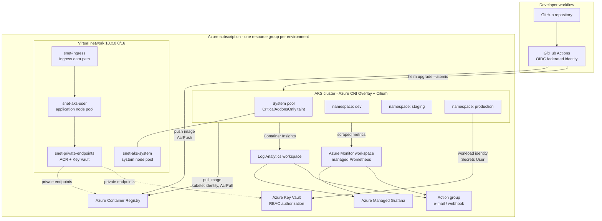
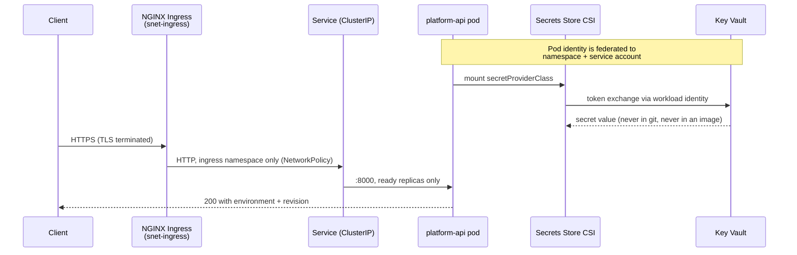
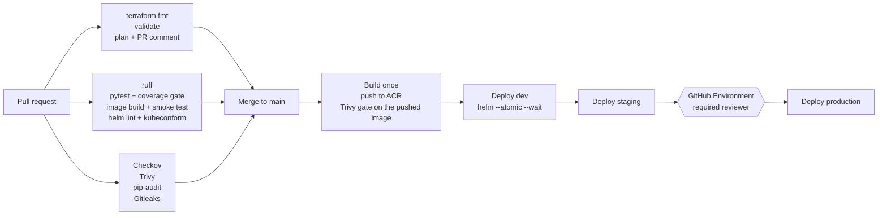

# azure-aks-production-platform

[](https://github.com/REPLACE_ORG/azure-aks-production-platform/actions/workflows/terraform-ci.yml)
[](https://github.com/REPLACE_ORG/azure-aks-production-platform/actions/workflows/app-ci.yml)
[](https://github.com/REPLACE_ORG/azure-aks-production-platform/actions/workflows/security.yml)
[](LICENSE)

> **Reference implementation.** This repository is a complete, deployable Azure
> Kubernetes platform built to demonstrate platform-engineering practice. It has
> been validated locally (see [DEPLOYMENT_STATUS.md](DEPLOYMENT_STATUS.md)) but
> has not been run against a live Azure subscription, and it makes no claims
> about production traffic, uptime or cost savings.

## Executive summary

An end-to-end Azure Kubernetes platform: Terraform provisions a segmented VNet,
an AKS cluster with workload identity, a container registry, a Key Vault, and a
full observability stack; GitHub Actions builds a containerised service once and
promotes that single artifact through dev, staging and production with a human
approval in front of production.

The design decisions that matter are the ones about *credentials*, *blast
radius* and *feedback speed*:

- **No long-lived secrets anywhere in the delivery path.** CI authenticates to
  Azure with OIDC federation, the cluster pulls images with its kubelet managed
  identity, and pods read Key Vault secrets with workload identity. There is no
  registry password, no service principal secret and no kubeconfig to leak.
- **Three environments from one module.** `terraform/modules/platform` is the
  single composition; the environments differ only in sizing and hardening, so a
  change cannot land in staging and quietly miss production.
- **Failures are caught before they reach a cluster.** Format, validate, plan,
  unit tests, an image smoke test, chart rendering and schema validation, plus
  four security scanners, all run before a deploy is possible.

## What this project demonstrates

| Area | Evidence |
| --- | --- |
| Infrastructure as code | 7 reusable Terraform modules, 3 environment roots, remote state with locking, `validate`-clean |
| Kubernetes engineering | Helm chart with probes, HPA, PDB, topology spread, NetworkPolicy, CSI secrets; namespace quotas, limit ranges, Pod Security Admission |
| Identity and access | Workload Identity federation, Entra ID cluster RBAC with local accounts disabled, least-privilege role assignments per identity |
| CI/CD | Build-once/promote-many pipeline, environment-gated production approval, atomic Helm deploys with automatic rollback |
| Security engineering | Checkov, Trivy (image + IaC), pip-audit, Gitleaks, all with a justified baseline rather than blanket suppressions |
| Observability | Container Insights, managed Prometheus, 13 Prometheus rules, 7 Azure Monitor alerts, a Grafana dashboard, structured JSON logs |
| Operational maturity | Runbook, disaster-recovery plan with stated RTO/RPO targets, documented cost model, production-hardening backlog |

## Architecture



### Request path and trust boundaries



## Technology stack

| Layer | Choice | Why this one |
| --- | --- | --- |
| Cloud | Microsoft Azure | Target platform for the identity model (Entra ID, managed identity) |
| IaC | Terraform 1.7+, azurerm 4.x | Module composition and a plan/apply review gate |
| Orchestration | AKS 1.31, Azure CNI Overlay, Cilium | Overlay avoids VNet IP exhaustion; Cilium enforces policy in eBPF |
| Registry | Azure Container Registry | Managed-identity pulls, no registry credentials |
| Secrets | Azure Key Vault + Secrets Store CSI | Secrets stay in the vault; pods get them via federated identity |
| Packaging | Helm 3 | Per-environment values with one templated source of truth |
| Ingress | NGINX Ingress Controller | Portable across clusters and clouds; AGIC noted as the Azure-native alternative in [docs/architecture.md](docs/architecture.md) |
| CI/CD | GitHub Actions | OIDC federation to Azure, environment approval gates |
| Application | Python 3.12 + FastAPI | Small, well-instrumented workload for exercising the platform |
| Observability | Azure Monitor, Container Insights, managed Prometheus, Grafana | Managed collection, open query language |
| Security | Checkov, Trivy, pip-audit, Gitleaks | IaC, image, dependency and secret coverage |

## Architecture explanation

**Network segmentation.** Four subnets split by trust level: system nodes, user
nodes, the ingress data path and private endpoints. Each has its own NSG, so a
rule change for the public-facing tier cannot silently widen the node tier. Pods
get addresses from an overlay CIDR, which means node-count growth never turns
into an IP-exhaustion incident.

**Two node pools.** The system pool carries the `CriticalAddonsOnly` taint so a
misbehaving workload cannot starve CoreDNS or metrics-server. Application pods
land on the user pool, which scales independently.

**Identity, not credentials.** Three distinct identities, each with one job: the
cluster identity manages network resources (Network Contributor scoped to the
VNet, not Contributor on the subscription); the kubelet identity holds `AcrPull`
on one registry; a per-namespace workload identity holds `Key Vault Secrets User`
and is federated to exactly one namespace/service-account pair, so a pod in `dev`
cannot assume the `production` identity even if it forges the service account
name.

**Environment separation.** Each environment is a separate resource group, VNet,
cluster, registry, vault and state file. There is no shared plane to blast
through: destroying dev cannot touch production.

Full reasoning, including the trade-offs that were deliberately *not* taken, is
in [docs/architecture.md](docs/architecture.md).

## Repository structure

```
azure-aks-production-platform/
├── app/                          # FastAPI service: /, /health, /ready, /metrics
│   ├── app/                      # config, logging, metrics, main
│   ├── tests/                    # 21 tests: endpoints, metrics, config, logging
│   └── Dockerfile                # multi-stage, non-root, read-only rootfs
├── charts/platform-api/          # Helm chart + per-environment values
│   └── templates/                # deployment, service, ingress, HPA, PDB,
│                                 # NetworkPolicy, SecretProviderClass, ServiceMonitor
├── k8s/bootstrap/                # namespaces, quotas, limit ranges, RBAC, default-deny
├── terraform/
│   ├── modules/
│   │   ├── networking/           # VNet, subnets, NSGs, private DNS
│   │   ├── aks/                  # cluster, node pools, workload identities
│   │   ├── acr/                  # registry + role assignments
│   │   ├── keyvault/             # RBAC vault, private endpoint, audit logs
│   │   ├── monitoring/           # Log Analytics, Prometheus, Grafana, action group
│   │   ├── alerts/               # metric + log alert rules
│   │   └── platform/             # composition root used by every environment
│   └── environments/{dev,staging,prod}/
├── observability/
│   ├── prometheus/               # PrometheusRule + managed-Prometheus scrape config
│   └── grafana/                  # service overview dashboard
├── .github/
│   ├── workflows/                # terraform-ci, app-ci, cd, security
│   └── actions/helm-deploy/      # composite deploy action shared by all environments
├── docs/                         # architecture, security, observability, runbook, DR, interview notes
└── scripts/bootstrap-remote-state.sh
```

## Prerequisites

| Requirement | Version | Notes |
| --- | --- | --- |
| Azure subscription | — | Owner or User Access Administrator on the target scope; role assignments are created |
| Azure CLI | 2.60+ | `az login` |
| Terraform | 1.7+ | 1.9.8 used for validation |
| kubectl | 1.30+ | |
| Helm | 3.14+ | 3.16.3 used for validation |
| Docker | 24+ | Only needed to build the image locally |
| Python | 3.12 | Only needed to run the app or its tests locally |

One-off subscription features:

```bash
# Host-level encryption of node temp disks and caches.
az feature register --namespace Microsoft.Compute --name EncryptionAtHost
az provider register --namespace Microsoft.Compute
```

Everything the deployment needs from you is listed in
[DEPLOYMENT_STATUS.md](DEPLOYMENT_STATUS.md#what-requires-an-azure-account).

## Deployment

### 1. Remote state

```bash
./scripts/bootstrap-remote-state.sh <subscription-id> uksouth
```

Creates a ZRS storage account with versioning, soft delete, shared-key access
disabled and a delete lock, then prints the `backend.hcl` values.

### 2. Infrastructure

```bash
cd terraform/environments/dev
cp backend.hcl.example backend.hcl          # fill in from step 1
cp terraform.tfvars.example terraform.tfvars # fill in your object IDs

terraform init -backend-config=backend.hcl
terraform plan -out=tfplan
terraform apply tfplan
```

Repeat for `staging` and `prod`. Each environment has its own state key, so they
can be applied and destroyed independently.

### 3. Cluster bootstrap

```bash
az aks get-credentials \
  --resource-group "$(terraform output -raw resource_group_name)" \
  --name "$(terraform output -raw cluster_name)"

# Namespaces first: the default-deny policy must not land on live traffic.
kubectl apply -f ../../../k8s/bootstrap/namespaces.yaml
kubectl apply -f ../../../k8s/bootstrap/resource-quotas.yaml
kubectl apply -f ../../../k8s/bootstrap/limit-ranges.yaml
kubectl apply -f ../../../k8s/bootstrap/default-deny-networkpolicy.yaml
# Replace the placeholder group object IDs in rbac.yaml before applying it.
kubectl apply -f ../../../k8s/bootstrap/rbac.yaml

# Ingress controller.
helm repo add ingress-nginx https://kubernetes.github.io/ingress-nginx
helm upgrade --install ingress-nginx ingress-nginx/ingress-nginx \
  --namespace ingress-nginx --create-namespace \
  --set controller.service.annotations."service\.beta\.kubernetes\.io/azure-load-balancer-health-probe-request-path"=/healthz
```

### 4. Application

Normally the CD workflow does this. Manually:

```bash
helm upgrade --install platform-api charts/platform-api \
  --namespace dev \
  -f charts/platform-api/values-dev.yaml \
  --set image.repository="$(terraform output -raw acr_login_server)/platform-api" \
  --set image.tag=<short-git-sha> \
  --set serviceAccount.workloadIdentityClientId="$(terraform output -json workload_identity_client_ids | jq -r .dev)" \
  --atomic --wait --timeout 5m
```

## CI/CD



Four workflows:

| Workflow | Trigger | What it guarantees |
| --- | --- | --- |
| [`terraform-ci.yml`](.github/workflows/terraform-ci.yml) | changes under `terraform/` | Formatting, validity, and a plan posted to the PR before anyone approves it |
| [`app-ci.yml`](.github/workflows/app-ci.yml) | changes under `app/`, `charts/` | Lint, tests with an 85% coverage floor, an image that actually serves `/health` as UID 10001, and manifests that schema-validate against Kubernetes 1.31 |
| [`cd.yml`](.github/workflows/cd.yml) | push to `main` | One image, promoted dev → staging → production, with production behind a required reviewer |
| [`security.yml`](.github/workflows/security.yml) | push, PR, weekly | IaC, image, dependency and secret scanning, with results in the Security tab |

Two properties worth calling out:

- **Build once, promote many.** The image is built in the first job only. Later
  environments deploy the same tag, so what reaches production is bit-for-bit
  what passed staging.
- **The approval gate is the environment, not a button.** `deploy-production`
  targets a GitHub Environment with required reviewers; the job pauses until a
  human approves. There is no separate step that can be skipped.

## Security model

| Control | Implementation |
| --- | --- |
| CI → Azure | OIDC federated credentials; no client secret stored |
| CI → ACR | `AcrPush` on one registry, nothing more |
| Cluster → ACR | Kubelet managed identity with `AcrPull` |
| Pod → Key Vault | Workload identity federated to one namespace/service-account; `Key Vault Secrets User` (read-only) |
| Human → cluster | Entra ID groups via Azure RBAC; `local_account_disabled = true` |
| Human → secrets | `Key Vault Secrets Officer` for people only — no pipeline has write access |
| Network | Per-tier NSGs, default-deny NetworkPolicy, IMDS blocked from pods, private endpoints in staging/prod |
| Pod hardening | Non-root UID 10001, read-only rootfs, all capabilities dropped, `RuntimeDefault` seccomp, Pod Security Admission `restricted` |
| Supply chain | Trivy gate on the pushed image, SBOM and provenance attestations, ACR quarantine and content trust on Premium |
| Auditing | Key Vault `AuditEvent` logs, `kube-audit-admin` control-plane logs |

Accepted risks are enumerated with justifications in [`.checkov.yaml`](.checkov.yaml)
and [`.trivyignore`](.trivyignore), and explained in [docs/security.md](docs/security.md).

## Observability

Three signals, each with a defined owner:

- **Metrics.** The application exposes `http_requests_total`,
  `http_request_duration_seconds` and `app_ready` on `/metrics`. Managed
  Prometheus scrapes it; [13 rules](observability/prometheus/alert-rules.yaml)
  turn those into SLIs and alerts.
- **Logs.** Structured JSON to stdout, ingested by Container Insights, queryable
  in KQL without a parsing sidecar.
- **Alerts.** Azure Monitor owns infrastructure signals (node CPU, memory, disk,
  NotReady, pod restarts, unavailable replicas, failed deployments); Prometheus
  owns application SLIs (error ratio, p95 latency, throttling).

Every alert carries a `runbook_url` pointing at the matching section of
[docs/operations-runbook.md](docs/operations-runbook.md). Details and the SLO
definitions are in [docs/observability.md](docs/observability.md).

## Scaling strategy

Four independent layers, deliberately tuned so they do not fight each other:

| Layer | Mechanism | Configuration |
| --- | --- | --- |
| Pods | HPA on CPU and memory | 3–20 replicas in production at 65% CPU; scale up fast (100%/min), down slowly (300s stabilisation) |
| Nodes | Cluster autoscaler | `least-waste` expander, 10-minute scale-down delay, skips nodes with local storage |
| Placement | Topology spread across zones | `DoNotSchedule` in production, `ScheduleAnyway` elsewhere |
| Disruption | PDB | `minAvailable: 2` in production, so a drain evicts one pod at a time |

HPA utilisation is measured against the *request*, which is why requests are set
to observed usage rather than to the limit — an inflated request makes the HPA
scale too late. Memory request equals limit because memory is not compressible.

## Disaster recovery

| Scenario | Recovery | Target |
| --- | --- | --- |
| Bad release | `helm rollback`, or `--atomic` does it automatically | RTO < 5 min |
| Corrupted Terraform state | Restore a blob version from the versioned state account | RTO < 30 min |
| Node or zone loss | Cluster autoscaler replaces capacity; workloads are zone-spread | Automatic |
| Cluster loss | `terraform apply` + `helm upgrade` from git | RTO ~60 min |
| Region loss | Rebuild in the paired region from the same code; requires geo-replicated ACR | RTO ~4 h |
| Deleted Key Vault secret | Soft delete (90 days in production) + purge protection | RTO < 15 min |

The platform's own recovery is straightforward because nothing about it lives
only in a cluster. Full procedures, and the honest limits of this model, are in
[docs/disaster-recovery.md](docs/disaster-recovery.md).

## Cost considerations

Approximate monthly list prices, UK South, at the time of writing. Treat them as
an order-of-magnitude guide and confirm with the
[Azure pricing calculator](https://azure.microsoft.com/pricing/calculator/):

| Environment | Main drivers | Rough monthly cost |
| --- | --- | --- |
| dev | 2× D2ds_v5, Free control plane, Standard ACR, 1 GB/day logs | ~$180 |
| staging | 3–4× D2ds/D4ds, Standard tier ($73), Premium ACR ($50), Grafana | ~$600 |
| production | 6× D4ds/D8ds across 3 zones, Standard tier, Premium ACR, 25 GB/day logs | ~$2,000+ |

Cost controls that are actually implemented, not just recommended: a daily
ingestion cap on every Log Analytics workspace, `kube-audit-admin` instead of
full `kube-audit`, ephemeral OS disks, cluster autoscaler minimums of 1 in dev,
ACR untagged-manifest retention, and mandatory `CostCentre`/`Owner` tags on every
resource. The largest single lever is log ingestion, which is why it is capped
per environment rather than left unbounded.

## Production hardening recommendations

This repository is deliberately one step short of a regulated production
deployment. What a real rollout should add, in priority order:

1. **Private cluster** (`private_cluster_enabled = true`) with self-hosted
   runners or a private agent pool for CI.
2. **Egress through Azure Firewall** (`outbound_type = "userDefinedRouting"`)
   with an FQDN allowlist, so a compromised pod cannot exfiltrate freely.
3. **Digest-pinned base images** plus Renovate or Dependabot to bump them.
4. **Image signing and admission enforcement** — Notation/Cosign signatures with
   Ratify or Azure Policy rejecting unsigned images.
5. **cert-manager** with an ACME issuer so TLS certificates renew automatically.
6. **Customer-managed keys** (`disk_encryption_set_id`) where key custody is a
   compliance requirement.
7. **GitOps** (Argo CD or Flux) so cluster state is reconciled continuously
   rather than only at deploy time.
8. **Cost governance** — Azure Budgets with alerts, plus reserved instances or
   spot node pools for the user pool.
9. **Chaos and DR testing** on a schedule, since an untested runbook is a guess.

## Cleanup

```bash
# Application first, so the ingress load balancer is released before the VNet.
helm uninstall platform-api -n production
helm uninstall ingress-nginx -n ingress-nginx

# Then the environment.
cd terraform/environments/dev
terraform destroy
```

Production has `prevent_deletion_if_contains_resources` and Key Vault purge
protection enabled, so a production teardown fails fast unless it is deliberate —
see [docs/operations-runbook.md](docs/operations-runbook.md#teardown) for the
override procedure and its consequences (the vault name is held for 90 days).

## Interview discussion points

The reasoning behind each decision, including the alternatives that were
rejected and why, is written up in [docs/interview-notes.md](docs/interview-notes.md).
The short version:

1. **Why workload identity over pod-managed identity or a secret?** The token is
   bound to a namespace and service account, expires in minutes, and never
   exists at rest.
2. **Why Azure CNI Overlay over CNI or kubenet?** Node-count growth stops being
   an IP-exhaustion problem, without giving up NetworkPolicy.
3. **Why build once and promote?** Rebuilding per environment means the artifact
   in production was never the one that passed staging.
4. **Why is `replicas` omitted from the Deployment when the HPA is on?** Because
   leaving it in makes every `helm upgrade` reset the replica count.
5. **Why `minAvailable` on the PDB rather than `maxUnavailable`?** It stays
   correct as the HPA changes the replica count.
6. **Why memory request equals limit?** Memory is not compressible; overcommit
   turns into OOMKills under pressure.
7. **Why a separate readiness endpoint that fails during drain?** So endpoints
   are withdrawn before the process stops accepting connections.
8. **Why `kube-audit-admin` rather than `kube-audit`?** Mutating calls at a
   fraction of the ingestion cost; full audit is enabled during an investigation.
9. **Why are the Checkov and Trivy baselines not empty?** Because every entry is
   a documented decision, and a suppression without a reason is technical debt
   disguised as a green check.
10. **What would you do differently with a real budget?** Everything in
    [Production hardening](#production-hardening-recommendations), starting with
    the private cluster and firewalled egress.

## Documentation

| Document | Contents |
| --- | --- |
| [docs/architecture.md](docs/architecture.md) | Component-by-component design and the alternatives rejected |
| [docs/security.md](docs/security.md) | Threat model, identity model, accepted risks |
| [docs/observability.md](docs/observability.md) | Signals, SLOs, alert catalogue, useful KQL and PromQL |
| [docs/operations-runbook.md](docs/operations-runbook.md) | Step-by-step incident procedures |
| [docs/disaster-recovery.md](docs/disaster-recovery.md) | RTO/RPO targets and recovery drills |
| [docs/interview-notes.md](docs/interview-notes.md) | Decision rationale and likely follow-up questions |
| [DEPLOYMENT_STATUS.md](DEPLOYMENT_STATUS.md) | Exactly what was validated locally, and what needs Azure |
| [CONTRIBUTING.md](CONTRIBUTING.md) | Local checks that mirror CI |
| [SECURITY.md](SECURITY.md) | Vulnerability reporting |
| [CHANGELOG.md](CHANGELOG.md) | Release history |

## License

[MIT](LICENSE).
