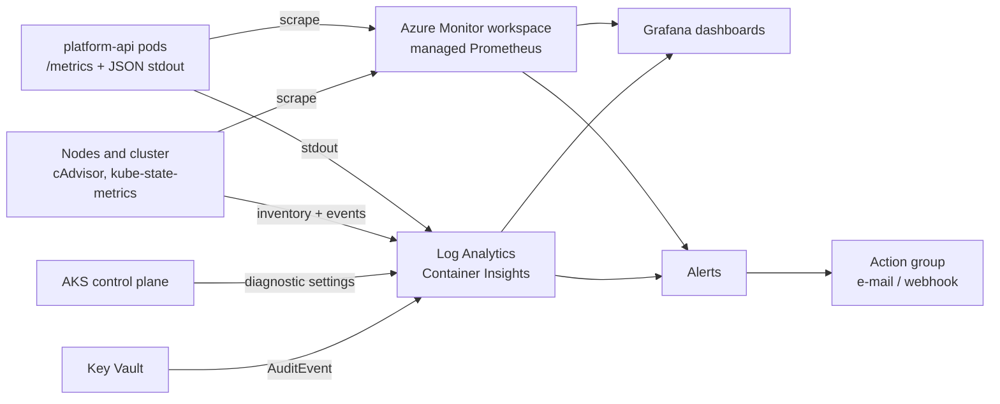

# Observability

## What is collected, and by whom



The split is deliberate: **Azure Monitor owns infrastructure signals** (nodes,
pods, events, control plane) because it already collects them for free, and
**Prometheus owns application SLIs** because they exist only in the app's own
`/metrics` output.

## Application metrics

Exposed on `/metrics` from a private registry (`app/metrics.py`):

| Metric | Type | Labels | Purpose |
| --- | --- | --- | --- |
| `http_requests_total` | counter | `method`, `path`, `status` | Throughput and error ratio |
| `http_request_duration_seconds` | histogram | `method`, `path` | Latency percentiles |
| `app_build_info` | gauge | `environment`, `revision` | Which build is running where |
| `app_ready` | gauge | — | Readiness as the app sees it, not as the Deployment claims |

The `path` label is the **route template**, never the raw URL. A scanner hitting
random paths collapses into a single `path="unmatched"` series instead of
exploding cardinality — covered by a test
(`test_path_label_uses_route_template_not_raw_url`).

## Logs

Structured JSON to stdout, so Container Insights ingests fields that are directly
queryable in KQL with no parsing sidecar:

```json
{"timestamp":"2026-01-01T00:00:00Z","level":"INFO","logger":"platform_api","message":"startup complete","environment":"production","revision":"9f2c1ab"}
```

Useful queries:

```kql
// Error-level logs from the last hour, newest first
ContainerLogV2
| where TimeGenerated > ago(1h)
| where PodNamespace == "production"
| extend parsed = parse_json(LogMessage)
| where parsed.level == "ERROR"
| project TimeGenerated, PodName, message = parsed.message
| order by TimeGenerated desc
```

```kql
// Which revision is each pod actually running?
ContainerLogV2
| where TimeGenerated > ago(30m)
| extend parsed = parse_json(LogMessage)
| where isnotempty(parsed.revision)
| summarize arg_max(TimeGenerated, tostring(parsed.revision)) by PodName
```

```kql
// Restart counts by container over the last 6 hours
KubePodInventory
| where TimeGenerated > ago(6h) and Namespace == "production"
| summarize Restarts = max(ContainerRestartCount) - min(ContainerRestartCount)
    by ContainerName, Name
| where Restarts > 0
| order by Restarts desc
```

```kql
// Who read which secret? (Key Vault audit)
AzureDiagnostics
| where ResourceType == "VAULTS" and OperationName == "SecretGet"
| project TimeGenerated, identity_claim_appid_g, requestUri_s, ResultSignature
| order by TimeGenerated desc
```

## Service level objectives

Starting targets, to be re-derived from a real baseline once the service carries
traffic:

| SLI | Definition | Target |
| --- | --- | --- |
| Availability | Non-5xx responses ÷ total responses | 99.9% over 30 days |
| Latency | p95 of `http_request_duration_seconds` | < 250 ms |
| Freshness | Time from merge to production deploy | < 30 min excluding approval wait |

The histogram buckets in `app/metrics.py` are placed around the 250 ms target, so
the p95 estimate is accurate where it matters rather than uniformly coarse.

## Alert catalogue

### Azure Monitor — `terraform/modules/alerts`

| Alert | Condition | Severity |
| --- | --- | --- |
| Node CPU | avg > 80% (75% prod) for 15 min | Warning |
| Node memory | working set > 80% (75% prod) for 15 min | Warning |
| Node disk | > 80% (75% prod) for 1 h | Warning |
| Nodes not ready | any node `Ready != true` | Critical |
| Pod restart spike | restart delta > threshold over 15 min | Warning |
| Unavailable replicas | below desired for 2 consecutive 10-min periods | Critical |
| Failed deployment | `Failed`/`FailedScheduling`/`BackOff`/`FailedMount` events over threshold | Critical |

### Prometheus — `observability/prometheus/alert-rules.yaml`

| Alert | Condition | Severity |
| --- | --- | --- |
| `PlatformApiHighErrorRate` | 5xx ratio > 5% for 10 min | Critical |
| `PlatformApiHighLatency` | p95 > 250 ms for 10 min | Warning |
| `PlatformApiNoReadyReplicas` | `sum(app_ready) == 0` for 2 min | Critical |
| `PodCrashLooping` | > 1 restart in 15 min, sustained 10 min | Critical |
| `DeploymentReplicasUnavailable` | unavailable replicas for 15 min | Warning |
| `ContainerCpuThrottling` | > 25% of CFS periods throttled for 15 min | Warning |
| `ContainerMemoryNearLimit` | > 90% of the memory limit for 10 min | Warning |
| `NodeCpuSaturation` / `NodeMemoryPressure` | > 85% for 15 min | Warning |
| `NodeNotReady` | not ready for 10 min | Critical |

Three design choices behind these thresholds:

- **`for` durations are not decoration.** `DeploymentReplicasUnavailable` waits
  15 minutes because a rolling update legitimately dips below desired; paging on
  that would train people to ignore the alert.
- **Unavailable-replica alerts require two consecutive failing periods**, for the
  same reason.
- **CPU throttling has its own alert.** Throttling is invisible in CPU-usage
  graphs but shows up immediately as user-facing latency, and the fix (raise the
  limit) is different from the fix for high usage (scale out).

Every Prometheus alert carries a `runbook_url` pointing at the matching section
of [operations-runbook.md](operations-runbook.md), so the person paged at 3am
gets a procedure rather than a metric name.

## Dashboards

`observability/grafana/platform-overview-dashboard.json` — 12 panels in four
rows: SLIs, workload health, resources, cluster. Rollouts are drawn as
annotations from `kube_deployment_status_observed_generation`, which makes "did
the deploy cause this?" a glance rather than an investigation.

Data source and namespace are template variables, so one dashboard serves every
environment and works against managed or self-hosted Prometheus.

## Collection paths

Two supported configurations — pick one:

**Azure managed Prometheus (what Terraform provisions).** The add-on does not
read `ServiceMonitor` CRDs; targets come from the ConfigMap in
`observability/prometheus/scrape-config.yaml`. Alert rules are authored as
Prometheus rule groups in Azure Monitor with the same PromQL.

Three resources have to line up for metrics to arrive, and missing the third is
the usual reason a workspace stays empty with no error anywhere:

1. `monitor_metrics` enabled on the cluster (the add-on).
2. A Data Collection Rule routing `Microsoft-PrometheusMetrics` to the Azure
   Monitor workspace, with a Data Collection Endpoint.
3. A **Data Collection Rule Association** binding that rule to the cluster.

All three are provisioned — the DCR and DCE in `modules/monitoring`, the
association in `modules/platform` where both IDs are in scope.

**Self-hosted kube-prometheus-stack.** Set `serviceMonitor.enabled=true` in the
Helm values and apply `alert-rules.yaml` unchanged.

Validate rule changes before committing:

```bash
promtool check rules <(yq '.spec' observability/prometheus/alert-rules.yaml)
```

## Gaps

Named rather than hidden:

- **No distributed tracing.** One service, so there is nothing to correlate yet.
  OpenTelemetry instrumentation exporting to Application Insights is the natural
  addition when a second service appears.
- **No synthetic monitoring.** All signals are internal; nothing verifies the
  service from outside Azure. Azure Monitor availability tests would close this.
- **No log-based SLO burn-rate alerting.** Alerts are threshold-based rather than
  multi-window burn-rate, which is the right next iteration once there is enough
  traffic for the error budget to mean something.
