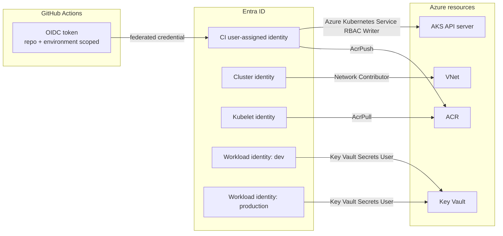
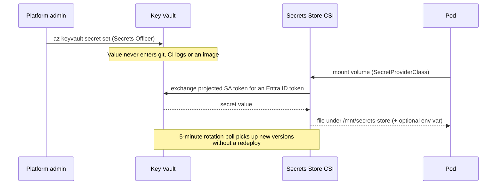

# Security model

## Threat model

The controls below exist to answer specific questions, not to tick boxes. Each
row is a threat and the control that addresses it.

| Threat | Control |
| --- | --- |
| Leaked CI credentials give an attacker Azure access | No stored credentials: GitHub OIDC federation issues a short-lived token, scoped to a named repository and environment |
| A compromised pod reads production secrets | Workload identity is federated to one namespace + service account; a `dev` pod cannot obtain the `production` token |
| A compromised pod escalates to the node | Non-root, no privilege escalation, all capabilities dropped, read-only rootfs, seccomp `RuntimeDefault`, Pod Security Admission `restricted` |
| A compromised pod steals node credentials via IMDS | Egress NetworkPolicy explicitly denies `169.254.169.254/32` |
| A compromised pod scans the cluster | Default-deny NetworkPolicy per namespace; only the ingress controller and the metrics scraper can reach the workload |
| An attacker publishes a malicious image | `AcrPush` is held only by the CI federated identity; content trust and quarantine are enabled on Premium; Trivy gates the pushed image |
| An insider reads production secrets | `Key Vault Secrets User` (read-only) for workloads; the `developer` Role has no `secrets` access; every data-plane call is logged as `AuditEvent` |
| Someone bypasses review by editing the portal | Terraform is the source of truth, the `Repository` tag says so, and drift is visible in the next plan |
| A secret is committed to git | Gitleaks runs on every push and PR with full history |
| A dependency CVE reaches production | pip-audit on the pinned runtime requirements, weekly as well as per-change |

## Identity architecture

Five identities, each with exactly one job. The properties that matter:

- **Nothing is a secret.** Every arrow is a role assignment or a federation, not
  a password.
- **Nothing is subscription-scoped.** The cluster identity gets Network
  Contributor on *the VNet*, not Contributor on the subscription — the
  single most common over-grant in AKS deployments.
- **Push and pull are separate.** Compromising a running pod cannot publish an
  image; compromising CI cannot read secrets.
- **Namespace binding is cryptographic, not conventional.** The federated
  credential's subject is `system:serviceaccount:<namespace>:<name>`. Entra ID
  refuses a token whose projected subject does not match.

### Human access

| Role | Scope | Rights |
| --- | --- | --- |
| Platform admin group | Cluster | `cluster-admin` via `admin_group_object_ids`, ideally PIM-elevated |
| `developer` Role | `production` namespace | Read pods, logs, deployments, HPAs — **not** secrets |
| `operator` Role | `production` namespace | Read, plus restart/scale/patch workloads — **not** RBAC or secrets |
| `Key Vault Secrets Officer` | Key Vault | Humans only; no pipeline holds write access to secrets |

`local_account_disabled = true` means there is no certificate-based admin
kubeconfig to steal, and every API call is attributable to a directory identity.

## Secrets lifecycle

The application reports only *presence* (`secret_bound: true`) and never the
value — enforced by a test (`test_root_never_leaks_secret_value`).

## Container security

| Control | Where |
| --- | --- |
| Multi-stage build; no compiler or pip cache in the runtime image | `app/Dockerfile` |
| Runs as UID/GID 10001, verified in CI | Dockerfile + `app-ci.yml` smoke test |
| Read-only root filesystem, writable `/tmp` only | chart `securityContext` + `emptyDir` |
| All Linux capabilities dropped, no privilege escalation | chart `securityContext` |
| `RuntimeDefault` seccomp profile | chart `podSecurityContext` |
| Base image patched at build time (`apt-get upgrade`) | Dockerfile |
| Trivy gate on `CRITICAL` fixable CVEs before promotion | `cd.yml`, `security.yml` |
| SBOM and provenance attestations attached at push | `cd.yml` (`sbom: true`, `provenance: true`) |
| No `HEALTHCHECK` — Kubernetes probes own health | Dockerfile, justified in `.trivyignore` |

## Network security

Defence in depth, from the outside in:

1. **NSGs** — the ingress subnet accepts 80/443 from configured prefixes; node
   subnets accept traffic only from the ingress subnet; private endpoints are
   VNet-internal.
2. **API server** — restricted to authorized IP ranges in staging and production.
3. **NetworkPolicy** — default-deny per namespace, then the workload chart opens
   exactly three paths: from the ingress namespace, from the metrics scraper, and
   egress to DNS and HTTPS with IMDS explicitly excluded.
4. **Private endpoints** — ACR and Key Vault traffic never traverses the public
   Internet in staging or production; private DNS zones make the FQDNs resolve
   correctly inside the VNet.

## Automated scanning

| Scanner | Scope | Gate |
| --- | --- | --- |
| Checkov | Terraform | Reports to the Security tab; baseline in `.checkov.yaml` |
| Trivy config | Dockerfile, Kubernetes manifests, Terraform | Reports to the Security tab |
| Trivy image | Container image CVEs | **Fails** on fixable `CRITICAL` |
| pip-audit | Pinned runtime dependencies | **Fails** on any known vulnerability |
| Gitleaks | Full git history | **Fails** on a detected secret |

Scheduled weekly as well as per-change, because a dependency that is clean today
can have a published CVE tomorrow with no code change.

## Accepted risks

Every suppression in [`.checkov.yaml`](../.checkov.yaml) and
[`.trivyignore`](../.trivyignore) is a decision. The substantive ones:

| Finding | Decision | What would change it |
| --- | --- | --- |
| Public API server (CKV_AZURE_115) | GitHub-hosted runners cannot reach a private endpoint. Compensated by IP restrictions and disabled local accounts. | Self-hosted runners or a private agent pool; then set `private_cluster_enabled = true` |
| Platform-managed disk keys (CKV_AZURE_117) | Platform-managed keys meet most requirements; CMKs add a key to rotate and protect. | A compliance requirement for key custody; then set `disk_encryption_set_id` |
| Free control-plane tier in dev (CKV_AZURE_170) | A non-production cluster does not need an API-server SLA. | Nothing — this is correct for dev |
| Standard ACR in dev (several) | Premium features cost ~$45/month more per registry. | Nothing — staging and production already use Premium |
| No purge protection in dev/staging (AVD-AZU-0016) | Irreversible, and it holds the vault name for the soft-delete window, which prevents destroy/recreate. | Nothing — production enables it |
| Public ingress (AVD-AZU-0047) | The service is meant to be Internet-facing. | A non-public service; narrow `allowed_ingress_source_prefixes` |

## Reporting

See [SECURITY.md](../SECURITY.md).
