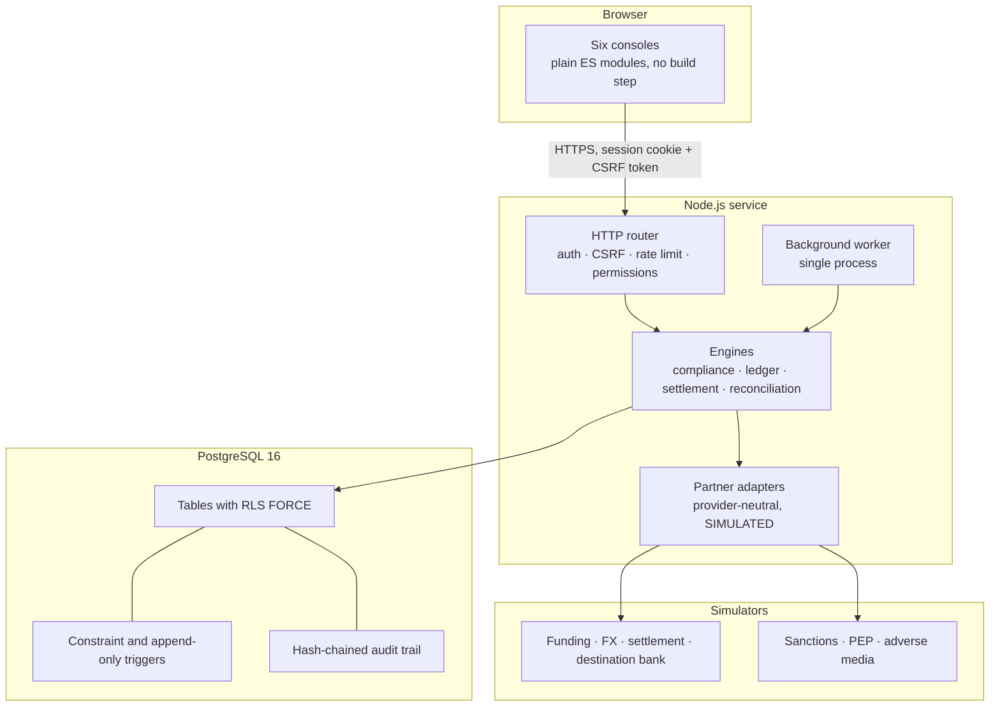

# 02 — System architecture

---

## 1. The idea the architecture is built around

Most of the properties this system has to guarantee are not the kind a careful application can
guarantee. An application that is careful today is careful until somebody adds a feature in a hurry.

So the guarantees live below the application, in the database, where the application cannot reach
around them:

- A journal that does not balance **cannot be committed** — a deferred constraint trigger raises at
  commit time.
- An audit record **cannot be edited** — an append-only trigger raises, and the application's
  database role holds no `UPDATE` or `DELETE` grant on the table anyway.
- One customer **cannot see another's rows** — row-level security with `FORCE`, driven by a
  transaction-local security context.

The application is then free to be ordinary code, because the consequences of its being wrong are
bounded. This is the single most important decision in the build and everything else follows from
it.

## 2. Components



| Component | What it is | Status |
|---|---|---|
| Web consoles | Six role-scoped interfaces, plain ES modules, no framework and no build step | Built |
| HTTP router | Hand-written. Authentication, CSRF, rate limiting, permission checks, the response envelope | Built |
| Engines | Compliance, ledger, settlement state machine, FX quoting, reconciliation | Built |
| Partner adapters | Provider-neutral interfaces with idempotency keys and eleven injectable failure scenarios | Built, **simulated** |
| Background worker | Job table plus a single-process runner | Built, single-instance only |
| PostgreSQL 16 | The enforcement layer | Built |
| Object storage | A managed store for document bytes | **Not connected** |
| Antivirus | A real scanning service | **Not connected** |
| Observability | Metrics, tracing, uptime monitoring | **Not deployed** |
| Identity provider | An external OIDC provider | **Not connected** (authentication is built in) |

## 3. Why there is no build step and no framework

Recorded as founder decision FD-010.

The console runs under a Content-Security-Policy with `default-src 'self'`, no inline script, no
`unsafe-eval`, and no external origin. Meeting that policy with a modern framework means either
loosening the policy or adding a build pipeline and a dependency tree.

The choice was to write a client that fits the policy rather than a policy that fits the client.
The runtime has exactly one dependency, `pg`. There is no bundler, no transpiler for the client,
no CSS framework, and no third-party JavaScript reaching a user's browser. The ZIP, XLSX and PDF
writers used for report exports are written from scratch for the same reason.

The cost is real and is paid in two places. First, some things are more verbose — there is a small
`h()` helper instead of JSX. Second, nothing catches a renamed export at build time, which is a
class of defect a bundler would find for free. `scripts/check-web.mjs` exists to pay that second
cost back: it statically verifies that every named import resolves, that every route names a view
that exists, that every menu item and `navigate()` call points at a real route, and that no module
assigns `innerHTML`, calls `eval`, or converts a monetary value to a JavaScript number.

## 4. The three database roles

Least privilege is meaningless if the application connects as the schema owner.

| Role | Superuser | BYPASSRLS | Rights | Why it exists |
|---|---|---|---|---|
| `ekorails_owner` | no | no | Owns the schema. Runs migrations | Migrations need DDL. Nothing else does |
| `ekorails_app` | no | no | `SELECT`/`INSERT` broadly; `UPDATE`/`DELETE` only where a record is legitimately mutable | What the service connects as. Subject to row-level security like anybody else |
| `ekorails_backup` | no | **yes** | `SELECT` only | `FORCE` row-level security breaks `pg_dump` even for the owner. A backup role that can read everything and change nothing is the honest answer |

`scripts/provision-roles.sh` creates them and then asserts the posture: if `ekorails_owner` or
`ekorails_app` is a superuser, or has `BYPASSRLS`, `CREATEROLE` or `CREATEDB`, it fails with
`PRIVILEGE_POSTURE_VIOLATION` rather than proceeding.

The application role has no `UPDATE` or `DELETE` grant at all on `audit_event`, `journal`,
`journal_entry`, `compliance_decision`, `rule_evaluation`, `transaction_transition`,
`compliance_case_note` or `exception_case_note`. A defect in the service cannot rewrite history,
and neither can an administrator using the service.

## 5. The security context

Every request opens a transaction and sets three transaction-local settings before touching a
table:

```sql
SELECT set_config('ekorails.scope',   $1, true),   -- 'org' or 'system'
       set_config('ekorails.org_id',  $2, true),
       set_config('ekorails.user_id', $3, true);
```

Row-level security policies read those settings. Because they are transaction-local (`true`), they
cannot leak between requests through a pooled connection: the value dies with the transaction
whether it commits or rolls back.

A back-office role runs in `system` scope, which sees across organisations. A customer runs in
`org` scope and sees only their own rows — not because the query filters, but because the database
does. A query that forgot its `WHERE organization_id = ...` returns nothing extra.

## 6. Request path

1. **Security headers** on every response, including errors: strict CSP with a per-response nonce,
   `X-Content-Type-Options: nosniff`, `X-Frame-Options: DENY`, `Referrer-Policy: no-referrer`,
   `Cache-Control: no-store`, HSTS, and the environment banner.
2. **Rate limiting**, keyed on the session where there is one and on a hashed network address
   otherwise. Authentication endpoints are limited far more tightly than reads.
3. **Authentication** — an opaque session token from an `HttpOnly`, `Secure`, `SameSite=Strict`
   cookie, resolved to a principal. A session with an outstanding second factor can reach `/api/me`
   and nothing else.
4. **CSRF** — a double-submit token for every state-changing request. The token is readable by the
   client on purpose: it is not a secret from the client, only from other origins.
5. **Permission check** against the route's declared requirement.
6. **Handler**, inside a transaction with the security context set.
7. **Response envelope** — `data` plus `meta` carrying the environment, the banner and a request id.

Every step that refuses writes an audit event. A trail containing only successes tells you nothing
about what somebody tried to do.

## 7. Where the money logic lives

| Concern | Where it is enforced | Why there |
|---|---|---|
| Precision | `NUMERIC(24,6)` columns; BigInt-backed `Decimal` in the application | The type system cannot lose a kobo; a JavaScript number can |
| Balance | Deferred constraint trigger at commit | The application can be wrong; the commit cannot succeed |
| Immutability | Append-only triggers plus withheld grants | Two independent mechanisms, either sufficient |
| Derivation | Balances are always summed from entries, never stored | A stored balance is a second source of truth waiting to drift |
| Correction | Reversal journals only | Both the mistake and the correction stay visible |

## 8. Failure modes the architecture takes seriously

**The partner does not answer.** The instruction may or may not have been executed. Retrying is how
a payment is made twice. So the transaction moves to `under_investigation`, automatic retry is
disabled, and a person has to establish the true position before anything else happens.

**The same instruction is sent twice.** Every partner call carries a deterministic idempotency key
derived from the transaction and the operation. A repeat returns `duplicate_ignored` and instructs
no second payment.

**Less settles than was instructed.** The paid portion discharges that much of the obligation; the
shortfall posts to settlement suspense with an owner. It is never written off quietly.

**The destination bank returns the money.** A return is a new event. The original settlement is not
reversed, because erasing it would hide what happened.

**Our record and the partner's disagree.** Reconciliation opens a break and leaves both records
alone. A person explains the difference, and above the four-eyes threshold a second person approves
the closure.

## 9. Deployment shape

`infra/` carries a Terraform skeleton and `docker-compose.yml` runs the whole thing locally. Both
are starting points, and the honest position is that this system has never been deployed anywhere
but a developer machine and this repository's CI.

Data residency is **unresolved** (founder decision FD-008). No region has been selected and no
residency claim is made anywhere in this software. African ownership is not African data residency,
and the two are not conflated here.

## 10. What would have to change for live money

Nine release gates, each requiring named evidence, none of them settable from any interface:

| Gate | Evidence |
|---|---|
| `EKORAILS_GATE_REGULATORY_APPROVAL` | A written approval or admission letter |
| `EKORAILS_GATE_LICENCE_VERIFIED` | Verification of the licence under which each activity is performed |
| `EKORAILS_GATE_PARTNER_CONTRACTS` | Executed agreements with every partner named in the flow |
| `EKORAILS_GATE_SECURITY_REVIEW` | An independent review, with findings closed |
| `EKORAILS_GATE_PRIVACY_REVIEW` | A completed privacy impact and cross-border transfer assessment |
| `EKORAILS_GATE_OPERATIONAL_CONTROLS` | Documented and rehearsed operational procedures |
| `EKORAILS_GATE_DR_TESTED` | An evidenced restoration test |
| `EKORAILS_GATE_RECONCILIATION_SIGNOFF` | Reconciliation signed off over a sustained period |
| `EKORAILS_GATE_BOARD_APPROVAL` | A recorded board decision |

In `PRODUCTION` mode the process refuses to start with any gate unmet. In this build,
`assertLiveMoneyPermitted()` throws unconditionally, regardless of configuration.
