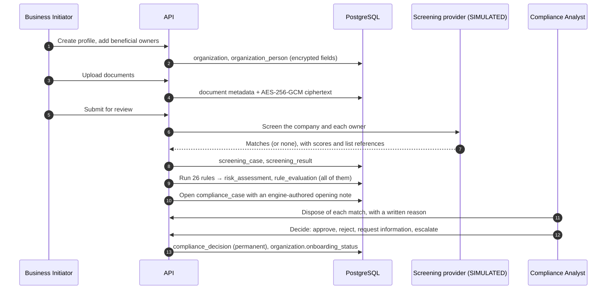
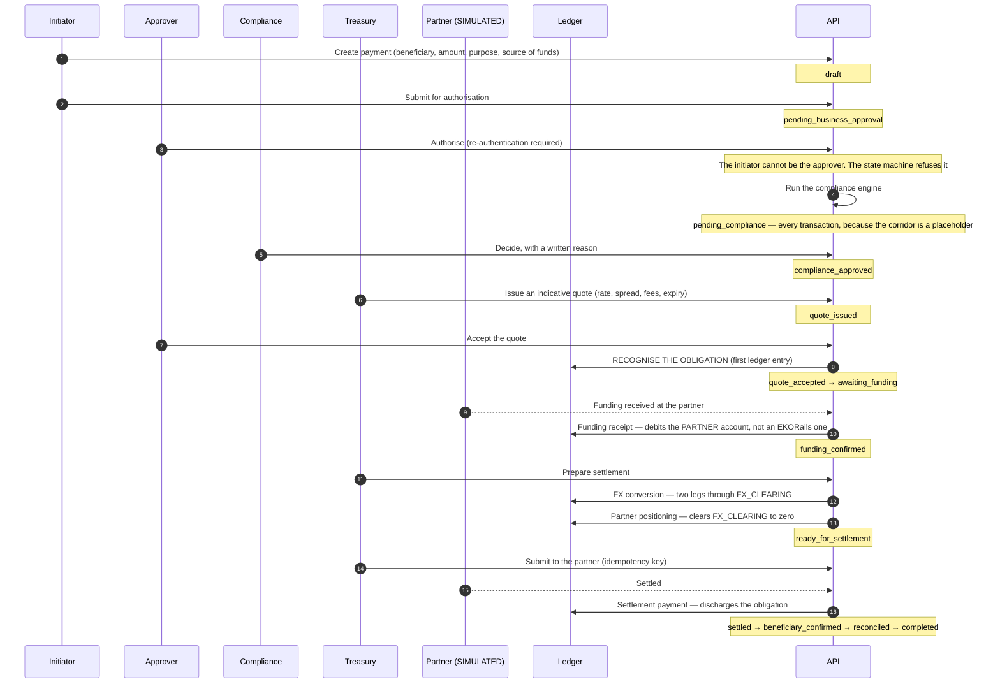
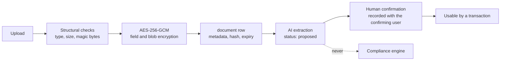
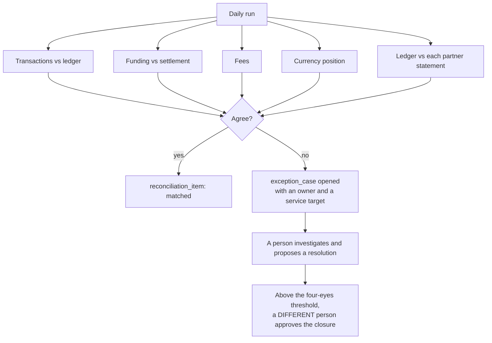
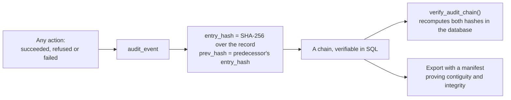

# 03 — Data flows

Five flows, each traced from the act that starts it to the record it leaves behind. For each: what
moves, who touches it, what is written, and where it can go wrong.

---

## Flow 1 — Onboarding a business

**What is written that cannot later be changed:** every rule evaluation including the ones that did
not fire, every screening result, every disposition and its reason, every decision and its reason,
and an audit event for each.

**Personal data in this flow:** names, dates of birth, nationalities, identification numbers and
addresses of beneficial owners. Identification numbers and addresses are encrypted at field level
with AES-256-GCM under a key derived through HKDF. They are masked for every role except where an
explicit unmasking permission is held, and unmasking is audited.

**Where it goes wrong:** a name collides with a sanctioned person. That is the ordinary case, not
the exception. The system never resolves it automatically — a person compares dates of birth,
nationalities and identifiers and records what distinguished them.

---

## Flow 2 — A payment, end to end

**Ledger entries, in order:** obligation recognition, funding receipt, FX conversion (two legs),
partner positioning, settlement payment, fee payment. Every one balances within each currency; the
database refuses it otherwise.

**Where the money is at each point.** This is the question that decides whether EKORails is
performing a licensed activity, so it is worth stating flatly:

| State | Where the customer's money is |
|---|---|
| Before funding | With the customer |
| `awaiting_funding` | With the customer. EKORails has recorded an obligation, not received value |
| `funding_confirmed` | With the **licensed partner institution** |
| `ready_for_settlement` | With the partner, converted |
| `settled` | With the beneficiary's bank |

At no point is it with EKORails. There is no account in the chart of accounts that could record it
being with EKORails, which is a stronger statement than a policy.

---

## Flow 3 — A document

The dotted line is the point of the diagram. Extraction output is written to a separate table with
status `proposed`. The compliance engine never reads it. It cannot reach a transaction without an
explicit confirmation event carrying the confirming user's identity.

The word "verified" is not used about extraction anywhere in this system, and the claims lint fails
the build on `AI verif|validat|confirm|check` unless the surrounding text says it is advisory.

**What the structural checks are not:** they are not antivirus. No scanning service is connected.
That is stated on the upload screen, in the risk register as `R-12`, and here.

---

## Flow 4 — Reconciliation

Five comparisons run daily, plus one per settlement partner. A difference never resolves itself and
is never resolved by overwriting one side. Both records stay as they are; what closes the break is
the explanation.

The result types and what each means:

| Result | Means |
|---|---|
| `matched` | Both sides agree on reference and amount |
| `amount_difference` | Both have the record, amounts differ. Somebody says which is right and why |
| `missing_partner_record` | We have it, they do not. Either it never arrived or their file is late |
| `missing_internal_record` | They have it, we do not. **The more serious direction** — money may have moved without us knowing |
| `duplicate` | The same item twice on one side. A payment risk until proven otherwise |

---

## Flow 5 — Audit

Every entry carries the hash of its predecessor and a hash over its own contents. Verification is a
SQL function: it recomputes both inside the database and does not depend on the application being
honest about anything.

The application's database role holds no `UPDATE` or `DELETE` grant on the table, and an
append-only trigger raises even for the table owner. There is a deliberately permissive RLS policy
for `UPDATE` and `DELETE` so that an attempt reaches the trigger and fails **loudly**, rather than
being silently filtered to zero rows — a silent no-op looks like success to whoever tried.

**Refusals are recorded exactly as carefully as successes.** A separation-of-duties refusal, a
denied permission, a failed sign-in and a rejected step-up all leave a record. An audit trail
containing only successes tells you nothing about what somebody tried to do.

---

## Cross-cutting: what never enters a log

Enforced by a redaction layer over structured logging, and asserted by an automated test that
exercises the real logging path and searches its output.

Never logged, in any form:

- passwords, or anything derived from one
- authentication tokens, session tokens or CSRF tokens
- complete identification numbers
- full bank-account credentials
- private cryptographic keys or the material they are derived from
- unmasked sensitive documents or their contents

What is logged instead: a hashed network address, a hashed user agent, a request id, a correlation
id, the route, the outcome and the duration. Enough to investigate; not enough to impersonate.
