<!--
  GENERATED FILE — do not edit.

  Produced by scripts/generate-docs.mjs from the definitions the software actually
  uses. If this document is wrong, the code is wrong: change the code and regenerate.
  `node scripts/generate-docs.mjs --check` fails the build when the two disagree.
-->

# 04 — Data model

75 tables across 14 migrations.

## The properties this schema is responsible for

The database is the enforcement layer, not a store the application writes to. Three
things are true of it that no amount of careful application code could guarantee:

- **Money is fixed-precision.** Every monetary column is `NUMERIC(24,6)` and every
  exchange rate is `NUMERIC(24,12)`. No monetary value is ever stored as a floating-point
  number, anywhere, and the application reads them as strings so IEEE-754 never touches
  a figure that represents money.
- **A journal that does not balance cannot be committed.** A deferred constraint trigger
  sums each journal by currency at commit time and raises if the sum is not zero.
- **Evidence cannot be edited.** Audit events, journal entries, compliance decisions,
  transitions and case notes carry append-only triggers, and the application role holds
  no `UPDATE` or `DELETE` grant on them. A bug in the application cannot rewrite history.

## Monetary columns (0)

Every one is `NUMERIC(24,6)`.

_None._

## Exchange-rate columns (0)

Every one is `NUMERIC(24,12)`. Rates carry more precision than money because a rate is
multiplied by a large amount, and rounding the rate rounds the result by much more.

_None._

## Entity relationships

Rendered as a diagram below and listed in full afterwards. Read the arrows as
"references": the source table holds a foreign key into the target.

```mermaid
erDiagram
  role ||--o{ role_permission : "role_code"
  permission ||--o{ role_permission : "permission_code"
  organization ||--o{ app_user : "organization_id"
  app_user ||--o{ user_role : "user_id"
  role ||--o{ user_role : "role_code"
  app_user ||--o{ user_session : "user_id"
  app_user ||--o{ login_attempt : "user_id"
  app_user ||--o{ break_glass_request : "requested_by"
  organization ||--o{ organization_profile : "organization_id"
  app_user ||--o{ organization_profile : "submitted_by"
  organization ||--o{ natural_person : "organization_id"
  organization_profile ||--o{ natural_person : "profile_id"
  natural_person ||--o{ person_capacity : "person_id"
  organization ||--o{ person_capacity : "organization_id"
  organization ||--o{ bank_account : "organization_id"
  organization ||--o{ beneficiary : "organization_id"
  bank_account ||--o{ beneficiary : "bank_account_id"
  app_user ||--o{ beneficiary : "approved_by"
  organization ||--o{ document : "organization_id"
  app_user ||--o{ document : "uploaded_by"
  document ||--o{ document_access : "document_id"
  app_user ||--o{ document_access : "user_id"
  document ||--o{ document_extraction : "document_id"
  organization ||--o{ document_extraction : "organization_id"
  app_user ||--o{ document_extraction : "confirmed_by"
  app_user ||--o{ risk_rule : "created_by"
  organization ||--o{ screening_case : "organization_id"
  app_user ||--o{ screening_case : "disposed_by"
  screening_case ||--o{ screening_result : "screening_case_id"
  organization ||--o{ risk_assessment : "organization_id"
  risk_assessment ||--o{ rule_evaluation : "risk_assessment_id"
  risk_rule ||--o{ rule_evaluation : "rule_id"
  organization ||--o{ compliance_case : "organization_id"
  risk_assessment ||--o{ compliance_case : "risk_assessment_id"
  app_user ||--o{ compliance_case : "assigned_to"
  compliance_case ||--o{ compliance_decision : "compliance_case_id"
  organization ||--o{ compliance_decision : "organization_id"
  app_user ||--o{ compliance_decision : "decided_by"
  role ||--o{ compliance_decision : "decided_by_role"
  risk_assessment ||--o{ compliance_decision : "risk_assessment_id"
  compliance_case ||--o{ compliance_case_note : "compliance_case_id"
  app_user ||--o{ compliance_case_note : "author_id"
  organization ||--o{ fx_quote : "organization_id"
  corridor ||--o{ fx_quote : "corridor_id"
  app_user ||--o{ fx_quote : "accepted_by"
  organization ||--o{ transaction : "organization_id"
  beneficiary ||--o{ transaction : "beneficiary_id"
  corridor ||--o{ transaction : "corridor_id"
  fx_quote ||--o{ transaction : "fx_quote_id"
  app_user ||--o{ transaction : "initiated_by"
  risk_assessment ||--o{ transaction : "latest_risk_assessment_id"
  transaction ||--o{ transaction_approval : "transaction_id"
  organization ||--o{ transaction_approval : "organization_id"
  app_user ||--o{ transaction_approval : "decided_by"
  role ||--o{ transaction_approval : "decided_by_role"
  transaction ||--o{ transaction_document : "transaction_id"
  document ||--o{ transaction_document : "document_id"
  app_user ||--o{ transaction_document : "linked_by"
  transaction ||--o{ transaction_transition : "transaction_id"
  organization ||--o{ transaction_transition : "organization_id"
  app_user ||--o{ transaction_transition : "actor_user_id"
  role ||--o{ transaction_transition : "actor_role"
  transaction ||--o{ funding_instruction : "transaction_id"
  organization ||--o{ funding_instruction : "organization_id"
  app_user ||--o{ funding_instruction : "confirmed_by"
  transaction ||--o{ settlement_instruction : "transaction_id"
  organization ||--o{ settlement_instruction : "organization_id"
  app_user ||--o{ settlement_instruction : "released_by"
  organization ||--o{ ledger_account : "organization_id"
  transaction ||--o{ journal : "transaction_id"
  organization ||--o{ journal : "organization_id"
  app_user ||--o{ journal : "posted_by"
  journal ||--o{ journal_entry : "journal_id"
  ledger_account ||--o{ journal_entry : "ledger_account_id"
  organization ||--o{ journal_entry : "organization_id"
  transaction ||--o{ journal_entry : "transaction_id"
  partner ||--o{ partner_account : "partner_id"
  ledger_account ||--o{ partner_account : "ledger_account_id"
  partner ||--o{ outbound_idempotency : "partner_id"
  transaction ||--o{ outbound_idempotency : "transaction_id"
  partner ||--o{ integration_event : "partner_id"
  transaction ||--o{ integration_event : "transaction_id"
  organization ||--o{ integration_event : "organization_id"
  partner ||--o{ simulation_directive : "partner_id"
  transaction ||--o{ simulation_directive : "transaction_id"
  app_user ||--o{ simulation_directive : "created_by"
  organization ||--o{ webhook_endpoint : "organization_id"
  webhook_endpoint ||--o{ webhook_delivery : "endpoint_id"
  partner ||--o{ partner_statement : "partner_id"
  partner_statement ||--o{ partner_statement_line : "statement_id"
  partner ||--o{ reconciliation_run : "partner_id"
  app_user ||--o{ reconciliation_run : "started_by"
  reconciliation_run ||--o{ reconciliation_item : "run_id"
  reconciliation_item ||--o{ exception_case : "reconciliation_item_id"
  transaction ||--o{ exception_case : "transaction_id"
  organization ||--o{ exception_case : "organization_id"
  partner ||--o{ exception_case : "partner_id"
  app_user ||--o{ exception_case : "owner_id"
  journal ||--o{ exception_case : "resolution_journal_id"
  exception_case ||--o{ exception_case_note : "exception_case_id"
  app_user ||--o{ exception_case_note : "author_id"
  app_user ||--o{ audit_event : "actor_user_id"
  organization ||--o{ audit_event : "organization_id"
  transaction ||--o{ audit_event : "transaction_id"
  organization ||--o{ notification : "organization_id"
  app_user ||--o{ notification : "recipient_user_id"
  role ||--o{ notification : "recipient_role"
  transaction ||--o{ notification : "transaction_id"
  organization ||--o{ support_case : "organization_id"
  app_user ||--o{ support_case : "owner_id"
  transaction ||--o{ support_case : "transaction_id"
  compliance_case ||--o{ support_case : "compliance_case_id"
  exception_case ||--o{ support_case : "exception_case_id"
  support_case ||--o{ support_case_message : "support_case_id"
  app_user ||--o{ support_case_message : "author_id"
  document ||--o{ support_case_message : "attachment_document_id"
  support_case ||--o{ complaint : "support_case_id"
  organization ||--o{ complaint : "organization_id"
  app_user ||--o{ security_incident : "owner_id"
  organization ||--o{ data_subject_request : "organization_id"
  natural_person ||--o{ data_subject_request : "subject_person_id"
  app_user ||--o{ data_subject_request : "handled_by"
  app_user ||--o{ report : "generated_by"
  app_user ||--o{ system_configuration : "proposed_by"
  app_user ||--o{ feature_flag : "changed_by"
  corridor ||--o{ fee_schedule : "corridor_id"
  app_user ||--o{ fee_schedule : "approved_by"
  corridor ||--o{ required_document_rule : "corridor_id"
  organization ||--o{ velocity_counter : "organization_id"
  learning_module ||--o{ learning_assessment_question : "module_key"
  app_user ||--o{ learning_assessment_attempt : "user_id"
  learning_module ||--o{ learning_assessment_attempt : "module_key"
```

## Tables

### `environment_stamp`

Defined in `db/migrations/001_foundation.sql`.

| Column | Type | Required | References | Permitted values |
|---|---|---|---|---|
| `id` | `SMALLINT` | no | — | — |
| `mode` | `TEXT` | yes | — | DEMO, SANDBOX, CONTROLLED_PILOT, PRODUCTION |
| `live_funds` | `BOOLEAN` | yes | — | — |
| `first_booted_at` | `TIMESTAMPTZ` | yes | — | — |
| `last_booted_at` | `TIMESTAMPTZ` | yes | — | — |

### `schema_migration`

Defined in `db/migrations/001_foundation.sql`.

| Column | Type | Required | References | Permitted values |
|---|---|---|---|---|
| `version` | `TEXT` | no | — | — |
| `applied_at` | `TIMESTAMPTZ` | yes | — | — |
| `checksum` | `sha256_hex` | yes | — | — |

### `role`

Defined in `db/migrations/002_identity.sql`.

| Column | Type | Required | References | Permitted values |
|---|---|---|---|---|
| `code` | `TEXT` | no | — | — |
| `name` | `TEXT` | yes | — | — |
| `description` | `TEXT` | yes | — | — |
| `realm` | `TEXT` | yes | — | business, backoffice, external, platform |
| `requires_step_up` | `BOOLEAN` | yes | — | — |
| `is_break_glass` | `BOOLEAN` | yes | — | — |
| `created_at` | `TIMESTAMPTZ` | yes | — | — |

### `permission`

Defined in `db/migrations/002_identity.sql`.

| Column | Type | Required | References | Permitted values |
|---|---|---|---|---|
| `code` | `TEXT` | no | — | — |
| `description` | `TEXT` | yes | — | — |
| `domain` | `TEXT` | yes | — | — |
| `is_sensitive` | `BOOLEAN` | yes | — | — |

### `role_permission`

Defined in `db/migrations/002_identity.sql`.

| Column | Type | Required | References | Permitted values |
|---|---|---|---|---|
| `role_code` | `TEXT` | yes | `role` | — |
| `permission_code` | `TEXT` | yes | `permission` | — |

### `organization`

Defined in `db/migrations/002_identity.sql`.

| Column | Type | Required | References | Permitted values |
|---|---|---|---|---|
| `id` | `UUID` | no | — | — |
| `display_code` | `TEXT` | yes | — | — |
| `legal_name` | `TEXT` | yes | — | — |
| `trading_name` | `TEXT` | no | — | — |
| `kind` | `TEXT` | yes | — | customer, internal |
| `onboarding_status` | `TEXT` | yes | — | — |
| `risk_rating` | `TEXT` | no | — | low, medium, high, prohibited |
| `suspended_at` | `TIMESTAMPTZ` | no | — | — |
| `suspension_reason` | `TEXT` | no | — | — |
| `created_at` | `TIMESTAMPTZ` | yes | — | — |
| `updated_at` | `TIMESTAMPTZ` | yes | — | — |

### `app_user`

Defined in `db/migrations/002_identity.sql`.

| Column | Type | Required | References | Permitted values |
|---|---|---|---|---|
| `id` | `UUID` | no | — | — |
| `organization_id` | `UUID` | no | `organization` | — |
| `email` | `TEXT` | yes | — | — |
| `email_normalised` | `TEXT` | yes | — | — |
| `full_name` | `TEXT` | yes | — | — |
| `display_name` | `TEXT` | yes | — | — |
| `password_hash` | `TEXT` | no | — | — |
| `password_algo` | `TEXT` | yes | — | — |
| `password_updated_at` | `TIMESTAMPTZ` | no | — | — |
| `password_history` | `JSONB` | yes | — | — |
| `must_change_password` | `BOOLEAN` | yes | — | — |
| `mfa_enrolled` | `BOOLEAN` | yes | — | — |
| `mfa_secret_encrypted` | `TEXT` | no | — | — |
| `mfa_recovery_codes` | `JSONB` | yes | — | — |
| `mfa_last_used_step` | `BIGINT` | no | — | — |
| `status` | `TEXT` | yes | — | — |
| `failed_login_count` | `INTEGER` | yes | — | — |
| `locked_until` | `TIMESTAMPTZ` | no | — | — |
| `last_login_at` | `TIMESTAMPTZ` | no | — | — |
| `last_login_ip_hash` | `sha256_hex` | no | — | — |
| `created_at` | `TIMESTAMPTZ` | yes | — | — |
| `updated_at` | `TIMESTAMPTZ` | yes | — | — |

### `user_role`

Defined in `db/migrations/002_identity.sql`.

| Column | Type | Required | References | Permitted values |
|---|---|---|---|---|
| `user_id` | `UUID` | yes | `app_user` | — |
| `role_code` | `TEXT` | yes | `role` | — |
| `granted_at` | `TIMESTAMPTZ` | yes | — | — |
| `granted_by` | `UUID` | no | `app_user` | — |
| `expires_at` | `TIMESTAMPTZ` | no | — | — |
| `reason` | `TEXT` | no | — | — |

### `user_session`

Defined in `db/migrations/002_identity.sql`.

| Column | Type | Required | References | Permitted values |
|---|---|---|---|---|
| `id` | `UUID` | no | — | — |
| `user_id` | `UUID` | yes | `app_user` | — |
| `token_hash` | `sha256_hex` | yes | — | — |
| `csrf_token_hash` | `sha256_hex` | yes | — | — |
| `mfa_satisfied` | `BOOLEAN` | yes | — | — |
| `step_up_until` | `TIMESTAMPTZ` | no | — | — |
| `user_agent_hash` | `sha256_hex` | no | — | — |
| `ip_hash` | `sha256_hex` | no | — | — |
| `created_at` | `TIMESTAMPTZ` | yes | — | — |
| `last_seen_at` | `TIMESTAMPTZ` | yes | — | — |
| `absolute_expiry` | `TIMESTAMPTZ` | yes | — | — |
| `idle_expiry` | `TIMESTAMPTZ` | yes | — | — |
| `revoked_at` | `TIMESTAMPTZ` | no | — | — |
| `revoked_reason` | `TEXT` | no | — | — |

### `login_attempt`

Defined in `db/migrations/002_identity.sql`.

| Column | Type | Required | References | Permitted values |
|---|---|---|---|---|
| `id` | `BIGSERIAL` | no | — | — |
| `email_hash` | `sha256_hex` | yes | — | — |
| `user_id` | `UUID` | no | `app_user` | — |
| `succeeded` | `BOOLEAN` | yes | — | — |
| `failure_reason` | `TEXT` | no | — | — |
| `ip_hash` | `sha256_hex` | no | — | — |
| `user_agent_hash` | `sha256_hex` | no | — | — |
| `occurred_at` | `TIMESTAMPTZ` | yes | — | — |

### `break_glass_request`

Defined in `db/migrations/002_identity.sql`.

| Column | Type | Required | References | Permitted values |
|---|---|---|---|---|
| `id` | `UUID` | no | — | — |
| `requested_by` | `UUID` | yes | `app_user` | — |
| `reason` | `TEXT` | yes | — | — |
| `requested_at` | `TIMESTAMPTZ` | yes | — | — |
| `requested_minutes` | `INTEGER` | yes | — | — |
| `status` | `TEXT` | yes | — | — |
| `approved_by` | `UUID` | no | `app_user` | — |
| `approved_at` | `TIMESTAMPTZ` | no | — | — |
| `decision_note` | `TEXT` | no | — | — |
| `activated_at` | `TIMESTAMPTZ` | no | — | — |
| `expires_at` | `TIMESTAMPTZ` | no | — | — |
| `revoked_at` | `TIMESTAMPTZ` | no | — | — |

### `organization_profile`

Defined in `db/migrations/003_onboarding.sql`.

| Column | Type | Required | References | Permitted values |
|---|---|---|---|---|
| `id` | `UUID` | no | — | — |
| `organization_id` | `UUID` | yes | `organization` | — |
| `version` | `INTEGER` | yes | — | — |
| `is_current` | `BOOLEAN` | yes | — | — |
| `legal_business_name` | `TEXT` | yes | — | — |
| `trading_name` | `TEXT` | no | — | — |
| `registration_number` | `TEXT` | yes | — | — |
| `jurisdiction` | `country_code` | yes | — | — |
| `date_of_incorporation` | `DATE` | yes | — | — |
| `registered_address` | `JSONB` | yes | — | — |
| `operating_address` | `JSONB` | yes | — | — |
| `business_activity` | `TEXT` | yes | — | — |
| `industry_code` | `TEXT` | yes | — | — |
| `website` | `TEXT` | no | — | — |
| `tax_identification_number` | `TEXT` | no | — | — |
| `regulatory_licence` | `JSONB` | no | — | — |
| `expected_corridors` | `JSONB` | yes | — | — |
| `expected_monthly_volume` | `money_amount` | no | — | — |
| `expected_monthly_currency` | `currency_code` | no | — | — |
| `expected_transaction_size` | `money_amount` | no | — | — |
| `expected_txn_currency` | `currency_code` | no | — | — |
| `source_of_funds` | `TEXT` | yes | — | — |
| `purpose_of_transactions` | `TEXT` | yes | — | — |
| `submitted_at` | `TIMESTAMPTZ` | no | — | — |
| `submitted_by` | `UUID` | no | `app_user` | — |
| `created_at` | `TIMESTAMPTZ` | yes | — | — |
| `updated_at` | `TIMESTAMPTZ` | yes | — | — |

### `natural_person`

Defined in `db/migrations/003_onboarding.sql`.

| Column | Type | Required | References | Permitted values |
|---|---|---|---|---|
| `id` | `UUID` | no | — | — |
| `organization_id` | `UUID` | yes | `organization` | — |
| `profile_id` | `UUID` | yes | `organization_profile` | — |
| `full_name` | `TEXT` | yes | — | — |
| `date_of_birth` | `DATE` | no | — | — |
| `nationality` | `country_code` | no | — | — |
| `country_of_residence` | `country_code` | no | — | — |
| `residential_address` | `JSONB` | no | — | — |
| `id_document_type` | `TEXT` | no | — | — |
| `id_number_encrypted` | `TEXT` | no | — | — |
| `id_number_last4` | `CHAR(4)` | no | — | — |
| `id_number_fingerprint` | `sha256_hex` | no | — | — |
| `id_expires_on` | `DATE` | no | — | — |
| `is_pep` | `BOOLEAN` | yes | — | — |
| `pep_declaration` | `TEXT` | no | — | — |
| `pep_category` | `TEXT` | no | — | — |
| `verification_status` | `TEXT` | yes | — | — |
| `created_at` | `TIMESTAMPTZ` | yes | — | — |
| `updated_at` | `TIMESTAMPTZ` | yes | — | — |

### `person_capacity`

Defined in `db/migrations/003_onboarding.sql`.

| Column | Type | Required | References | Permitted values |
|---|---|---|---|---|
| `id` | `UUID` | no | — | — |
| `person_id` | `UUID` | yes | `natural_person` | — |
| `organization_id` | `UUID` | yes | `organization` | — |
| `capacity` | `TEXT` | yes | — | — |
| `appointed_on` | `DATE` | no | — | — |
| `resigned_on` | `DATE` | no | — | — |
| `ownership_percent` | `NUMERIC(7` | no | — | — |
| `ownership_is_direct` | `BOOLEAN` | no | — | — |
| `control_basis` | `TEXT` | no | — | — |
| `created_at` | `TIMESTAMPTZ` | yes | — | — |

### `bank_account`

Defined in `db/migrations/003_onboarding.sql`.

| Column | Type | Required | References | Permitted values |
|---|---|---|---|---|
| `id` | `UUID` | no | — | — |
| `organization_id` | `UUID` | yes | `organization` | — |
| `ownership` | `TEXT` | yes | — | own, beneficiary |
| `account_holder_name` | `TEXT` | yes | — | — |
| `institution_name` | `TEXT` | yes | — | — |
| `institution_country` | `country_code` | yes | — | — |
| `swift_bic` | `TEXT` | no | — | — |
| `identifier_scheme` | `TEXT` | yes | — | iban, nuban, account_number, sort_code_account, other |
| `identifier_encrypted` | `TEXT` | yes | — | — |
| `identifier_last4` | `CHAR(4)` | yes | — | — |
| `identifier_fingerprint` | `sha256_hex` | yes | — | — |
| `currency` | `currency_code` | yes | — | — |
| `verification_status` | `TEXT` | yes | — | — |
| `verification_evidence_id` | `UUID` | no | — | — |
| `created_at` | `TIMESTAMPTZ` | yes | — | — |
| `updated_at` | `TIMESTAMPTZ` | yes | — | — |

### `beneficiary`

Defined in `db/migrations/003_onboarding.sql`.

| Column | Type | Required | References | Permitted values |
|---|---|---|---|---|
| `id` | `UUID` | no | — | — |
| `organization_id` | `UUID` | yes | `organization` | — |
| `display_code` | `TEXT` | yes | — | — |
| `legal_name` | `TEXT` | yes | — | — |
| `registration_number` | `TEXT` | no | — | — |
| `country` | `country_code` | yes | — | — |
| `address` | `JSONB` | yes | — | — |
| `bank_account_id` | `UUID` | yes | `bank_account` | — |
| `payment_purpose` | `TEXT` | yes | — | — |
| `relationship_to_sender` | `TEXT` | yes | — | — |
| `supporting_contract_id` | `UUID` | no | — | — |
| `status` | `TEXT` | yes | — | — |
| `requires_rereview` | `BOOLEAN` | yes | — | — |
| `rereview_reason` | `TEXT` | no | — | — |
| `material_fingerprint` | `sha256_hex` | yes | — | — |
| `approved_at` | `TIMESTAMPTZ` | no | — | — |
| `approved_by` | `UUID` | no | `app_user` | — |
| `first_used_at` | `TIMESTAMPTZ` | no | — | — |
| `created_by` | `UUID` | yes | `app_user` | — |
| `created_at` | `TIMESTAMPTZ` | yes | — | — |
| `updated_at` | `TIMESTAMPTZ` | yes | — | — |

### `document`

Defined in `db/migrations/003_onboarding.sql`.

| Column | Type | Required | References | Permitted values |
|---|---|---|---|---|
| `id` | `UUID` | no | — | — |
| `organization_id` | `UUID` | yes | `organization` | — |
| `document_type` | `TEXT` | yes | — | — |
| `version` | `INTEGER` | yes | — | — |
| `supersedes_id` | `UUID` | no | `document` | — |
| `is_current` | `BOOLEAN` | yes | — | — |
| `original_filename` | `TEXT` | yes | — | — |
| `mime_type` | `TEXT` | yes | — | — |
| `byte_size` | `BIGINT` | yes | — | — |
| `content_sha256` | `sha256_hex` | yes | — | — |
| `storage_key` | `TEXT` | yes | — | — |
| `encryption_key_id` | `TEXT` | yes | — | — |
| `malware_scan_status` | `TEXT` | yes | — | — |
| `malware_scan_at` | `TIMESTAMPTZ` | no | — | — |
| `malware_scanner` | `TEXT` | no | — | — |
| `issued_on` | `DATE` | no | — | — |
| `expires_on` | `DATE` | no | — | — |
| `expiry_notified_at` | `TIMESTAMPTZ` | no | — | — |
| `classification` | `TEXT` | yes | — | — |
| `retention_until` | `DATE` | no | — | — |
| `legal_hold` | `BOOLEAN` | yes | — | — |
| `uploaded_by` | `UUID` | yes | `app_user` | — |
| `created_at` | `TIMESTAMPTZ` | yes | — | — |
| `updated_at` | `TIMESTAMPTZ` | yes | — | — |

### `document_access`

Defined in `db/migrations/003_onboarding.sql`.

| Column | Type | Required | References | Permitted values |
|---|---|---|---|---|
| `id` | `BIGSERIAL` | no | — | — |
| `document_id` | `UUID` | yes | `document` | — |
| `user_id` | `UUID` | yes | `app_user` | — |
| `action` | `TEXT` | yes | — | metadata_read, url_minted, downloaded, denied |
| `reason` | `TEXT` | no | — | — |
| `session_id` | `UUID` | no | — | — |
| `occurred_at` | `TIMESTAMPTZ` | yes | — | — |

### `document_extraction`

Defined in `db/migrations/003_onboarding.sql`.

| Column | Type | Required | References | Permitted values |
|---|---|---|---|---|
| `id` | `UUID` | no | — | — |
| `document_id` | `UUID` | yes | `document` | — |
| `organization_id` | `UUID` | yes | `organization` | — |
| `extractor` | `TEXT` | yes | — | — |
| `extractor_version` | `TEXT` | yes | — | — |
| `proposed_fields` | `JSONB` | yes | — | — |
| `field_confidence` | `JSONB` | yes | — | — |
| `status` | `TEXT` | yes | — | — |
| `confirmed_fields` | `JSONB` | no | — | — |
| `confirmed_by` | `UUID` | no | `app_user` | — |
| `confirmed_at` | `TIMESTAMPTZ` | no | — | — |
| `created_at` | `TIMESTAMPTZ` | yes | — | — |

### `risk_rule`

Defined in `db/migrations/004_compliance.sql`.

| Column | Type | Required | References | Permitted values |
|---|---|---|---|---|
| `id` | `UUID` | no | — | — |
| `rule_key` | `TEXT` | yes | — | — |
| `version` | `INTEGER` | yes | — | — |
| `name` | `TEXT` | yes | — | — |
| `category` | `TEXT` | yes | — | — |
| `risk_addressed` | `TEXT` | yes | — | — |
| `trigger_condition` | `TEXT` | yes | — | — |
| `required_evidence` | `TEXT` | yes | — | — |
| `automated_action` | `TEXT` | yes | — | — |
| `human_decision` | `TEXT` | yes | — | — |
| `false_positive_risk` | `TEXT` | yes | — | — |
| `policy_basis` | `TEXT` | yes | — | — |
| `parameters` | `JSONB` | yes | — | — |
| `severity` | `TEXT` | yes | — | low, medium, high, prohibited |
| `on_trigger_action` | `TEXT` | yes | — | — |
| `status` | `TEXT` | yes | — | draft, active, retired |
| `effective_from` | `TIMESTAMPTZ` | yes | — | — |
| `effective_to` | `TIMESTAMPTZ` | no | — | — |
| `created_by` | `UUID` | no | `app_user` | — |
| `approved_by` | `UUID` | no | `app_user` | — |
| `approved_at` | `TIMESTAMPTZ` | no | — | — |
| `created_at` | `TIMESTAMPTZ` | yes | — | — |

### `screening_case`

Defined in `db/migrations/004_compliance.sql`.

| Column | Type | Required | References | Permitted values |
|---|---|---|---|---|
| `id` | `UUID` | no | — | — |
| `reference` | `external_reference` | yes | — | — |
| `organization_id` | `UUID` | yes | `organization` | — |
| `subject_type` | `TEXT` | yes | — | — |
| `subject_id` | `UUID` | yes | — | — |
| `provider` | `TEXT` | yes | — | — |
| `provider_adapter_version` | `TEXT` | yes | — | — |
| `is_simulated` | `BOOLEAN` | yes | — | — |
| `status` | `TEXT` | yes | — | — |
| `requested_at` | `TIMESTAMPTZ` | yes | — | — |
| `completed_at` | `TIMESTAMPTZ` | no | — | — |
| `disposition` | `TEXT` | no | — | cleared, escalated, blocked, pending_review |
| `disposed_by` | `UUID` | no | `app_user` | — |
| `disposed_at` | `TIMESTAMPTZ` | no | — | — |
| `disposition_reason` | `TEXT` | no | — | — |
| `disposition` | `IS` | yes | — | — |

### `screening_result`

Defined in `db/migrations/004_compliance.sql`.

| Column | Type | Required | References | Permitted values |
|---|---|---|---|---|
| `id` | `UUID` | no | — | — |
| `screening_case_id` | `UUID` | yes | `screening_case` | — |
| `screening_type` | `TEXT` | yes | — | — |
| `matched_name` | `TEXT` | no | — | — |
| `match_score` | `NUMERIC(5` | no | — | — |
| `list_name` | `TEXT` | no | — | — |
| `list_entry_ref` | `TEXT` | no | — | — |
| `match_details` | `JSONB` | yes | — | — |
| `provider_payload` | `JSONB` | no | — | — |
| `payload_retention_until` | `DATE` | no | — | — |
| `created_at` | `TIMESTAMPTZ` | yes | — | — |

### `risk_assessment`

Defined in `db/migrations/004_compliance.sql`.

| Column | Type | Required | References | Permitted values |
|---|---|---|---|---|
| `id` | `UUID` | no | — | — |
| `organization_id` | `UUID` | yes | `organization` | — |
| `subject_type` | `TEXT` | yes | — | organization, transaction, beneficiary |
| `subject_id` | `UUID` | yes | — | — |
| `ruleset_snapshot` | `JSONB` | yes | — | — |
| `ruleset_hash` | `sha256_hex` | yes | — | — |
| `input_hash` | `sha256_hex` | yes | — | — |
| `outcome` | `TEXT` | yes | — | low, medium, high, prohibited |
| `recommended_action` | `TEXT` | yes | — | — |
| `score` | `INTEGER` | yes | — | — |
| `evaluated_at` | `TIMESTAMPTZ` | yes | — | — |
| `engine_version` | `TEXT` | yes | — | — |

### `rule_evaluation`

Defined in `db/migrations/004_compliance.sql`.

| Column | Type | Required | References | Permitted values |
|---|---|---|---|---|
| `id` | `BIGSERIAL` | no | — | — |
| `risk_assessment_id` | `UUID` | yes | `risk_assessment` | — |
| `rule_key` | `TEXT` | yes | — | — |
| `rule_version` | `INTEGER` | yes | — | — |
| `rule_id` | `UUID` | yes | `risk_rule` | — |
| `triggered` | `BOOLEAN` | yes | — | — |
| `evaluated_condition` | `TEXT` | yes | — | — |
| `parameters_used` | `JSONB` | yes | — | — |
| `data_used` | `JSONB` | yes | — | — |
| `result_severity` | `TEXT` | no | — | low, medium, high, prohibited |
| `result_action` | `TEXT` | no | — | — |
| `message` | `TEXT` | yes | — | — |
| `evaluated_at` | `TIMESTAMPTZ` | yes | — | — |

### `compliance_case`

Defined in `db/migrations/004_compliance.sql`.

| Column | Type | Required | References | Permitted values |
|---|---|---|---|---|
| `id` | `UUID` | no | — | — |
| `reference` | `external_reference` | yes | — | — |
| `organization_id` | `UUID` | yes | `organization` | — |
| `case_type` | `TEXT` | yes | — | — |
| `subject_type` | `TEXT` | yes | — | — |
| `subject_id` | `UUID` | yes | — | — |
| `risk_assessment_id` | `UUID` | no | `risk_assessment` | — |
| `priority` | `TEXT` | yes | — | low, normal, high, critical |
| `status` | `TEXT` | yes | — | — |
| `assigned_to` | `UUID` | no | `app_user` | — |
| `opened_at` | `TIMESTAMPTZ` | yes | — | — |
| `sla_due_at` | `TIMESTAMPTZ` | no | — | — |
| `first_touched_at` | `TIMESTAMPTZ` | no | — | — |
| `closed_at` | `TIMESTAMPTZ` | no | — | — |
| `requires_manager` | `BOOLEAN` | yes | — | — |
| `created_at` | `TIMESTAMPTZ` | yes | — | — |
| `updated_at` | `TIMESTAMPTZ` | yes | — | — |

### `compliance_decision`

Defined in `db/migrations/004_compliance.sql`.

| Column | Type | Required | References | Permitted values |
|---|---|---|---|---|
| `id` | `UUID` | no | — | — |
| `compliance_case_id` | `UUID` | yes | `compliance_case` | — |
| `organization_id` | `UUID` | yes | `organization` | — |
| `decision` | `TEXT` | yes | — | — |
| `reason` | `TEXT` | yes | — | — |
| `decided_by` | `UUID` | yes | `app_user` | — |
| `decided_by_role` | `TEXT` | yes | `role` | — |
| `evidence_refs` | `JSONB` | yes | — | — |
| `risk_assessment_id` | `UUID` | no | `risk_assessment` | — |
| `reviews_decision_id` | `UUID` | no | `compliance_decision` | — |
| `decided_at` | `TIMESTAMPTZ` | yes | — | — |

### `compliance_case_note`

Defined in `db/migrations/004_compliance.sql`.

| Column | Type | Required | References | Permitted values |
|---|---|---|---|---|
| `id` | `BIGSERIAL` | no | — | — |
| `compliance_case_id` | `UUID` | yes | `compliance_case` | — |
| `author_id` | `UUID` | yes | `app_user` | — |
| `visibility` | `TEXT` | yes | — | internal, customer_visible |
| `body` | `TEXT` | yes | — | — |
| `created_at` | `TIMESTAMPTZ` | yes | — | — |

### `corridor`

Defined in `db/migrations/005_transactions.sql`.

| Column | Type | Required | References | Permitted values |
|---|---|---|---|---|
| `id` | `UUID` | no | — | — |
| `code` | `TEXT` | yes | — | — |
| `origin_country` | `TEXT` | yes | — | — |
| `destination_country` | `TEXT` | yes | — | — |
| `origin_currency` | `TEXT` | yes | — | — |
| `destination_currency` | `TEXT` | yes | — | — |
| `is_placeholder` | `BOOLEAN` | yes | — | — |
| `status` | `TEXT` | yes | — | enabled, disabled |
| `per_transaction_limit` | `money_amount` | no | — | — |
| `daily_limit` | `money_amount` | no | — | — |
| `monthly_limit` | `money_amount` | no | — | — |
| `pilot_aggregate_cap` | `money_amount` | no | — | — |
| `limit_currency` | `currency_code` | no | — | — |
| `notes` | `TEXT` | no | — | — |
| `created_at` | `TIMESTAMPTZ` | yes | — | — |
| `updated_at` | `TIMESTAMPTZ` | yes | — | — |

### `fx_quote`

Defined in `db/migrations/005_transactions.sql`.

| Column | Type | Required | References | Permitted values |
|---|---|---|---|---|
| `id` | `UUID` | no | — | — |
| `reference` | `external_reference` | yes | — | — |
| `organization_id` | `UUID` | yes | `organization` | — |
| `corridor_id` | `UUID` | yes | `corridor` | — |
| `send_currency` | `currency_code` | yes | — | — |
| `receive_currency` | `currency_code` | yes | — | — |
| `send_amount` | `money_amount` | yes | — | — |
| `reference_rate` | `fx_rate` | yes | — | — |
| `reference_rate_source` | `TEXT` | yes | — | — |
| `reference_rate_at` | `TIMESTAMPTZ` | yes | — | — |
| `provider_rate` | `fx_rate` | yes | — | — |
| `spread_bps` | `NUMERIC(10` | yes | — | — |
| `ekorails_fee` | `money_amount` | yes | — | — |
| `ekorails_fee_currency` | `currency_code` | yes | — | — |
| `partner_fee` | `money_amount` | yes | — | — |
| `partner_fee_currency` | `currency_code` | yes | — | — |
| `tax_or_levy` | `money_amount` | yes | — | — |
| `tax_or_levy_currency` | `currency_code` | yes | — | — |
| `tax_basis` | `TEXT` | no | — | — |
| `total_payable` | `money_amount` | yes | — | — |
| `total_payable_currency` | `currency_code` | yes | — | — |
| `expected_receivable` | `money_amount` | yes | — | — |
| `expected_receive_currency` | `currency_code` | yes | — | — |
| `quote_source` | `TEXT` | yes | — | — |
| `quote_source_detail` | `TEXT` | no | — | — |
| `is_simulated` | `BOOLEAN` | yes | — | — |
| `lock_status` | `TEXT` | yes | — | indicative, locked |
| `lock_evidence_ref` | `TEXT` | no | — | — |
| `issued_at` | `TIMESTAMPTZ` | yes | — | — |
| `expires_at` | `TIMESTAMPTZ` | yes | — | — |
| `status` | `TEXT` | yes | — | — |
| `accepted_at` | `TIMESTAMPTZ` | no | — | — |
| `accepted_by` | `UUID` | no | `app_user` | — |
| `issued_by` | `UUID` | no | `app_user` | — |

### `transaction`

Defined in `db/migrations/005_transactions.sql`.

| Column | Type | Required | References | Permitted values |
|---|---|---|---|---|
| `id` | `UUID` | no | — | — |
| `reference` | `external_reference` | yes | — | — |
| `organization_id` | `UUID` | yes | `organization` | — |
| `beneficiary_id` | `UUID` | yes | `beneficiary` | — |
| `corridor_id` | `UUID` | yes | `corridor` | — |
| `send_currency` | `currency_code` | yes | — | — |
| `receive_currency` | `currency_code` | yes | — | — |
| `send_amount` | `money_amount` | yes | — | — |
| `expected_receive_amount` | `money_amount` | no | — | — |
| `actual_receive_amount` | `money_amount` | no | — | — |
| `purpose` | `TEXT` | yes | — | — |
| `source_of_funds` | `TEXT` | yes | — | — |
| `requested_settlement_date` | `DATE` | no | — | — |
| `fx_quote_id` | `UUID` | no | `fx_quote` | — |
| `initiated_by` | `UUID` | yes | `app_user` | — |
| `approved_by` | `UUID` | no | `app_user` | — |
| `approved_at` | `TIMESTAMPTZ` | no | — | — |
| `state` | `TEXT` | yes | — | — |
| `risk_rating` | `TEXT` | no | — | low, medium, high, prohibited |
| `latest_risk_assessment_id` | `UUID` | no | `risk_assessment` | — |
| `invoice_number` | `TEXT` | no | — | — |
| `invoice_fingerprint` | `sha256_hex` | no | — | — |
| `idempotency_key` | `TEXT` | no | — | — |
| `created_at` | `TIMESTAMPTZ` | yes | — | — |
| `updated_at` | `TIMESTAMPTZ` | yes | — | — |
| `completed_at` | `TIMESTAMPTZ` | no | — | — |

### `transaction_approval`

Defined in `db/migrations/005_transactions.sql`.

| Column | Type | Required | References | Permitted values |
|---|---|---|---|---|
| `id` | `UUID` | no | — | — |
| `transaction_id` | `UUID` | yes | `transaction` | — |
| `organization_id` | `UUID` | yes | `organization` | — |
| `approval_type` | `TEXT` | yes | — | — |
| `decision` | `TEXT` | yes | — | approved, rejected |
| `decided_by` | `UUID` | yes | `app_user` | — |
| `decided_by_role` | `TEXT` | yes | `role` | — |
| `reason` | `TEXT` | no | — | — |
| `session_id` | `UUID` | no | — | — |
| `step_up_verified` | `BOOLEAN` | yes | — | — |
| `decided_at` | `TIMESTAMPTZ` | yes | — | — |

### `transaction_document`

Defined in `db/migrations/005_transactions.sql`.

| Column | Type | Required | References | Permitted values |
|---|---|---|---|---|
| `transaction_id` | `UUID` | yes | `transaction` | — |
| `document_id` | `UUID` | yes | `document` | — |
| `role` | `TEXT` | yes | — | — |
| `linked_by` | `UUID` | yes | `app_user` | — |
| `linked_at` | `TIMESTAMPTZ` | yes | — | — |

### `transaction_transition`

Defined in `db/migrations/005_transactions.sql`.

| Column | Type | Required | References | Permitted values |
|---|---|---|---|---|
| `id` | `BIGSERIAL` | no | — | — |
| `transaction_id` | `UUID` | yes | `transaction` | — |
| `organization_id` | `UUID` | yes | `organization` | — |
| `from_state` | `TEXT` | no | — | — |
| `to_state` | `TEXT` | yes | — | — |
| `actor_type` | `TEXT` | yes | — | user, partner, job, engine |
| `actor_user_id` | `UUID` | no | `app_user` | — |
| `actor_role` | `TEXT` | no | `role` | — |
| `actor_partner_id` | `UUID` | no | — | — |
| `reason` | `TEXT` | yes | — | — |
| `evidence` | `JSONB` | yes | — | — |
| `journal_id` | `UUID` | no | — | — |
| `occurred_at` | `TIMESTAMPTZ` | yes | — | — |

### `funding_instruction`

Defined in `db/migrations/005_transactions.sql`.

| Column | Type | Required | References | Permitted values |
|---|---|---|---|---|
| `id` | `UUID` | no | — | — |
| `transaction_id` | `UUID` | yes | `transaction` | — |
| `organization_id` | `UUID` | yes | `organization` | — |
| `receiving_partner_id` | `UUID` | no | — | — |
| `expected_amount` | `money_amount` | yes | — | — |
| `expected_currency` | `currency_code` | yes | — | — |
| `received_amount` | `money_amount` | no | — | — |
| `received_currency` | `currency_code` | no | — | — |
| `payment_reference` | `TEXT` | yes | — | — |
| `status` | `TEXT` | yes | — | — |
| `is_simulated` | `BOOLEAN` | yes | — | — |
| `confirmed_at` | `TIMESTAMPTZ` | no | — | — |
| `confirmed_by` | `UUID` | no | `app_user` | — |
| `created_at` | `TIMESTAMPTZ` | yes | — | — |
| `updated_at` | `TIMESTAMPTZ` | yes | — | — |

### `settlement_instruction`

Defined in `db/migrations/005_transactions.sql`.

| Column | Type | Required | References | Permitted values |
|---|---|---|---|---|
| `id` | `UUID` | no | — | — |
| `transaction_id` | `UUID` | yes | `transaction` | — |
| `organization_id` | `UUID` | yes | `organization` | — |
| `partner_id` | `UUID` | yes | — | — |
| `idempotency_key` | `TEXT` | yes | — | — |
| `instructed_amount` | `money_amount` | yes | — | — |
| `instructed_currency` | `currency_code` | yes | — | — |
| `settled_amount` | `money_amount` | no | — | — |
| `settled_currency` | `currency_code` | no | — | — |
| `partner_reference` | `TEXT` | no | — | — |
| `status` | `TEXT` | yes | — | — |
| `failure_code` | `TEXT` | no | — | — |
| `failure_detail` | `TEXT` | no | — | — |
| `is_simulated` | `BOOLEAN` | yes | — | — |
| `submitted_at` | `TIMESTAMPTZ` | no | — | — |
| `settled_at` | `TIMESTAMPTZ` | no | — | — |
| `released_by` | `UUID` | no | `app_user` | — |
| `created_at` | `TIMESTAMPTZ` | yes | — | — |
| `updated_at` | `TIMESTAMPTZ` | yes | — | — |

### `ledger_account`

Defined in `db/migrations/006_ledger.sql`.

| Column | Type | Required | References | Permitted values |
|---|---|---|---|---|
| `id` | `UUID` | no | — | — |
| `code` | `TEXT` | yes | — | — |
| `name` | `TEXT` | yes | — | — |
| `category` | `TEXT` | yes | — | — |
| `normal_side` | `TEXT` | yes | — | debit, credit |
| `account_type` | `TEXT` | yes | — | asset, liability, income, expense, equity, clearing |
| `currency` | `currency_code` | yes | — | — |
| `organization_id` | `UUID` | no | `organization` | — |
| `partner_id` | `UUID` | no | — | — |
| `is_simulated` | `BOOLEAN` | yes | — | — |
| `status` | `TEXT` | yes | — | active, closed |
| `opened_on` | `DATE` | yes | — | — |
| `closed_on` | `DATE` | no | — | — |
| `created_at` | `TIMESTAMPTZ` | yes | — | — |

### `journal`

Defined in `db/migrations/006_ledger.sql`.

| Column | Type | Required | References | Permitted values |
|---|---|---|---|---|
| `id` | `UUID` | no | — | — |
| `reference` | `external_reference` | yes | — | — |
| `journal_type` | `TEXT` | yes | — | — |
| `transaction_id` | `UUID` | no | `transaction` | — |
| `organization_id` | `UUID` | no | `organization` | — |
| `description` | `TEXT` | yes | — | — |
| `plain_english` | `TEXT` | yes | — | — |
| `effective_date` | `DATE` | yes | — | — |
| `posted_at` | `TIMESTAMPTZ` | yes | — | — |
| `posting_status` | `TEXT` | yes | — | posted, reversed |
| `reverses_journal_id` | `UUID` | no | `journal` | — |
| `reversed_by_journal_id` | `UUID` | no | `journal` | — |
| `reversal_reason` | `TEXT` | no | — | — |
| `posted_by` | `UUID` | no | `app_user` | — |
| `posted_by_process` | `TEXT` | yes | — | — |
| `is_simulated` | `BOOLEAN` | yes | — | — |
| `created_at` | `TIMESTAMPTZ` | yes | — | — |
| `reverses_journal_id` | `IS` | no | — | — |

### `journal_entry`

Defined in `db/migrations/006_ledger.sql`.

| Column | Type | Required | References | Permitted values |
|---|---|---|---|---|
| `id` | `UUID` | no | — | — |
| `journal_id` | `UUID` | yes | `journal` | — |
| `line_number` | `INTEGER` | yes | — | — |
| `ledger_account_id` | `UUID` | yes | `ledger_account` | — |
| `direction` | `TEXT` | yes | — | debit, credit |
| `amount` | `money_amount` | yes | — | — |
| `currency` | `currency_code` | yes | — | — |
| `organization_id` | `UUID` | no | `organization` | — |
| `transaction_id` | `UUID` | no | `transaction` | — |
| `narrative` | `TEXT` | yes | — | — |
| `created_at` | `TIMESTAMPTZ` | yes | — | — |

### `partner`

Defined in `db/migrations/007_partners.sql`.

| Column | Type | Required | References | Permitted values |
|---|---|---|---|---|
| `id` | `UUID` | no | — | — |
| `code` | `TEXT` | yes | — | — |
| `display_name` | `TEXT` | yes | — | — |
| `partner_role` | `TEXT` | yes | — | — |
| `live_responsibility` | `TEXT` | yes | — | — |
| `licensed_activity` | `TEXT` | yes | — | — |
| `jurisdiction` | `TEXT` | no | — | — |
| `is_simulated` | `BOOLEAN` | yes | — | — |
| `contract_reference` | `TEXT` | no | — | — |
| `adapter_key` | `TEXT` | yes | — | — |
| `adapter_version` | `TEXT` | yes | — | — |
| `status` | `TEXT` | yes | — | — |
| `last_health_check_at` | `TIMESTAMPTZ` | no | — | — |
| `last_health_status` | `TEXT` | no | — | — |
| `created_at` | `TIMESTAMPTZ` | yes | — | — |
| `updated_at` | `TIMESTAMPTZ` | yes | — | — |

### `partner_account`

Defined in `db/migrations/007_partners.sql`.

| Column | Type | Required | References | Permitted values |
|---|---|---|---|---|
| `id` | `UUID` | no | — | — |
| `partner_id` | `UUID` | yes | `partner` | — |
| `account_label` | `TEXT` | yes | — | — |
| `currency` | `currency_code` | yes | — | — |
| `purpose` | `TEXT` | yes | — | funding, settlement, fees, returns |
| `ledger_account_id` | `UUID` | no | `ledger_account` | — |
| `is_simulated` | `BOOLEAN` | yes | — | — |
| `created_at` | `TIMESTAMPTZ` | yes | — | — |

### `inbound_idempotency`

Defined in `db/migrations/007_partners.sql`.

| Column | Type | Required | References | Permitted values |
|---|---|---|---|---|
| `id` | `UUID` | no | — | — |
| `scope` | `TEXT` | yes | — | — |
| `namespace` | `TEXT` | yes | — | — |
| `idempotency_key` | `TEXT` | yes | — | — |
| `request_hash` | `sha256_hex` | yes | — | — |
| `response_status` | `INTEGER` | no | — | — |
| `response_body` | `JSONB` | no | — | — |
| `state` | `TEXT` | yes | — | in_progress, completed, failed |
| `created_at` | `TIMESTAMPTZ` | yes | — | — |
| `completed_at` | `TIMESTAMPTZ` | no | — | — |
| `expires_at` | `TIMESTAMPTZ` | yes | — | — |

### `outbound_idempotency`

Defined in `db/migrations/007_partners.sql`.

| Column | Type | Required | References | Permitted values |
|---|---|---|---|---|
| `id` | `UUID` | no | — | — |
| `partner_id` | `UUID` | yes | `partner` | — |
| `operation` | `TEXT` | yes | — | — |
| `idempotency_key` | `TEXT` | yes | — | — |
| `transaction_id` | `UUID` | no | `transaction` | — |
| `state` | `TEXT` | yes | — | — |
| `attempt_count` | `INTEGER` | yes | — | — |
| `first_sent_at` | `TIMESTAMPTZ` | yes | — | — |
| `last_sent_at` | `TIMESTAMPTZ` | yes | — | — |
| `resolved_at` | `TIMESTAMPTZ` | no | — | — |

### `integration_event`

Defined in `db/migrations/007_partners.sql`.

| Column | Type | Required | References | Permitted values |
|---|---|---|---|---|
| `id` | `UUID` | no | — | — |
| `partner_id` | `UUID` | no | `partner` | — |
| `direction` | `TEXT` | yes | — | outbound, inbound |
| `operation` | `TEXT` | yes | — | — |
| `transaction_id` | `UUID` | no | `transaction` | — |
| `organization_id` | `UUID` | no | `organization` | — |
| `correlation_id` | `UUID` | yes | — | — |
| `idempotency_key` | `TEXT` | no | — | — |
| `request_payload` | `JSONB` | no | — | — |
| `response_payload` | `JSONB` | no | — | — |
| `http_status` | `INTEGER` | no | — | — |
| `outcome` | `TEXT` | yes | — | — |
| `latency_ms` | `INTEGER` | no | — | — |
| `simulation_scenario` | `TEXT` | no | — | — |
| `occurred_at` | `TIMESTAMPTZ` | yes | — | — |

### `simulation_directive`

Defined in `db/migrations/007_partners.sql`.

| Column | Type | Required | References | Permitted values |
|---|---|---|---|---|
| `id` | `UUID` | no | — | — |
| `partner_id` | `UUID` | no | `partner` | — |
| `transaction_id` | `UUID` | no | `transaction` | — |
| `operation` | `TEXT` | no | — | — |
| `scenario` | `TEXT` | yes | — | — |
| `parameters` | `JSONB` | yes | — | — |
| `remaining_uses` | `INTEGER` | no | — | — |
| `created_by` | `UUID` | no | `app_user` | — |
| `created_at` | `TIMESTAMPTZ` | yes | — | — |
| `revoked_at` | `TIMESTAMPTZ` | no | — | — |

### `webhook_endpoint`

Defined in `db/migrations/007_partners.sql`.

| Column | Type | Required | References | Permitted values |
|---|---|---|---|---|
| `id` | `UUID` | no | — | — |
| `organization_id` | `UUID` | yes | `organization` | — |
| `url` | `TEXT` | yes | — | — |
| `secret_encrypted` | `TEXT` | yes | — | — |
| `status` | `TEXT` | yes | — | active, paused, disabled |
| `created_at` | `TIMESTAMPTZ` | yes | — | — |

### `webhook_delivery`

Defined in `db/migrations/007_partners.sql`.

| Column | Type | Required | References | Permitted values |
|---|---|---|---|---|
| `id` | `UUID` | no | — | — |
| `endpoint_id` | `UUID` | yes | `webhook_endpoint` | — |
| `event_type` | `TEXT` | yes | — | — |
| `payload` | `JSONB` | yes | — | — |
| `signature` | `TEXT` | yes | — | — |
| `attempt_count` | `INTEGER` | yes | — | — |
| `status` | `TEXT` | yes | — | — |
| `last_error` | `TEXT` | no | — | — |
| `next_attempt_at` | `TIMESTAMPTZ` | no | — | — |
| `created_at` | `TIMESTAMPTZ` | yes | — | — |
| `delivered_at` | `TIMESTAMPTZ` | no | — | — |

### `job`

Defined in `db/migrations/007_partners.sql`.

| Column | Type | Required | References | Permitted values |
|---|---|---|---|---|
| `id` | `UUID` | no | — | — |
| `queue` | `TEXT` | yes | — | — |
| `job_type` | `TEXT` | yes | — | — |
| `payload` | `JSONB` | yes | — | — |
| `dedupe_key` | `TEXT` | no | — | — |
| `priority` | `INTEGER` | yes | — | — |
| `status` | `TEXT` | yes | — | — |
| `attempt_count` | `INTEGER` | yes | — | — |
| `max_attempts` | `INTEGER` | yes | — | — |
| `last_error` | `TEXT` | no | — | — |
| `run_after` | `TIMESTAMPTZ` | yes | — | — |
| `locked_at` | `TIMESTAMPTZ` | no | — | — |
| `locked_by` | `TEXT` | no | — | — |
| `created_at` | `TIMESTAMPTZ` | yes | — | — |
| `finished_at` | `TIMESTAMPTZ` | no | — | — |

### `partner_statement`

Defined in `db/migrations/008_reconciliation.sql`.

| Column | Type | Required | References | Permitted values |
|---|---|---|---|---|
| `id` | `UUID` | no | — | — |
| `partner_id` | `UUID` | yes | `partner` | — |
| `statement_date` | `DATE` | yes | — | — |
| `currency` | `currency_code` | yes | — | — |
| `opening_balance` | `money_amount` | yes | — | — |
| `closing_balance` | `money_amount` | yes | — | — |
| `is_simulated` | `BOOLEAN` | yes | — | — |
| `received_at` | `TIMESTAMPTZ` | yes | — | — |
| `source_hash` | `sha256_hex` | yes | — | — |

### `partner_statement_line`

Defined in `db/migrations/008_reconciliation.sql`.

| Column | Type | Required | References | Permitted values |
|---|---|---|---|---|
| `id` | `UUID` | no | — | — |
| `statement_id` | `UUID` | yes | `partner_statement` | — |
| `line_number` | `INTEGER` | yes | — | — |
| `partner_reference` | `TEXT` | yes | — | — |
| `value_date` | `DATE` | yes | — | — |
| `direction` | `TEXT` | yes | — | debit, credit |
| `amount` | `money_amount` | yes | — | — |
| `currency` | `currency_code` | yes | — | — |
| `narrative` | `TEXT` | no | — | — |
| `our_reference` | `TEXT` | no | — | — |
| `created_at` | `TIMESTAMPTZ` | yes | — | — |

### `reconciliation_run`

Defined in `db/migrations/008_reconciliation.sql`.

| Column | Type | Required | References | Permitted values |
|---|---|---|---|---|
| `id` | `UUID` | no | — | — |
| `reference` | `external_reference` | yes | — | — |
| `run_type` | `TEXT` | yes | — | — |
| `business_date` | `DATE` | yes | — | — |
| `partner_id` | `UUID` | no | `partner` | — |
| `currency` | `currency_code` | no | — | — |
| `status` | `TEXT` | yes | — | — |
| `started_at` | `TIMESTAMPTZ` | yes | — | — |
| `finished_at` | `TIMESTAMPTZ` | no | — | — |
| `started_by` | `UUID` | no | `app_user` | — |
| `items_total` | `INTEGER` | yes | — | — |
| `items_matched` | `INTEGER` | yes | — | — |
| `items_broken` | `INTEGER` | yes | — | — |
| `unexplained_amount` | `money_amount` | no | — | — |
| `notes` | `TEXT` | no | — | — |

### `reconciliation_item`

Defined in `db/migrations/008_reconciliation.sql`.

| Column | Type | Required | References | Permitted values |
|---|---|---|---|---|
| `id` | `UUID` | no | — | — |
| `run_id` | `UUID` | yes | `reconciliation_run` | — |
| `internal_ref` | `TEXT` | no | — | — |
| `internal_kind` | `TEXT` | no | — | transaction, journal, journal_entry, funding, settlement |
| `internal_id` | `UUID` | no | — | — |
| `internal_amount` | `money_amount` | no | — | — |
| `internal_currency` | `currency_code` | no | — | — |
| `internal_date` | `DATE` | no | — | — |
| `external_ref` | `TEXT` | no | — | — |
| `external_id` | `UUID` | no | — | — |
| `external_amount` | `money_amount` | no | — | — |
| `external_currency` | `currency_code` | no | — | — |
| `external_date` | `DATE` | no | — | — |
| `result` | `TEXT` | yes | — | — |
| `difference_amount` | `money_amount` | no | — | — |
| `difference_currency` | `currency_code` | no | — | — |
| `detail` | `TEXT` | yes | — | — |
| `created_at` | `TIMESTAMPTZ` | yes | — | — |

### `exception_case`

Defined in `db/migrations/008_reconciliation.sql`.

| Column | Type | Required | References | Permitted values |
|---|---|---|---|---|
| `id` | `UUID` | no | — | — |
| `reference` | `external_reference` | yes | — | — |
| `exception_type` | `TEXT` | yes | — | — |
| `reconciliation_item_id` | `UUID` | no | `reconciliation_item` | — |
| `transaction_id` | `UUID` | no | `transaction` | — |
| `organization_id` | `UUID` | no | `organization` | — |
| `partner_id` | `UUID` | no | `partner` | — |
| `currency` | `currency_code` | no | — | — |
| `amount` | `money_amount` | no | — | — |
| `priority` | `TEXT` | yes | — | low, normal, high, critical |
| `owner_id` | `UUID` | no | `app_user` | — |
| `status` | `TEXT` | yes | — | — |
| `resolution` | `TEXT` | no | — | — |
| `resolution_journal_id` | `UUID` | no | `journal` | — |
| `resolved_by` | `UUID` | no | `app_user` | — |
| `resolved_at` | `TIMESTAMPTZ` | no | — | — |
| `approved_by` | `UUID` | no | `app_user` | — |
| `approved_at` | `TIMESTAMPTZ` | no | — | — |
| `opened_at` | `TIMESTAMPTZ` | yes | — | — |
| `sla_due_at` | `TIMESTAMPTZ` | no | — | — |
| `closed_at` | `TIMESTAMPTZ` | no | — | — |
| `updated_at` | `TIMESTAMPTZ` | yes | — | — |

### `exception_case_note`

Defined in `db/migrations/008_reconciliation.sql`.

| Column | Type | Required | References | Permitted values |
|---|---|---|---|---|
| `id` | `BIGSERIAL` | no | — | — |
| `exception_case_id` | `UUID` | yes | `exception_case` | — |
| `author_id` | `UUID` | yes | `app_user` | — |
| `body` | `TEXT` | yes | — | — |
| `evidence_refs` | `JSONB` | yes | — | — |
| `created_at` | `TIMESTAMPTZ` | yes | — | — |

### `audit_event`

Defined in `db/migrations/009_audit_cases.sql`.

| Column | Type | Required | References | Permitted values |
|---|---|---|---|---|
| `seq` | `BIGSERIAL` | no | — | — |
| `id` | `UUID` | yes | — | — |
| `occurred_at` | `TIMESTAMPTZ` | yes | — | — |
| `category` | `TEXT` | yes | — | — |
| `action` | `TEXT` | yes | — | — |
| `outcome` | `TEXT` | yes | — | success, failure, denied |
| `actor_user_id` | `UUID` | no | `app_user` | — |
| `actor_role` | `TEXT` | no | — | — |
| `actor_type` | `TEXT` | yes | — | user, system, partner, job, anonymous |
| `session_id` | `UUID` | no | — | — |
| `ip_hash` | `sha256_hex` | no | — | — |
| `user_agent_hash` | `sha256_hex` | no | — | — |
| `organization_id` | `UUID` | no | `organization` | — |
| `entity_type` | `TEXT` | no | — | — |
| `entity_id` | `UUID` | no | — | — |
| `transaction_id` | `UUID` | no | `transaction` | — |
| `old_values` | `JSONB` | no | — | — |
| `new_values` | `JSONB` | no | — | — |
| `metadata` | `JSONB` | yes | — | — |
| `reason` | `TEXT` | no | — | — |
| `correlation_id` | `UUID` | no | — | — |
| `request_id` | `UUID` | no | — | — |
| `prev_hash` | `sha256_hex` | no | — | — |
| `entry_hash` | `sha256_hex` | yes | — | — |

### `notification`

Defined in `db/migrations/009_audit_cases.sql`.

| Column | Type | Required | References | Permitted values |
|---|---|---|---|---|
| `id` | `UUID` | no | — | — |
| `organization_id` | `UUID` | no | `organization` | — |
| `recipient_user_id` | `UUID` | no | `app_user` | — |
| `recipient_role` | `TEXT` | no | `role` | — |
| `channel` | `TEXT` | yes | — | in_app, email, sms |
| `event_type` | `TEXT` | yes | — | — |
| `subject` | `TEXT` | yes | — | — |
| `body` | `TEXT` | yes | — | — |
| `action_url` | `TEXT` | no | — | — |
| `transaction_id` | `UUID` | no | `transaction` | — |
| `status` | `TEXT` | yes | — | — |
| `attempt_count` | `INTEGER` | yes | — | — |
| `last_error` | `TEXT` | no | — | — |
| `created_at` | `TIMESTAMPTZ` | yes | — | — |
| `sent_at` | `TIMESTAMPTZ` | no | — | — |
| `read_at` | `TIMESTAMPTZ` | no | — | — |

### `support_case`

Defined in `db/migrations/009_audit_cases.sql`.

| Column | Type | Required | References | Permitted values |
|---|---|---|---|---|
| `id` | `UUID` | no | — | — |
| `reference` | `external_reference` | yes | — | — |
| `organization_id` | `UUID` | no | `organization` | — |
| `category` | `TEXT` | yes | — | — |
| `subject` | `TEXT` | yes | — | — |
| `description` | `TEXT` | yes | — | — |
| `priority` | `TEXT` | yes | — | low, normal, high, critical |
| `status` | `TEXT` | yes | — | — |
| `owner_id` | `UUID` | no | `app_user` | — |
| `raised_by` | `UUID` | no | `app_user` | — |
| `transaction_id` | `UUID` | no | `transaction` | — |
| `compliance_case_id` | `UUID` | no | `compliance_case` | — |
| `exception_case_id` | `UUID` | no | `exception_case` | — |
| `escalated_at` | `TIMESTAMPTZ` | no | — | — |
| `escalated_to` | `UUID` | no | `app_user` | — |
| `resolution` | `TEXT` | no | — | — |
| `sla_first_response_due` | `TIMESTAMPTZ` | no | — | — |
| `sla_resolution_due` | `TIMESTAMPTZ` | no | — | — |
| `first_response_at` | `TIMESTAMPTZ` | no | — | — |
| `opened_at` | `TIMESTAMPTZ` | yes | — | — |
| `resolved_at` | `TIMESTAMPTZ` | no | — | — |
| `closed_at` | `TIMESTAMPTZ` | no | — | — |
| `updated_at` | `TIMESTAMPTZ` | yes | — | — |

### `support_case_message`

Defined in `db/migrations/009_audit_cases.sql`.

| Column | Type | Required | References | Permitted values |
|---|---|---|---|---|
| `id` | `BIGSERIAL` | no | — | — |
| `support_case_id` | `UUID` | yes | `support_case` | — |
| `author_id` | `UUID` | yes | `app_user` | — |
| `visibility` | `TEXT` | yes | — | internal, customer_visible |
| `body` | `TEXT` | yes | — | — |
| `attachment_document_id` | `UUID` | no | `document` | — |
| `created_at` | `TIMESTAMPTZ` | yes | — | — |

### `complaint`

Defined in `db/migrations/009_audit_cases.sql`.

| Column | Type | Required | References | Permitted values |
|---|---|---|---|---|
| `id` | `UUID` | no | — | — |
| `support_case_id` | `UUID` | yes | `support_case` | — |
| `organization_id` | `UUID` | no | `organization` | — |
| `complaint_type` | `TEXT` | yes | — | — |
| `received_at` | `TIMESTAMPTZ` | yes | — | — |
| `acknowledged_at` | `TIMESTAMPTZ` | no | — | — |
| `outcome` | `TEXT` | no | — | upheld, partially_upheld, not_upheld, withdrawn |
| `redress_offered` | `BOOLEAN` | yes | — | — |
| `redress_detail` | `TEXT` | no | — | — |
| `closed_at` | `TIMESTAMPTZ` | no | — | — |
| `escalated_externally` | `BOOLEAN` | yes | — | — |

### `security_incident`

Defined in `db/migrations/009_audit_cases.sql`.

| Column | Type | Required | References | Permitted values |
|---|---|---|---|---|
| `id` | `UUID` | no | — | — |
| `reference` | `external_reference` | yes | — | — |
| `title` | `TEXT` | yes | — | — |
| `description` | `TEXT` | yes | — | — |
| `severity` | `TEXT` | yes | — | low, medium, high, critical |
| `category` | `TEXT` | yes | — | — |
| `status` | `TEXT` | yes | — | — |
| `detected_at` | `TIMESTAMPTZ` | yes | — | — |
| `detected_by` | `TEXT` | yes | — | — |
| `personal_data_involved` | `BOOLEAN` | yes | — | — |
| `notification_required` | `BOOLEAN` | no | — | — |
| `notification_due_at` | `TIMESTAMPTZ` | no | — | — |
| `notified_at` | `TIMESTAMPTZ` | no | — | — |
| `containment_at` | `TIMESTAMPTZ` | no | — | — |
| `resolved_at` | `TIMESTAMPTZ` | no | — | — |
| `root_cause` | `TEXT` | no | — | — |
| `corrective_actions` | `TEXT` | no | — | — |
| `owner_id` | `UUID` | no | `app_user` | — |
| `is_simulated` | `BOOLEAN` | yes | — | — |
| `updated_at` | `TIMESTAMPTZ` | yes | — | — |

### `data_subject_request`

Defined in `db/migrations/009_audit_cases.sql`.

| Column | Type | Required | References | Permitted values |
|---|---|---|---|---|
| `id` | `UUID` | no | — | — |
| `reference` | `external_reference` | yes | — | — |
| `organization_id` | `UUID` | no | `organization` | — |
| `subject_person_id` | `UUID` | no | `natural_person` | — |
| `subject_email_hash` | `sha256_hex` | no | — | — |
| `request_type` | `TEXT` | yes | — | — |
| `status` | `TEXT` | yes | — | — |
| `refusal_basis` | `TEXT` | no | — | — |
| `statutory_due_at` | `TIMESTAMPTZ` | no | — | — |
| `received_at` | `TIMESTAMPTZ` | yes | — | — |
| `completed_at` | `TIMESTAMPTZ` | no | — | — |
| `handled_by` | `UUID` | no | `app_user` | — |
| `outcome_detail` | `TEXT` | no | — | — |

### `report`

Defined in `db/migrations/009_audit_cases.sql`.

| Column | Type | Required | References | Permitted values |
|---|---|---|---|---|
| `id` | `UUID` | no | — | — |
| `report_key` | `TEXT` | yes | — | — |
| `report_family` | `TEXT` | yes | — | — |
| `title` | `TEXT` | yes | — | — |
| `parameters` | `JSONB` | yes | — | — |
| `format` | `TEXT` | yes | — | csv, xlsx, pdf, json |
| `row_count` | `INTEGER` | no | — | — |
| `content_sha256` | `sha256_hex` | no | — | — |
| `byte_size` | `BIGINT` | no | — | — |
| `masking_profile` | `TEXT` | yes | — | — |
| `generated_by` | `UUID` | no | `app_user` | — |
| `generated_by_role` | `TEXT` | no | — | — |
| `generated_at` | `TIMESTAMPTZ` | yes | — | — |
| `retention_until` | `DATE` | no | — | — |

### `system_configuration`

Defined in `db/migrations/010_configuration.sql`.

| Column | Type | Required | References | Permitted values |
|---|---|---|---|---|
| `id` | `UUID` | no | — | — |
| `config_key` | `TEXT` | yes | — | — |
| `version` | `INTEGER` | yes | — | — |
| `is_current` | `BOOLEAN` | yes | — | — |
| `value` | `JSONB` | yes | — | — |
| `value_type` | `TEXT` | yes | — | — |
| `description` | `TEXT` | yes | — | — |
| `is_placeholder` | `BOOLEAN` | yes | — | — |
| `founder_decision_ref` | `TEXT` | no | — | — |
| `requires_approval` | `BOOLEAN` | yes | — | — |
| `status` | `TEXT` | yes | — | — |
| `proposed_by` | `UUID` | no | `app_user` | — |
| `proposed_at` | `TIMESTAMPTZ` | yes | — | — |
| `approved_by` | `UUID` | no | `app_user` | — |
| `approved_at` | `TIMESTAMPTZ` | no | — | — |
| `change_reason` | `TEXT` | no | — | — |
| `effective_from` | `TIMESTAMPTZ` | no | — | — |
| `NOT` | `requires_approval OR approved_by IS` | no | — | — |

### `feature_flag`

Defined in `db/migrations/010_configuration.sql`.

| Column | Type | Required | References | Permitted values |
|---|---|---|---|---|
| `key` | `TEXT` | no | — | — |
| `description` | `TEXT` | yes | — | — |
| `enabled` | `BOOLEAN` | yes | — | — |
| `is_release_gate` | `BOOLEAN` | yes | — | — |
| `is_immutable` | `BOOLEAN` | yes | — | — |
| `changed_by` | `UUID` | no | `app_user` | — |
| `changed_at` | `TIMESTAMPTZ` | yes | — | — |
| `change_reason` | `TEXT` | no | — | — |

### `fee_schedule`

Defined in `db/migrations/010_configuration.sql`.

| Column | Type | Required | References | Permitted values |
|---|---|---|---|---|
| `id` | `UUID` | no | — | — |
| `code` | `TEXT` | yes | — | — |
| `version` | `INTEGER` | yes | — | — |
| `corridor_id` | `UUID` | no | `corridor` | — |
| `fee_type` | `TEXT` | yes | — | ekorails, partner, regulatory_levy |
| `fixed_amount` | `money_amount` | yes | — | — |
| `fixed_currency` | `currency_code` | no | — | — |
| `rate_bps` | `NUMERIC(10` | yes | — | — |
| `minimum_amount` | `money_amount` | no | — | — |
| `maximum_amount` | `money_amount` | no | — | — |
| `status` | `TEXT` | yes | — | draft, active, retired |
| `effective_from` | `TIMESTAMPTZ` | yes | — | — |
| `effective_to` | `TIMESTAMPTZ` | no | — | — |
| `approved_by` | `UUID` | no | `app_user` | — |
| `created_at` | `TIMESTAMPTZ` | yes | — | — |
| `minimum_amount` | `IS` | no | — | — |

### `approval_matrix`

Defined in `db/migrations/010_configuration.sql`.

| Column | Type | Required | References | Permitted values |
|---|---|---|---|---|
| `id` | `UUID` | no | — | — |
| `action_key` | `TEXT` | yes | — | — |
| `version` | `INTEGER` | yes | — | — |
| `threshold_amount` | `money_amount` | no | — | — |
| `threshold_currency` | `currency_code` | no | — | — |
| `approvals_required` | `INTEGER` | yes | — | — |
| `requires_step_up` | `BOOLEAN` | yes | — | — |
| `status` | `TEXT` | yes | — | draft, active, retired |
| `created_at` | `TIMESTAMPTZ` | yes | — | — |

### `required_document_rule`

Defined in `db/migrations/010_configuration.sql`.

| Column | Type | Required | References | Permitted values |
|---|---|---|---|---|
| `id` | `UUID` | no | — | — |
| `applies_to` | `TEXT` | yes | — | organization, beneficiary, transaction |
| `corridor_id` | `UUID` | no | `corridor` | — |
| `document_type` | `TEXT` | yes | — | — |
| `is_mandatory` | `BOOLEAN` | yes | — | — |
| `validity_months` | `INTEGER` | no | — | — |
| `condition` | `JSONB` | yes | — | — |
| `status` | `TEXT` | yes | — | active, retired |
| `created_at` | `TIMESTAMPTZ` | yes | — | — |

### `retention_policy`

Defined in `db/migrations/010_configuration.sql`.

| Column | Type | Required | References | Permitted values |
|---|---|---|---|---|
| `id` | `UUID` | no | — | — |
| `data_category` | `TEXT` | yes | — | — |
| `description` | `TEXT` | yes | — | — |
| `retention_months` | `INTEGER` | yes | — | — |
| `legal_basis` | `TEXT` | yes | — | — |
| `erasure_permitted` | `BOOLEAN` | yes | — | — |
| `disposal_method` | `TEXT` | yes | — | delete, anonymise, archive |
| `created_at` | `TIMESTAMPTZ` | yes | — | — |

### `velocity_counter`

Defined in `db/migrations/010_configuration.sql`.

| Column | Type | Required | References | Permitted values |
|---|---|---|---|---|
| `organization_id` | `UUID` | yes | `organization` | — |
| `window_kind` | `TEXT` | yes | — | daily, monthly, pilot_total |
| `window_start` | `DATE` | yes | — | — |
| `currency` | `currency_code` | yes | — | — |
| `transaction_count` | `INTEGER` | yes | — | — |
| `total_amount` | `money_amount` | yes | — | — |
| `updated_at` | `TIMESTAMPTZ` | yes | — | — |

### `learning_module`

Defined in `db/migrations/010_configuration.sql`.

| Column | Type | Required | References | Permitted values |
|---|---|---|---|---|
| `key` | `TEXT` | no | — | — |
| `ordinal` | `INTEGER` | yes | — | — |
| `title` | `TEXT` | yes | — | — |
| `what_it_does` | `TEXT` | yes | — | — |
| `why_it_exists` | `TEXT` | yes | — | — |
| `who_uses_it` | `TEXT` | yes | — | — |
| `regulatory_significance` | `TEXT` | yes | — | — |
| `main_operational_risk` | `TEXT` | yes | — | — |
| `what_if_it_fails` | `TEXT` | yes | — | — |
| `completion_stage` | `TEXT` | yes | — | — |
| `simulated_parts` | `TEXT` | yes | — | — |
| `known_limitations` | `TEXT` | yes | — | — |

### `learning_glossary`

Defined in `db/migrations/010_configuration.sql`.

| Column | Type | Required | References | Permitted values |
|---|---|---|---|---|
| `term` | `TEXT` | no | — | — |
| `short_definition` | `TEXT` | yes | — | — |
| `plain_english` | `TEXT` | yes | — | — |
| `why_it_matters` | `TEXT` | yes | — | — |
| `common_misunderstanding` | `TEXT` | no | — | — |

### `learning_assessment_question`

Defined in `db/migrations/010_configuration.sql`.

| Column | Type | Required | References | Permitted values |
|---|---|---|---|---|
| `id` | `UUID` | no | — | — |
| `module_key` | `TEXT` | yes | `learning_module` | — |
| `ordinal` | `INTEGER` | yes | — | — |
| `question` | `TEXT` | yes | — | — |
| `options` | `JSONB` | yes | — | — |
| `correct_index` | `INTEGER` | yes | — | — |
| `explanation` | `TEXT` | yes | — | — |

### `learning_assessment_attempt`

Defined in `db/migrations/010_configuration.sql`.

| Column | Type | Required | References | Permitted values |
|---|---|---|---|---|
| `id` | `UUID` | no | — | — |
| `user_id` | `UUID` | yes | `app_user` | — |
| `module_key` | `TEXT` | yes | `learning_module` | — |
| `answers` | `JSONB` | yes | — | — |
| `score` | `INTEGER` | yes | — | — |
| `total` | `INTEGER` | yes | — | — |
| `attempted_at` | `TIMESTAMPTZ` | yes | — | — |

### `decision_log`

Defined in `db/migrations/010_configuration.sql`.

| Column | Type | Required | References | Permitted values |
|---|---|---|---|---|
| `id` | `UUID` | no | — | — |
| `decision_ref` | `TEXT` | yes | — | — |
| `title` | `TEXT` | yes | — | — |
| `decision_date` | `DATE` | no | — | — |
| `status` | `TEXT` | yes | — | — |
| `context` | `TEXT` | yes | — | — |
| `options_considered` | `JSONB` | yes | — | — |
| `recommended_option` | `TEXT` | yes | — | — |
| `reason_selected` | `TEXT` | no | — | — |
| `main_risk` | `TEXT` | yes | — | — |
| `regulatory_impact` | `TEXT` | yes | — | — |
| `cost_impact` | `TEXT` | yes | — | — |
| `reversibility` | `TEXT` | yes | — | easily_reversible, costly_to_reverse, effectively_irreversible |
| `approver` | `TEXT` | no | — | — |
| `approved_at` | `TIMESTAMPTZ` | no | — | — |
| `blocks` | `TEXT` | yes | — | — |
| `created_at` | `TIMESTAMPTZ` | yes | — | — |

### `build_journal_entry`

Defined in `db/migrations/010_configuration.sql`.

| Column | Type | Required | References | Permitted values |
|---|---|---|---|---|
| `id` | `UUID` | no | — | — |
| `milestone` | `TEXT` | yes | — | — |
| `entry_date` | `DATE` | yes | — | — |
| `what_was_built` | `TEXT` | yes | — | — |
| `what_changed` | `TEXT` | yes | — | — |
| `how_to_test` | `TEXT` | yes | — | — |
| `still_simulated` | `TEXT` | yes | — | — |
| `known_limitations` | `TEXT` | yes | — | — |
| `open_decisions` | `TEXT` | yes | — | — |
| `new_risks` | `TEXT` | yes | — | — |
| `questions_for_founder` | `TEXT` | yes | — | — |
| `created_at` | `TIMESTAMPTZ` | yes | — | — |

### `risk_register_entry`

Defined in `db/migrations/010_configuration.sql`.

| Column | Type | Required | References | Permitted values |
|---|---|---|---|---|
| `id` | `UUID` | no | — | — |
| `risk_ref` | `TEXT` | yes | — | — |
| `category` | `TEXT` | yes | — | — |
| `title` | `TEXT` | yes | — | — |
| `description` | `TEXT` | yes | — | — |
| `inherent_likelihood` | `TEXT` | yes | — | rare, unlikely, possible, likely, almost_certain |
| `inherent_impact` | `TEXT` | yes | — | minor, moderate, major, severe, critical |
| `existing_controls` | `TEXT` | yes | — | — |
| `control_status` | `TEXT` | yes | — | — |
| `residual_likelihood` | `TEXT` | yes | — | rare, unlikely, possible, likely, almost_certain |
| `residual_impact` | `TEXT` | yes | — | minor, moderate, major, severe, critical |
| `owner` | `TEXT` | yes | — | — |
| `treatment` | `TEXT` | yes | — | accept, mitigate, transfer, avoid |
| `further_action` | `TEXT` | yes | — | — |
| `blocks_pilot` | `BOOLEAN` | yes | — | — |
| `updated_at` | `TIMESTAMPTZ` | yes | — | — |
