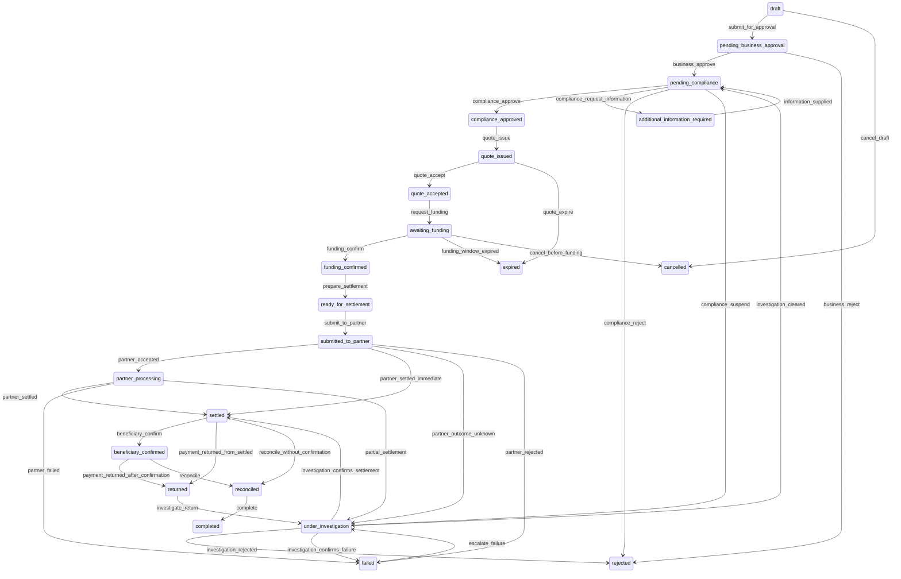

<!--
  GENERATED FILE — do not edit.

  Produced by scripts/generate-docs.mjs from the definitions the software actually
  uses. If this document is wrong, the code is wrong: change the code and regenerate.
  `node scripts/generate-docs.mjs --check` fails the build when the two disagree.
-->

# 07 — Transaction states

22 states and 37 declared transitions.

## Why this is a table and not a status column

There is no function anywhere in this system that sets a transaction's state. Every
route between two states is declared with the actor type allowed to take it, the
permission required, the preconditions, the accounting consequence, who is notified and
whether it requires re-authentication. A state that is not reachable by a declared edge
is not reachable at all.

That matters most in the states nobody wants to think about. When a partner does not
answer, the payment goes to `under_investigation` and automatic retry is switched off,
because retrying an instruction whose outcome is unknown is how a payment gets made
twice. Getting out of that state requires a person who has established what actually
happened.

## What "settled" does not mean

`settled` means the partner reported the payment as made. It is not settlement finality,
which is a legal property conferred by a settlement system operator, and nothing in this
build can produce it. A payment that has settled can still be returned, and a return is
a new event: the original settlement is never reversed, because erasing it would hide
what happened.

## Diagram

## States

| State | Terminal | What it means |
|---|---|---|
| `additional_information_required` | no | Compliance has asked the customer a question and is waiting for the answer. |
| `awaiting_funding` | no | Waiting for the customer to send funds to the partner institution. The funds go to the partner, never to EKORails. |
| `beneficiary_confirmed` | no | The destination bank confirmed the beneficiary was credited. |
| `cancelled` | yes | Withdrawn by the customer before funding. Nothing had moved yet. |
| `completed` | yes | Finished. A transaction cannot be completed while an open break stands against it. |
| `compliance_approved` | no | Compliance cleared it. It now needs a rate before the customer can commit. |
| `draft` | no | Created but not yet submitted. Nothing has been checked and nothing is owed. |
| `expired` | yes | A quote or an approval window lapsed before the next step happened. |
| `failed` | no | Settlement was attempted and did not succeed. The funding is still with the partner. |
| `funding_confirmed` | no | The partner reports holding the customer's funds. Conversion and positioning come next. |
| `partner_processing` | no | The partner accepted the instruction and has not yet reported an outcome. |
| `pending_business_approval` | no | Waiting for a second person at the customer to authorise it. The person who created it cannot be that person. |
| `pending_compliance` | no | With compliance. No transaction reaches a partner without a recorded compliance decision. |
| `quote_accepted` | no | The customer accepted the rate. This is the point at which an obligation is recognised in the ledger. |
| `quote_issued` | no | An indicative rate has been offered. It is indicative until accepted, and it expires. |
| `ready_for_settlement` | no | Currency converted and liquidity positioned. The instruction can be sent. |
| `reconciled` | no | Our record and the partner's record agree, with no unexplained difference. |
| `rejected` | yes | Refused — by the customer's own approver, by compliance or by the partner. No value moved. |
| `returned` | no | The destination bank sent the money back. The original settlement is NOT reversed: a return is a new event, and erasing the first would hide what happened. |
| `settled` | no | The partner reported the payment as made. This is not settlement finality, which is a legal property conferred by a settlement system operator and which nothing in this build can produce. |
| `submitted_to_partner` | no | The instruction has been sent. The idempotency key means sending it again cannot cause a second payment. |
| `under_investigation` | no | Something happened that the system will not resolve on its own — no partner response, or less settled than instructed. Automatic action is deliberately disabled here until a person establishes the true position. |

Terminal states: `completed`, `rejected`, `cancelled`, `expired`.

## Transitions

### From `additional_information_required`

| Event | Leads to | Actor | Permission | Re-auth | Preconditions | Ledger effect | Notifies |
|---|---|---|---|---|---|---|---|
| `information_supplied` | `pending_compliance` | user | `txn.initiate` | no | at least one new document or message has been added | none | compliance_analyst |

- **`information_supplied`** — The customer supplies what compliance asked for, and the case returns to the queue.

### From `awaiting_funding`

| Event | Leads to | Actor | Permission | Re-auth | Preconditions | Ledger effect | Notifies |
|---|---|---|---|---|---|---|---|
| `funding_confirm` | `funding_confirmed` | user, partner, job | `treasury.funding.review` | no | the partner reports funds received in the expected currency | FUNDING RECEIPT: Dr partner funding account; Cr customer funding receivable | initiator, treasury_operator |
| `funding_window_expired` | `expired` | job | — (not a human action) | no | the funding window has elapsed without receipt | REVERSAL of the obligation recognition journal | initiator |
| `cancel_before_funding` | `cancelled` | user | `txn.cancel` | no | no funding has been received | REVERSAL of the obligation recognition journal | treasury_operator |

- **`funding_confirm`** — The funds arrive at the origin partner. The ledger records them as sitting with the partner, because that is where they are.
- **`funding_window_expired`** — The customer did not fund in time. The obligation is reversed rather than deleted, so the ledger shows both that it existed and that it was undone.
- **`cancel_before_funding`** — The customer withdraws before paying. The obligation is reversed.

### From `beneficiary_confirmed`

| Event | Leads to | Actor | Permission | Re-auth | Preconditions | Ledger effect | Notifies |
|---|---|---|---|---|---|---|---|
| `payment_returned_after_confirmation` | `returned` | partner, job | — (not a human action) | no | the destination institution returned the funds after confirming | RETURN RECEIPT: Dr partner settlement account; Cr returned funds | initiator, treasury_operator, finance_analyst |
| `reconcile` | `reconciled` | user, job | `recon.run` | no | the transaction matched cleanly to both the ledger and the partner statement | none, where the reconciliation matched | — |

- **`payment_returned_after_confirmation`** — A return that arrives after the credit was confirmed.
- **`reconcile`** — Our records, the ledger and the partner's statement all agree. Only then is the payment considered reconciled.

### From `compliance_approved`

| Event | Leads to | Actor | Permission | Re-auth | Preconditions | Ledger effect | Notifies |
|---|---|---|---|---|---|---|---|
| `quote_issue` | `quote_issued` | user, job | `fx.quote.issue` | no | compliance approval is recorded; a rate source is available | none — an indicative quote creates no obligation | initiator, business_approver |

- **`quote_issue`** — Treasury issues a price. Until the customer accepts it, it is indicative and nothing is owed by anyone.

### From `draft`

| Event | Leads to | Actor | Permission | Re-auth | Preconditions | Ledger effect | Notifies |
|---|---|---|---|---|---|---|---|
| `submit_for_approval` | `pending_business_approval` | user | `txn.initiate` | no | organisation approved; beneficiary approved; required documents linked | none — nothing is owed until a quote is accepted | business_approver |
| `cancel_draft` | `cancelled` | user | `txn.cancel` | no | — | none | — |

- **`submit_for_approval`** — The person who created the payment sends it for a colleague to authorise. They cannot authorise it themselves; that is the maker-checker control.
- **`cancel_draft`** — The customer abandons an unsubmitted payment.

### From `failed`

| Event | Leads to | Actor | Permission | Re-auth | Preconditions | Ledger effect | Notifies |
|---|---|---|---|---|---|---|---|
| `escalate_failure` | `under_investigation` | user | `treasury.exception.read` | no | a written reason is supplied | none | finance_analyst |

- **`escalate_failure`** — A failure that needs more than a retry is escalated for investigation.

### From `funding_confirmed`

| Event | Leads to | Actor | Permission | Re-auth | Preconditions | Ledger effect | Notifies |
|---|---|---|---|---|---|---|---|
| `prepare_settlement` | `ready_for_settlement` | user, job | `treasury.settlement.route` | no | funding is fully received; compliance approval is still valid; the beneficiary is still approved | FX CONVERSION and PARTNER POSITIONING: the obligation changes currency through FX clearing, and liquidity moves from the origin partner to the settlement partner | treasury_operator |

- **`prepare_settlement`** — Treasury converts the obligation and positions the funds. After this the FX clearing account should be back to zero; if it is not, we have an open position and the dashboard says so.

### From `partner_processing`

| Event | Leads to | Actor | Permission | Re-auth | Preconditions | Ledger effect | Notifies |
|---|---|---|---|---|---|---|---|
| `partner_settled` | `settled` | partner, job | — (not a human action) | no | the partner reported settlement of the full instructed amount | SETTLEMENT PAYMENT: Dr customer settlement payable; Cr partner settlement account | initiator, treasury_operator |
| `partner_failed` | `failed` | partner, job | — (not a human action) | no | the partner reported failure after accepting | REVERSAL of the FX conversion and partner positioning journals | treasury_operator, initiator |
| `partial_settlement` | `under_investigation` | partner, job | — (not a human action) | no | the partner settled less than the instructed amount | PARTIAL SETTLEMENT: the paid portion discharges the obligation; the shortfall goes to settlement suspense | treasury_operator, finance_analyst |

- **`partner_settled`** — The partner reports the payment as made. This discharges our obligation. It is not settlement finality, which no simulator can confer.
- **`partner_failed`** — The partner accepted and then could not complete.
- **`partial_settlement`** — The partner paid part of the instruction. The shortfall is not written off and is not treated as complete; it sits in suspense with an owner until it is explained.

### From `pending_business_approval`

| Event | Leads to | Actor | Permission | Re-auth | Preconditions | Ledger effect | Notifies |
|---|---|---|---|---|---|---|---|
| `business_approve` | `pending_compliance` | user | `txn.approve` | yes | approver is not the initiator; approver holds dual-authorisation permission | none | compliance_analyst |
| `business_reject` | `rejected` | user | `txn.approve` | no | written reason supplied | none | initiator |

- **`business_approve`** — A second person at the customer authorises the payment. The database refuses this step if the approver is the same person who created it.
- **`business_reject`** — The second authoriser declines the payment. It ends here.

### From `pending_compliance`

| Event | Leads to | Actor | Permission | Re-auth | Preconditions | Ledger effect | Notifies |
|---|---|---|---|---|---|---|---|
| `compliance_approve` | `compliance_approved` | user | `compliance.alert.clear` | no | a risk assessment exists for this transaction; no prohibited-severity rule is outstanding; a written reason of at least 20 characters is supplied | none | treasury_operator, initiator |
| `compliance_request_information` | `additional_information_required` | user | `compliance.information.request` | no | a written request is supplied | none | initiator |
| `compliance_reject` | `rejected` | user | `compliance.alert.clear` | no | a written reason of at least 20 characters is supplied | none | initiator |
| `compliance_suspend` | `under_investigation` | user | `txn.suspend` | no | a written reason is supplied | none | compliance_manager |

- **`compliance_approve`** — A compliance analyst reviews the alerts the engine raised and clears the payment to proceed, recording why. The decision is written to an append-only table.
- **`compliance_request_information`** — Compliance needs more from the customer before it can decide.
- **`compliance_reject`** — Compliance declines the payment. The reason is recorded permanently.
- **`compliance_suspend`** — A sanctions or serious alert suspends the payment pending investigation. It does not proceed and it is not rejected — it waits for a decision.

### From `quote_accepted`

| Event | Leads to | Actor | Permission | Re-auth | Preconditions | Ledger effect | Notifies |
|---|---|---|---|---|---|---|---|
| `request_funding` | `awaiting_funding` | user, job | `treasury.funding.review` | no | an obligation journal has been posted | none | initiator |

- **`request_funding`** — The customer is told where to send the funds. Note the destination is the partner institution, not EKORails.

### From `quote_issued`

| Event | Leads to | Actor | Permission | Re-auth | Preconditions | Ledger effect | Notifies |
|---|---|---|---|---|---|---|---|
| `quote_accept` | `quote_accepted` | user | `fx.quote.accept` | yes | the quote has not expired | OBLIGATION RECOGNITION: Dr customer funding receivable; Cr customer settlement payable, fee revenue, partner fees payable and any levy | treasury_operator, initiator |
| `quote_expire` | `expired` | job | — (not a human action) | no | the quote validity window has elapsed | none | initiator |

- **`quote_accept`** — The customer accepts the price. This is the moment obligations come into existence in both directions, and the first journal is posted.
- **`quote_expire`** — Nobody accepted the price in time. A stale rate is not a price, so the payment lapses.

### From `ready_for_settlement`

| Event | Leads to | Actor | Permission | Re-auth | Preconditions | Ledger effect | Notifies |
|---|---|---|---|---|---|---|---|
| `submit_to_partner` | `submitted_to_partner` | user, job | `treasury.settlement.route` | yes | an idempotency key has been claimed for this instruction; the transaction has not previously been submitted | none — instructing is not paying | treasury_operator |

- **`submit_to_partner`** — The settlement instruction goes to the partner, carrying an idempotency key derived from the transaction reference so the same instruction can never become two payments.

### From `reconciled`

| Event | Leads to | Actor | Permission | Re-auth | Preconditions | Ledger effect | Notifies |
|---|---|---|---|---|---|---|---|
| `complete` | `completed` | user, job | `recon.run` | no | reconciliation is complete and no break is open against this transaction | PARTNER FEE PAYMENT, where a partner fee was accrued | initiator |

- **`complete`** — The payment is finished: delivered, reconciled and with all fees settled.

### From `returned`

| Event | Leads to | Actor | Permission | Re-auth | Preconditions | Ledger effect | Notifies |
|---|---|---|---|---|---|---|---|
| `investigate_return` | `under_investigation` | user | `treasury.exception.read` | no | a written reason is supplied | none | finance_analyst |

- **`investigate_return`** — A returned payment is investigated before the customer is refunded.

### From `settled`

| Event | Leads to | Actor | Permission | Re-auth | Preconditions | Ledger effect | Notifies |
|---|---|---|---|---|---|---|---|
| `beneficiary_confirm` | `beneficiary_confirmed` | partner, job | — (not a human action) | no | the destination institution confirmed the credit | none — the accounting completed at settlement | initiator |
| `payment_returned_from_settled` | `returned` | partner, job | — (not a human action) | no | the destination institution returned the funds | RETURN RECEIPT: Dr partner settlement account; Cr returned funds. The original settlement journal is NOT reversed — the payment did happen. | initiator, treasury_operator, finance_analyst |
| `reconcile_without_confirmation` | `reconciled` | user, job | `recon.run` | no | the transaction matched to the ledger and the partner statement; the destination confirmation is not available from this partner | none, where the reconciliation matched | — |

- **`beneficiary_confirm`** — The destination bank confirms the beneficiary was credited.
- **`payment_returned_from_settled`** — The funds came back. The original payment is not erased: a return is a new event, and the ledger shows both.
- **`reconcile_without_confirmation`** — Some partners never send a beneficiary confirmation. Reconciliation can still complete, and the absence of confirmation is recorded rather than assumed away.

### From `submitted_to_partner`

| Event | Leads to | Actor | Permission | Re-auth | Preconditions | Ledger effect | Notifies |
|---|---|---|---|---|---|---|---|
| `partner_accepted` | `partner_processing` | partner, job | — (not a human action) | no | the partner acknowledged the instruction | none | — |
| `partner_settled_immediate` | `settled` | partner, job | — (not a human action) | no | the partner reported settlement without a separate acceptance step | SETTLEMENT PAYMENT: Dr customer settlement payable; Cr partner settlement account | initiator, treasury_operator |
| `partner_outcome_unknown` | `under_investigation` | partner, job, engine | — (not a human action) | no | the partner did not respond and the outcome is genuinely unknown | SUSPENSE POSTING: the instructed amount moves to settlement suspense until the outcome is known | treasury_operator, finance_analyst |
| `partner_rejected` | `failed` | partner, job | — (not a human action) | no | the partner rejected the instruction with a reason | REVERSAL of the FX conversion and partner positioning journals | treasury_operator, initiator |

- **`partner_accepted`** — The partner has the instruction and is working on it.
- **`partner_settled_immediate`** — Some partners settle synchronously. This is the same edge without the interim state.
- **`partner_outcome_unknown`** — The most dangerous state in the system. We sent an instruction and never learned whether it was executed. It is NEVER retried automatically — a blind retry here is how a duplicate payment happens. A human must establish the true position with the partner first.
- **`partner_rejected`** — The partner refused the instruction — insufficient liquidity, an invalid beneficiary, or its own compliance decision. The positioning is unwound.

### From `under_investigation`

| Event | Leads to | Actor | Permission | Re-auth | Preconditions | Ledger effect | Notifies |
|---|---|---|---|---|---|---|---|
| `investigation_cleared` | `pending_compliance` | user | `compliance.highrisk.approve` | yes | a manager decision is recorded | none | compliance_analyst |
| `investigation_rejected` | `rejected` | user | `compliance.highrisk.approve` | yes | a manager decision with a written reason is recorded | none | initiator, compliance_manager |
| `investigation_confirms_failure` | `failed` | user | `treasury.exception.read` | yes | the true position has been established with the partner; a written reason is supplied | REVERSAL of positioning journals, where nothing was paid | treasury_operator, finance_analyst |
| `investigation_confirms_settlement` | `settled` | user | `treasury.exception.read` | yes | the partner confirmed the payment was in fact made; a written reason is supplied | SETTLEMENT PAYMENT, and release of any suspense balance raised for the unknown outcome | treasury_operator, finance_analyst |

- **`investigation_cleared`** — A manager concludes the investigation and returns the payment to the normal queue.
- **`investigation_rejected`** — The investigation concludes that the payment must not proceed.
- **`investigation_confirms_failure`** — Investigation established that no payment was made. Only now may the positioning be unwound.
- **`investigation_confirms_settlement`** — Investigation established that the payment did go out after all. The suspense entry is cleared and the settlement is recorded properly.
