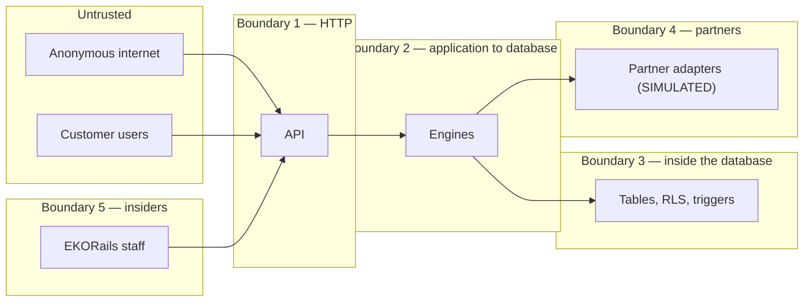

# 12 — Threat model

**Method:** STRIDE per trust boundary, then an attacker-goal pass, then a pass over what the
controls do NOT cover.
**Scope:** this build as it stands, in SANDBOX mode, with simulated partners.
**Status:** written by the team that built the system. **No independent review has taken place.**
That is a release gate (`EKORAILS_GATE_SECURITY_REVIEW`) and is why no risk in the register has
reached `implemented_and_independently_reviewed`.

---

## 1. Trust boundaries

---

## 2. STRIDE

### Boundary 1 — the internet to the API

| Threat | Concretely | Control | Status |
|---|---|---|---|
| **S**poofing | Credential stuffing against known business emails | scrypt (N=32768) passwords; lockout after 5 failures for 15 minutes; TOTP second factor; tight rate limits on authentication routes | Implemented, tested |
| Spoofing | Session token stolen from the browser | `HttpOnly`, `Secure`, `SameSite=Strict` cookie; no client code reads it; strict CSP with no inline script and no external origin | Implemented, tested |
| **T**ampering | Cross-site request forgery | Double-submit CSRF token required on every state-changing request; `SameSite=Strict` as a second layer | Implemented, tested |
| **R**epudiation | "I never authorised that payment" | Every transition records the actor, their role, the reason and a timestamp, in an append-only table, in a hash chain | Implemented, tested |
| **I**nformation disclosure | Enumerating which businesses exist | Records outside the caller's organisation return **404, not 403**. Sign-in failures do not distinguish an unknown email from a wrong password | Implemented, tested |
| **D**enial of service | Flooding the login route | Per-identity and per-hashed-address rate limits; a request body cap that drains and rejects rather than dropping the connection | Implemented, tested |
| Denial of service | A sustained volumetric attack | **Not addressed.** No CDN, WAF or upstream protection is deployed | **Gap** |
| **E**levation | Reaching a route the role should not have | Permission checked at the route, again in the service, again by row-level security. Hiding a menu item is never the control | Implemented, tested |

### Boundary 2 — the application to the database

| Threat | Concretely | Control | Status |
|---|---|---|---|
| Tampering | SQL injection | Every query is parameterised. No string concatenation builds a query anywhere | Implemented |
| Tampering | A defect rewrites an audit record | The application role has **no `UPDATE`/`DELETE` grant** on audit, ledger, decision or transition tables; append-only triggers raise even for the owner | Implemented, tested |
| Elevation | The service connects with excessive privilege | Three roles. `ekorails_app` is not a superuser, has no `BYPASSRLS`, `CREATEROLE` or `CREATEDB`. `provision-roles.sh` asserts this and fails if it is not so | Implemented, tested |
| Information disclosure | Security context leaks between pooled connections | The context is set with transaction-local `set_config(..., true)`. It dies with the transaction whether it commits or rolls back | Implemented, tested |
| Information disclosure | A forgotten `WHERE organization_id` | Row-level security with `FORCE`. The database filters whether or not the query does | Implemented, tested |

### Boundary 3 — inside the database

| Threat | Concretely | Control | Status |
|---|---|---|---|
| Tampering | Somebody with database access edits history | Append-only triggers raise for **any** role including the owner. The hash chain makes an edit detectable even if the triggers were dropped | Implemented, tested |
| Tampering | The chain is rebuilt to hide an edit | Rebuilding requires recomputing every subsequent hash. Detection depends on an **off-host copy of a chain head**, which is **not implemented** | **Gap** |
| Information disclosure | A database dump exposes identity numbers | Sensitive fields are AES-256-GCM encrypted before they are written. The dump contains ciphertext | Implemented, tested |
| Information disclosure | The encryption key is in the same place as the data | The key is HKDF-derived from process configuration. There is **no managed key store**, so an attacker with the host has both | **Gap** |
| Elevation | The backup role is used to read data | `ekorails_backup` has `BYPASSRLS` and `SELECT`, which is what makes `pg_dump` work under `FORCE` RLS. Its credential is a high-value target and there is no separate monitoring of its use | **Partial** |

### Boundary 4 — partners

| Threat | Concretely | Control | Status |
|---|---|---|---|
| Tampering | A replayed instruction causes a second payment | A deterministic idempotency key per transaction and operation; a repeat returns `duplicate_ignored` | Implemented, tested |
| Repudiation | A partner denies receiving an instruction | Every exchange is recorded with direction, operation, outcome, latency and a redacted payload | Implemented, tested |
| Denial of service | A partner does not answer | The transaction moves to `under_investigation` and **automatic retry is disabled** | Implemented, tested |
| Spoofing | A forged partner callback | **Not addressed.** No partner is real, so no callback signature scheme exists yet. This must be designed before any partner is connected | **Gap** |

### Boundary 5 — insiders

The threat a compliance-first system has to take most seriously, because insiders hold the
permissions by design.

| Threat | Concretely | Control | Status |
|---|---|---|---|
| Elevation | An administrator gives themselves a compliance role | Role changes are audited. **Nothing prevents it** — the administrator holds `admin.roles.manage` | **Partial** |
| Tampering | An administrator edits the ledger | They cannot. The grant does not exist at the database level for any application role | Implemented, tested |
| Repudiation | A break-glass action is denied later | Break-glass requires request, approval by a second person, and use — three separate audited events | Implemented |
| Information disclosure | An analyst reads customer data they have no case for | Access is audited and unmasking requires a specific permission. **There is no monitoring of access patterns**, so nobody would notice | **Gap** |
| Elevation | The single founder holds every role | This is the current position. Recorded as `R-16` and it blocks a pilot | **Gap, acknowledged** |

---

## 3. Attacker goals

Working backwards from what somebody would actually want.

### "Make a payment to an account I control"

The shortest path is a compromised Business Initiator account. It does not work:

1. A payment needs an **approved beneficiary**, and approval is a separate compliance action.
2. Adding a beneficiary triggers screening and a review.
3. A payment needs a **second authorisation**, and the initiator cannot provide it.
4. The approver's authorisation requires **re-authentication** with the second factor.
5. Compliance review sits between authorisation and any partner instruction.

Five independent things have to fail. The realistic version of this attack is not technical — it is
persuading a real approver to authorise a real payment to a beneficiary that looks legitimate. No
control in this system stops that. What it does is leave a complete record of who approved what and
why, which is the difference between a loss you can investigate and one you cannot.

### "Change a record so the fraud is not visible"

Does not work at the application layer at all: there is no `UPDATE` grant. It requires database
credentials. With them, the append-only triggers still raise, so it requires dropping the triggers,
which is DDL, which requires the owner role. Even then the hash chain breaks and
`verify_audit_chain()` reports it.

**Where it does work:** an attacker with the owner role, unlimited time and no external copy of any
chain head can drop the triggers, rewrite the records, and recompute every subsequent hash. Nothing
in this build would detect that. Publishing a chain head off-host — to a log service, a second
database, or a counterparty — is the control, and it is **not implemented**.

### "Read the customer list"

Row-level security means an authenticated customer sees only their own rows. A back-office role
sees more, by design. Database credentials give everything, subject to field-level encryption on
identity numbers — and the key derives from process configuration on the same host, so an attacker
who has the host has the key.

### "Cause a loss without stealing anything"

Getting a payment made twice would do it. This is why `under_investigation` disables automatic
retry, why every partner call carries an idempotency key, and why the partner simulators can be
told to time out on purpose so the behaviour can be watched rather than assumed.

---

## 4. The eight gaps, restated in one place

Not buried in the tables above, because a threat model whose gaps are hard to find is a marketing
document.

| # | Gap | Consequence | What closes it |
|---|---|---|---|
| 1 | No off-host audit chain head | An attacker with the owner role can rewrite history undetectably | Publish the chain head periodically to an independent system |
| 2 | No managed key store | Host compromise yields both ciphertext and key | A managed KMS with the key outside the application host |
| 3 | No antivirus | A malicious document reaches an analyst's machine | Connect a real scanning service. Structural checks are not scanning |
| 4 | No partner callback authentication | A forged callback could move a transaction | Design signature verification before any partner is connected |
| 5 | No access-pattern monitoring | Insider browsing is recorded but nobody is told | Alerting on unusual access volume and out-of-case access |
| 6 | No volumetric DoS protection | The service can be flooded | Upstream protection, which is a deployment decision |
| 7 | No independent security review | Everything above is the builder's own assessment | Commission one. It is a release gate |
| 8 | Single-person operation | No separation of duties in practice, whatever the software says | Appoint a compliance officer and a second engineer |

Gaps 1, 3, 7 and 8 block a pilot. Gaps 2, 4 and 5 must close before any live money, and gap 4 must
close before any real partner is connected.

---

## 5. What the controls are worth

An honest summary rather than a score:

- Against **an external attacker without credentials**, the controls are reasonable: parameterised
  queries, strict headers, a tight authentication path and a real second factor.
- Against **a compromised customer account**, they are good, because the separations are structural
  and there are several of them.
- Against **a compromised back-office account**, they are moderate: the ledger and audit trail hold,
  but a compliance analyst's session can read a great deal and nothing would notice.
- Against **an attacker with database credentials**, they are weak on confidentiality (the key is on
  the host) and moderate on integrity (the chain is detectable, but not if the attacker is patient
  and no head is published elsewhere).
- Against **a determined insider with the owner role**, they are weak, and the honest mitigation is
  organisational rather than technical: more than one person.
