<!--
  GENERATED FILE — do not edit.

  Produced by scripts/generate-docs.mjs from the definitions the software actually
  uses. If this document is wrong, the code is wrong: change the code and regenerate.
  `node scripts/generate-docs.mjs --check` fails the build when the two disagree.
-->

# Annex — The interface

**EKORAILS LIMITED** · RC 9490673

20 screens, captured from the running system.

## What these images are

Every image below is a screenshot of the **working application**, signed in as the role
named, reading the seeded database. None is a mockup, a wireframe or a design study.

The environment banner is visible in every frame, and the capture script refuses to
save an image in which it is absent. It reads:

> **SANDBOX ENVIRONMENT. NO LIVE FUNDS.** Every partner, rate and settlement below is
> simulated. Balances are not real. Fictional demonstration data.

Every business, person, document and account identifier shown is fictional. No real
identity document or bank detail appears anywhere in this system.

## What each image is offered as evidence of

A screenshot captioned "dashboard" proves nothing. Each caption below states what the
image is evidence OF, so that a reader can check the claim against the picture rather
than take the caption on trust.

If you would rather not rely on our screenshots at all, `S6-evaluator-instructions.md`
sets out how to run the whole system yourself in about five minutes and check any of
these claims directly.

## Index

| # | Screen | Role | Path |
|---|---|---|---|
| 1 | Supervisory view | Auditor / Regulator | `/regulator` |
| 2 | Release gates and controls | Auditor / Regulator | `/regulator/controls` |
| 3 | Audit trail, filtered to authorisation events | Auditor / Regulator | `/regulator/audit?category=authorisation` |
| 4 | Trial balance | Auditor / Regulator | `/finance/trial-balance` |
| 5 | Ledger accounts | Auditor / Regulator | `/finance/accounts` |
| 6 | Compliance queue, read-only oversight | Auditor / Regulator | `/compliance/cases` |
| 7 | A compliance case in full | Compliance Analyst | `/compliance/cases/CMP-202608-100004` |
| 8 | Compliance rule library | Compliance Analyst | `/compliance/rules` |
| 9 | Document expiry monitoring | Compliance Analyst | `/compliance/documents?within_days=90` |
| 10 | Operations console | Treasury and Settlement Operator | `/ops` |
| 11 | A completed payment, end to end | Treasury and Settlement Operator | `/transactions/0682df0c-acb2-48e5-9de5-dac65e8b109d` |
| 12 | Liquidity and partner positions | Treasury and Settlement Operator | `/ops/liquidity` |
| 13 | Daily reconciliation | Finance and Reconciliation Analyst | `/finance/reconciliation` |
| 14 | Exception cases | Finance and Reconciliation Analyst | `/ops/exceptions` |
| 15 | System configuration and unresolved placeholders | System Administrator | `/admin/configuration` |
| 16 | Partner failure simulation | System Administrator | `/admin/simulation` |
| 17 | Role and permission matrix | System Administrator | `/admin/roles` |
| 18 | Build status, module by module | Super Administrator | `/learning/product-map` |
| 19 | The settlement state machine | Super Administrator | `/learning/state-machine` |
| 20 | Founder decision log | Super Administrator | `/learning/decisions` |

## Signed in as: Auditor / Regulator

### 1. Supervisory view

`/regulator`

**Evidence of:** The complete list of what EKORails is not — bank, deposit-taker, licensed payment provider, custodian of customer funds — served from the API rather than written on a slide, together with how each is enforced. Sandbox admission is stated as NOT CONFIRMED on the applicant's own screen.

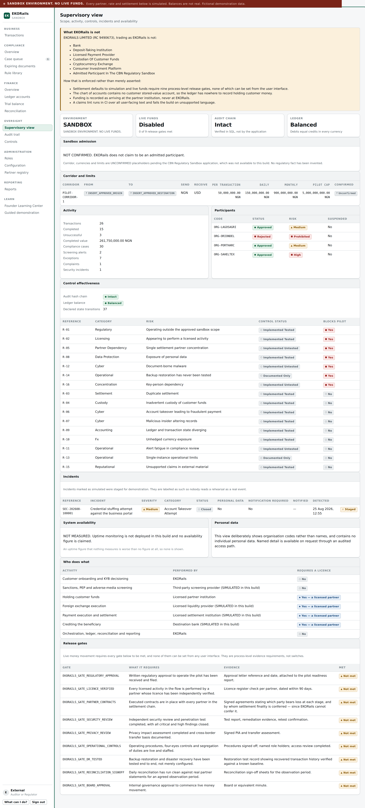

### 2. Release gates and controls

`/regulator/controls`

**Evidence of:** Nine gates stand between this build and live money, each requiring named evidence, and none is met. None is settable from any interface: they are process configuration read once at start-up. The risk register below them shows control status honestly — nothing has reached independently reviewed.

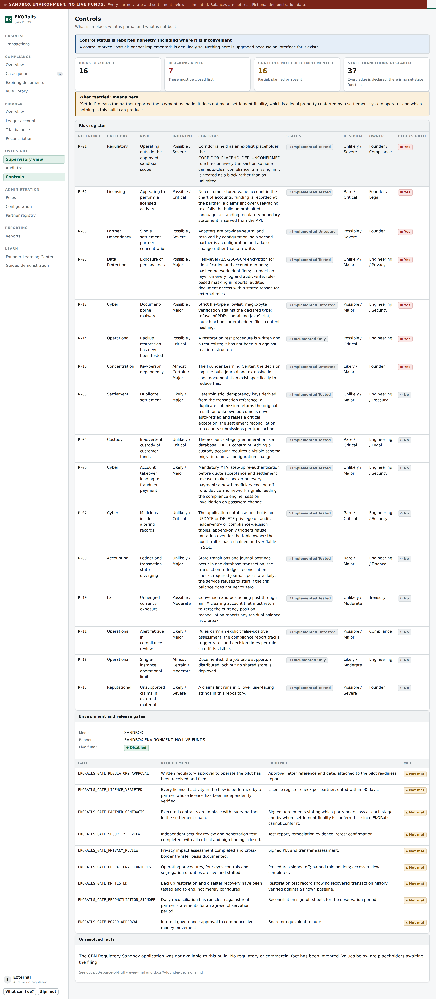

### 3. Audit trail, filtered to authorisation events

`/regulator/audit?category=authorisation`

**Evidence of:** The hash chain verifies, computed inside the database rather than by the application. Refused actions appear alongside successful ones — a trail containing only successes says nothing about what was attempted.

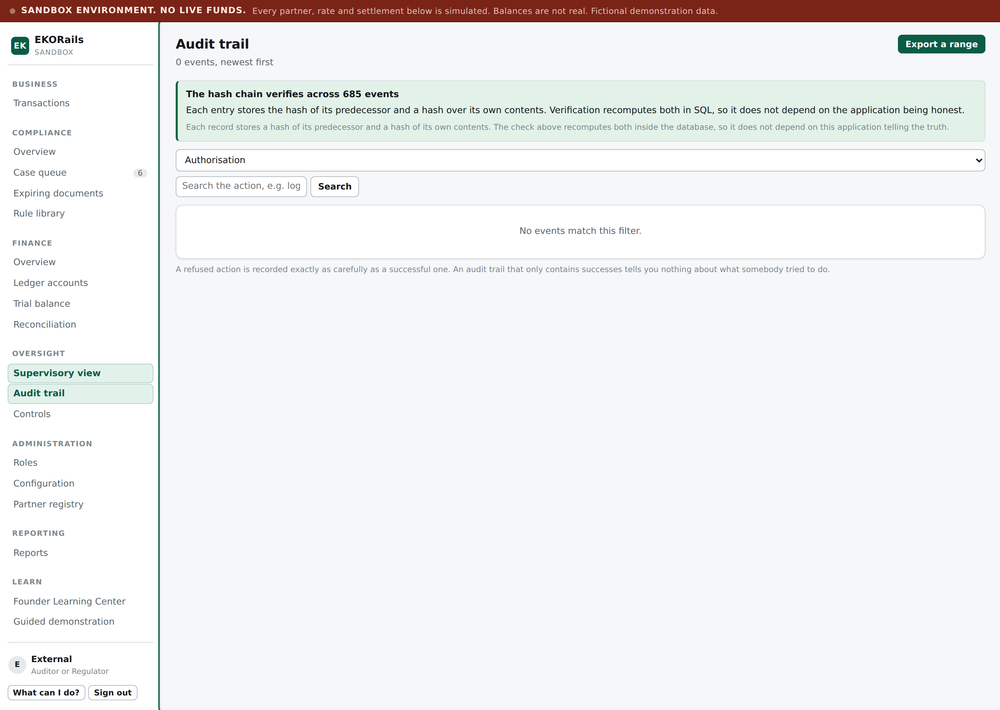

### 4. Trial balance

`/finance/trial-balance`

**Evidence of:** Debits equal credits in every currency. The check runs in SQL against the tables, and the service refuses to start if it fails.

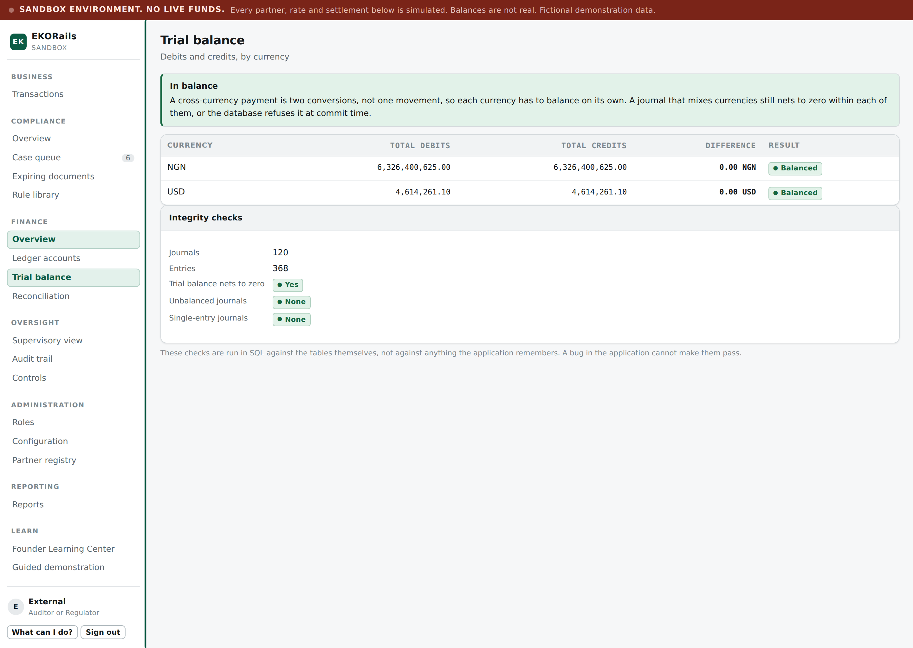

### 5. Ledger accounts

`/finance/accounts`

**Evidence of:** THE CUSTODY EVIDENCE. There is no customer stored-value account anywhere in this chart of accounts — not disabled, absent. Customer money appears only as a receivable or as a balance the PARTNER institution holds.

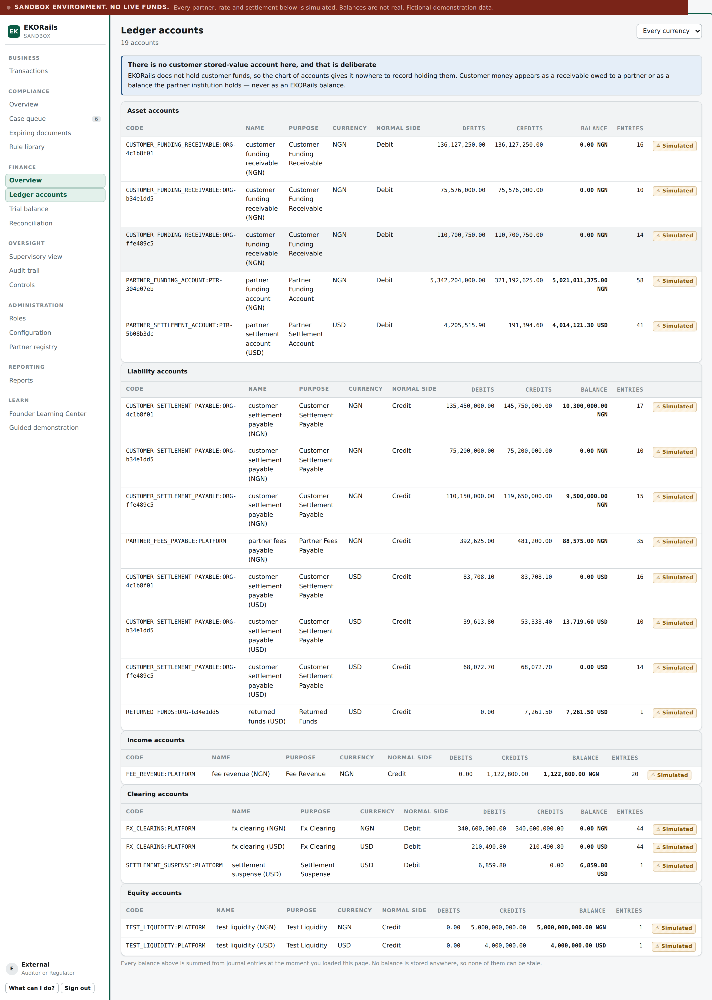

### 6. Compliance queue, read-only oversight

`/compliance/cases`

**Evidence of:** A supervisor can see every case, its authority level and its service target, through a read-only role whose every write route is refused.

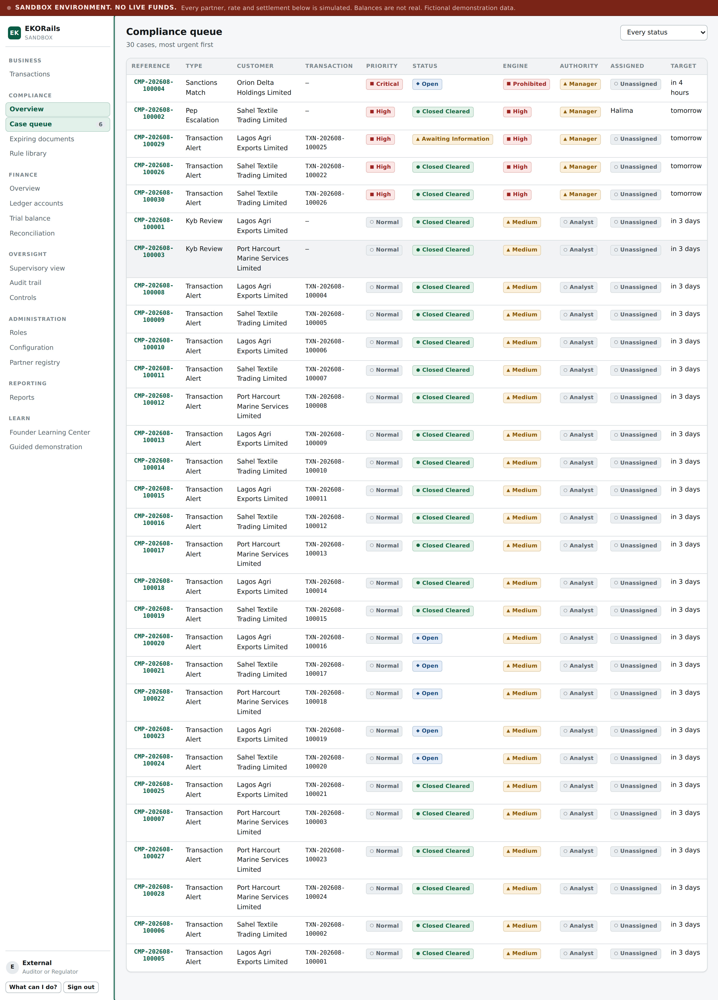

## Signed in as: Compliance Analyst

### 7. A compliance case in full

`/compliance/cases/CMP-202608-100004`

**Evidence of:** Every rule that APPLIED was evaluated and recorded, including those that did not fire — "checked and found nothing" is evidence, "never run" is a gap, and storing only triggered rules would make them indistinguishable. Each evaluation carries the rule text, the parameter values in force at the time and the data read.

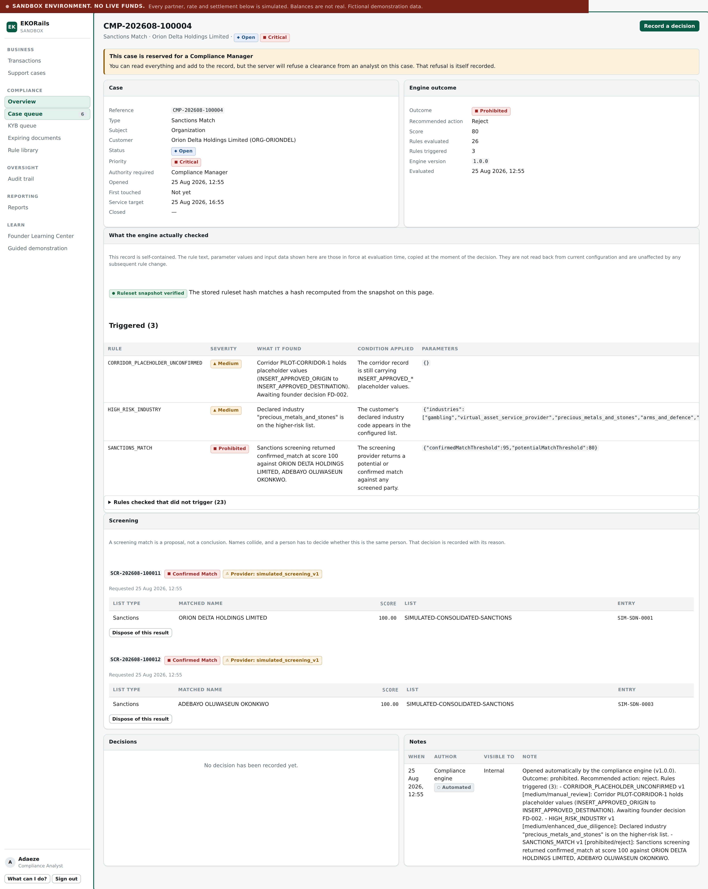

### 8. Compliance rule library

`/compliance/rules`

**Evidence of:** Every rule states the risk it addresses, when it fires, the evidence it requires, what the system does, what a person decides, and HOW IT CAN BE WRONG. Rules are immutable once published; a change creates a new version.

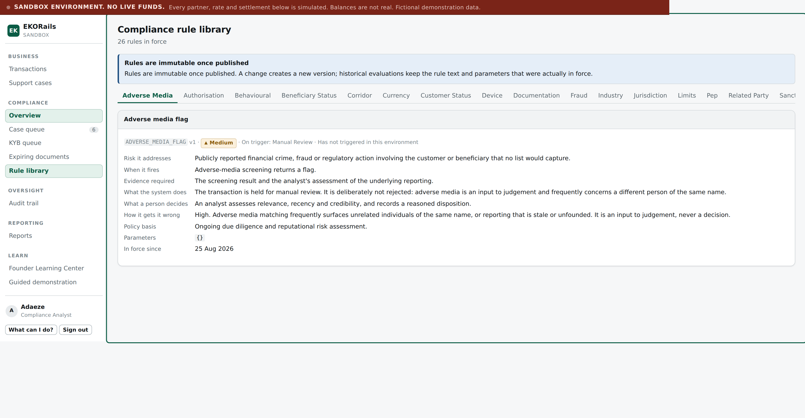

### 9. Document expiry monitoring

`/compliance/documents?within_days=90`

**Evidence of:** Customer evidence is tracked to its expiry. An expired document raises a rule against the next transaction relying on it rather than silently lapsing.

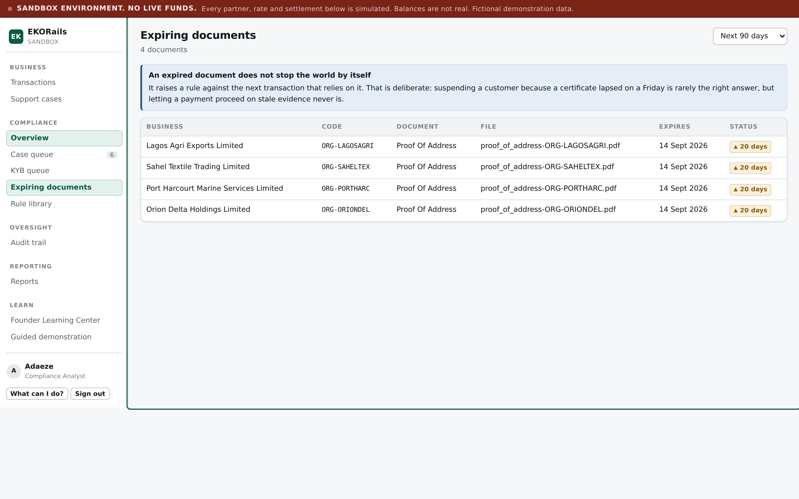

## Signed in as: Treasury and Settlement Operator

### 10. Operations console

`/ops`

**Evidence of:** Work is grouped by what is waiting on a person, not by recency. States where a payment cannot progress without human judgement are pinned to the top.

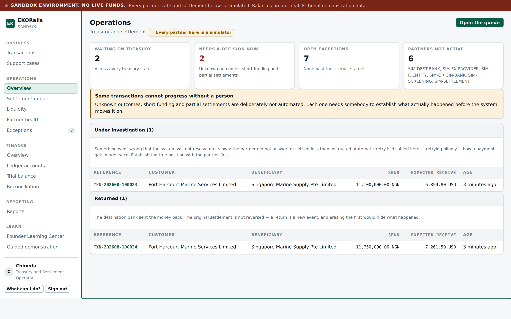

### 11. A completed payment, end to end

`/transactions/0682df0c-acb2-48e5-9de5-dac65e8b109d`

**Evidence of:** The full lifecycle with the actor, the reason and the timestamp for every transition; the ledger entries with a plain-English explanation of each; and every partner exchange, labelled as simulated.

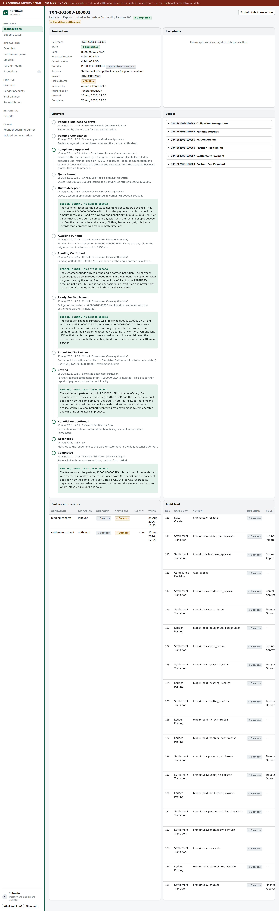

### 12. Liquidity and partner positions

`/ops/liquidity`

**Evidence of:** Every balance is held at a PARTNER institution. The FX clearing account is shown separately: a balance there means half a conversion happened, which is an open position with an owner rather than a rounding note.

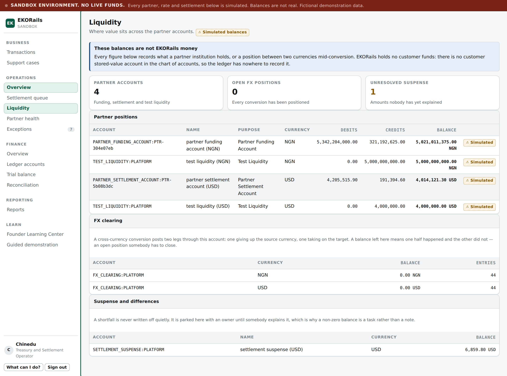

## Signed in as: Finance and Reconciliation Analyst

### 13. Daily reconciliation

`/finance/reconciliation`

**Evidence of:** Six comparisons run daily. A difference opens a break and adopts neither figure; above the four-eyes threshold the investigator cannot approve the closure.

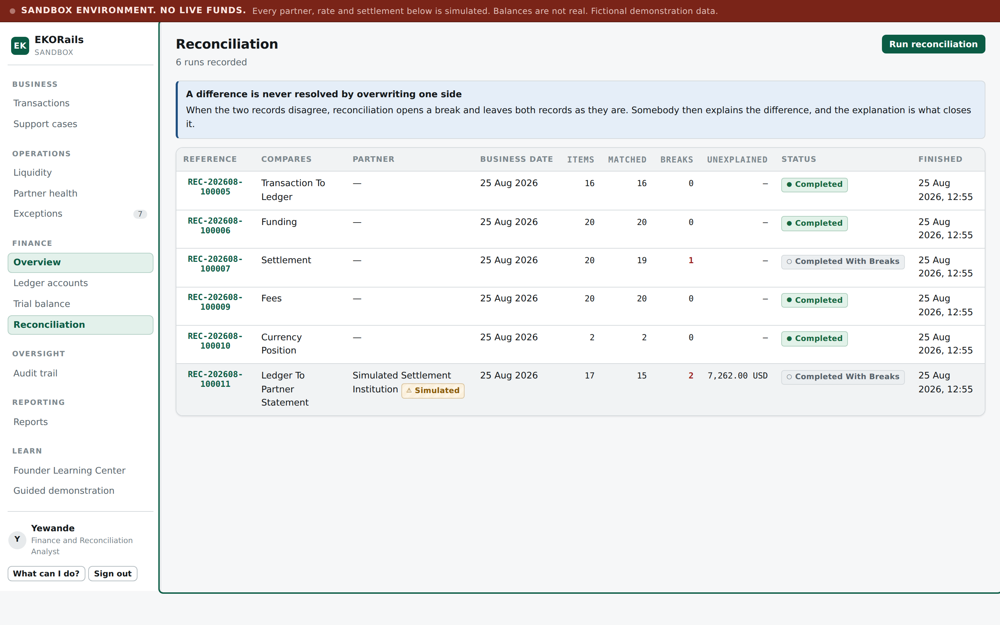

### 14. Exception cases

`/ops/exceptions`

**Evidence of:** Every break has an owner, a priority and a service target. A shortfall sits in settlement suspense until somebody explains it; it is never written off silently.

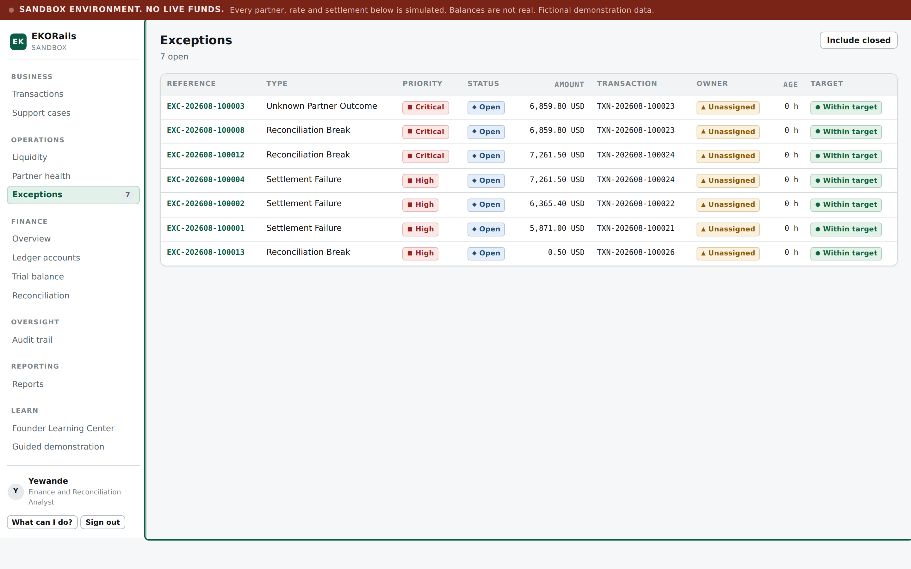

## Signed in as: System Administrator

### 15. System configuration and unresolved placeholders

`/admin/configuration`

**Evidence of:** The regulatory facts this application seeks to establish are held as explicit placeholders rather than assumed. Configuration is immutable: a change is a new version under maker-checker and never rewrites a historical result.

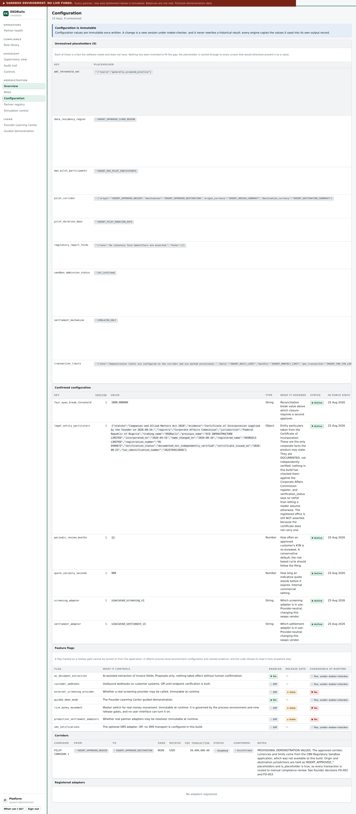

### 16. Partner failure simulation

`/admin/simulation`

**Evidence of:** Eleven failure modes can be produced on demand, so behaviour under failure is OBSERVED rather than described. Note the timeout scenario: the payment stops and automatic retry is disabled, because retrying an instruction whose outcome is unknown is how a payment gets made twice.

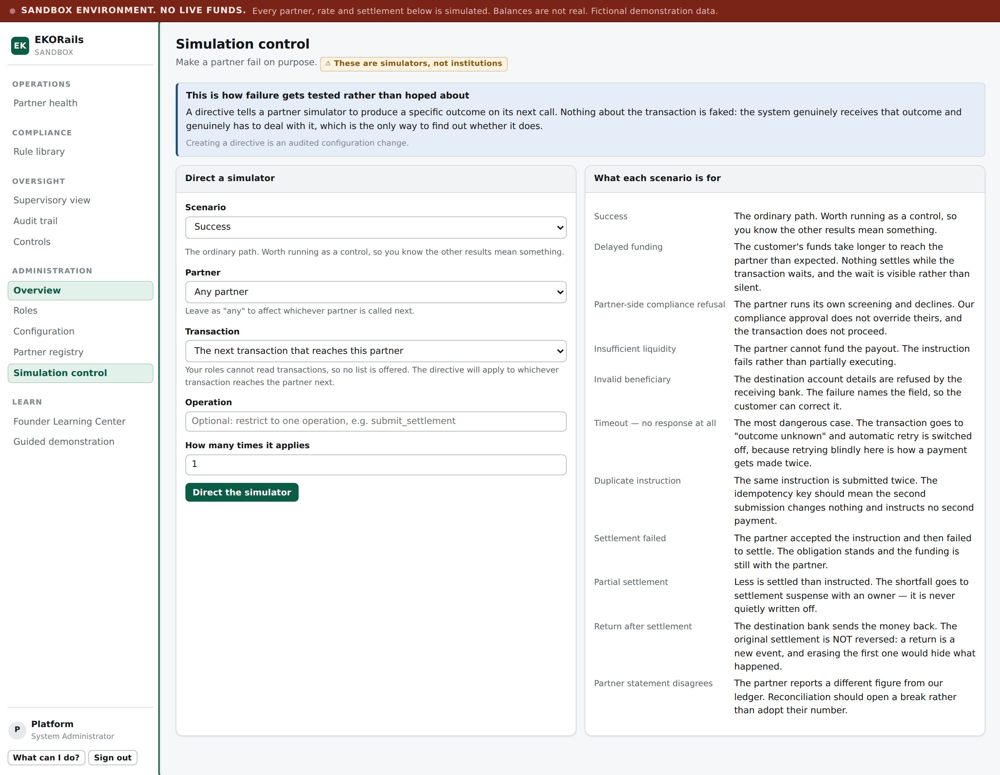

### 17. Role and permission matrix

`/admin/roles`

**Evidence of:** Nine roles, each with explicit denials rather than merely absent permissions. Separation-of-duties rules are evaluated against the context of an action, so holding two roles does not confer a capability neither role has.

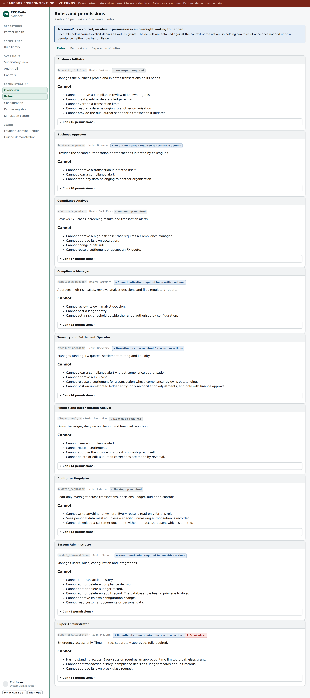

## Signed in as: Super Administrator

### 18. Build status, module by module

`/learning/product-map`

**Evidence of:** Sixteen modules, each reported at the highest stage it has GENUINELY reached, with what is simulated and what is limited stated per module. Nothing is above "tested", because an independent security review has not taken place.

### 19. The settlement state machine

`/learning/state-machine`

**Evidence of:** Every route between states is declared with the actor, the permission, the preconditions and the accounting consequence. There is no function that simply sets a state. The note disclaims settlement finality.

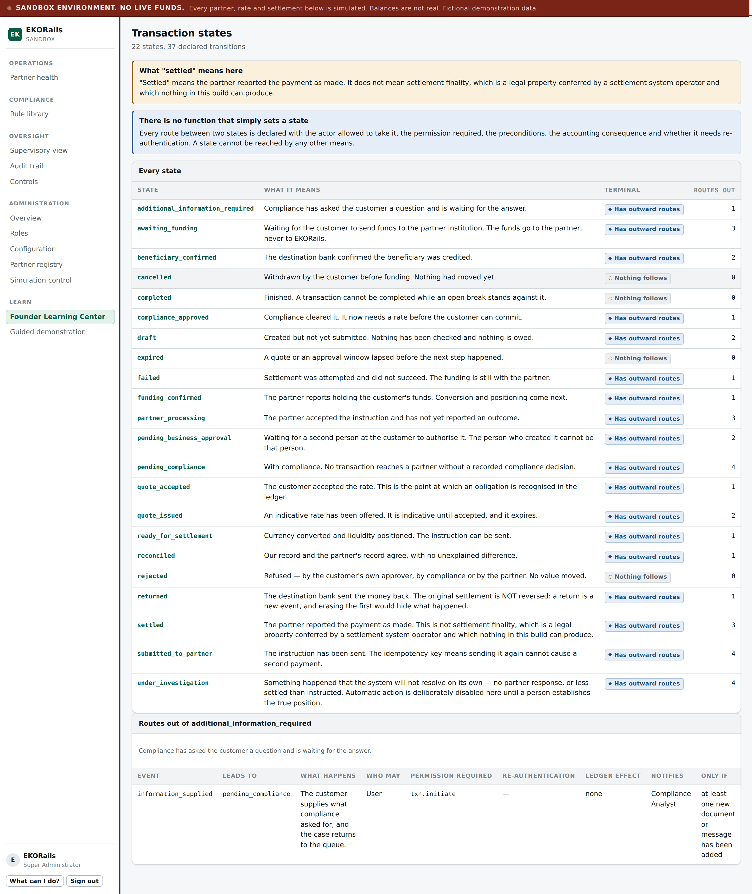

### 20. Founder decision log

`/learning/decisions`

**Evidence of:** Every fact the application could not establish is recorded as an open decision with its options, its recommendation and what it blocks. Nine of ten remain open.

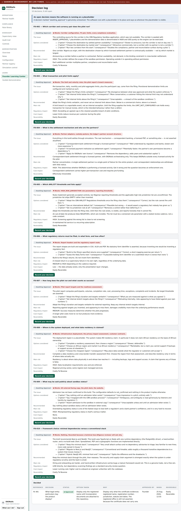

## What these images do not show

Stated here so the annex is not read as more than it is.

- **No partner is real.** Every partner interaction shown is a simulator, labelled as
  one on the screen. No agreement with any institution has been executed.
- **No corridor is confirmed.** The corridor, its currencies and its limits are the
  facts this application seeks to establish, and they appear as explicit placeholders.
- **No money has moved.** Every balance is simulated, and the release gates that would
  permit live funds are all unmet.
- **This is not a deployment.** The system has run on a developer machine and in this
  repository's continuous integration. No region has been selected, and no claim of
  data residency in any jurisdiction is made.
